Πτυχιακή Εργασία : Εκπαιδευτικό παιχνίδι με την χρήση του Phaser

Ονοματεπώνυμο : Χρήστος Σωτίδης

ΑΜ : Π2012079

1ο ΠΑΡΑΔΟΤΕΟ

  Η πτυχιακή μου εργασία θα είναι ένα εκπαιδευτικό παιχνίδι όπου θα επικεντρώνεται στην προσπάθεια εξοικείωσης του χρήστη με την προπαίδεια ή την διαιρετότητα των αριθμών. Θα εμφανίζεται δηλαδή στον χρήστη ένας αριθμός από το 1 μέχρι το 10 και έπειτα μια σειρά από αριθμούς οι οποίοι κάποιοι από αυτούς θα ανήκουν στην προπαίδεια αυτού του αριθμού ή θα διαιρούνται με αυτόν. Η ιδέα είναι ο χρήστης ή να επιλέγει αυτούς τους αριθμούς πηγαίνοντας πάνω τους, όπως για παράδειγμα στο 'super mario', ή να λειτουργεί ως shooter και να προσπαθεί να τους στοχεύσει. 
  Μέχρι στιγμής έχω φτιάξει ένα δοκιμαστικό βασικό κομμάτι του παιχνιδιού χωρίς να έχω προσθέσει τους αριθμούς και την λειτουργία τους. Αντί για τους αριθμούς, υπάρχουν δοκιμαστικά τα αντίστοιχα 'coins' του 'super mario', καθώς και κάποιοι εχθροί με τους οποίους αν έρθει σε επαφή ο χρήστης, το παιχνίδι ξεκινάει από την αρχή. Υπάρχουν ήδη κάποιας 'bugs' τα οποία θα πρέπει να λυθούν. Το παιχνίδι υπάρχει εδώ : 
  https://dafakias.github.io/Super-Mario/
  
  Τα εργαλεία που έχουν χρησιμοποιηθεί μέχρι στιγμής είναι η βιβλιοθήκη του Phazer και ο κειμενογράφος 'Brackets'.
  
                                                 

ΠΡΟΔΙΑΦΡΑΦΕΣ

Οι τρέχουσες προδιαγραφές του βιντεοπαιχνιδιού είναι :

1. Ύπαρξη κυρίως μενού με δύο επιλογές. Οι επιλογές που έχει ο χρήστης είναι ‘Play’ και ‘Controls’. Στην επιλογή ‘Controls’ οδηγείται σε μια οθόνη που του παρουσιάζει τα απαραίτητα κουμπιά που χρειάζεται για να παίξει το παιχνίδι, ενώ με στην επιλογή ‘Play’ οδηγείται στην αφήγηση του παιχνιδιού.
2. Ύπαρξη αφήγησης που βοηθάει τον χρήστη να νιώσει πιο οικεία με το παιχνίδι και να ταυτιστεί με τον χαρακτήρα του παιχνιδιού. Η αφήγηση ενημερώνει τον χρήστη πως πρέπει να επιλέξει δέκα σωστούς αριθμούς ώστε να βρει το κλειδί που τερματίζει το παιχνίδι. Επίσης η αφήγηση δίνει στον χρήστη πληροφορίες για την εξέλιξη του παιχνιδιού.

3.Δυνατότητα επιλογής αριθμού με τον οποίο θα παίξει ο χρήστης ανάμεσα στους 2,3,5 και 10.

4. Δυνατότητα επιλογής χαρακτήρα τον οποίο θα ελέγχει ο χρήστης κατά την διάρκεια του παιχνιδιού. Η επιλογή γίνεται ανάμεσα στους ‘Mario’ και ‘Luigi’ που αποτελούν βασικούς χαρακτήρες του Super Mario.

5. Ύπαρξη κουμπιού επιλογής ‘Skip Intro’ κατά την διάρκεια της αφήγησης σε περίπτωση που ο χρήστης θέλει να αποφύγει να δει τις πληροφορίες της αφήγησης και να μεταφερθεί κατευθείαν στην επιλογή αριθμού και χαρακτήρα.

6. Μετά την επιλογή χαρακτήρα, ο χρήστης μεταφέρεται εντός της πίστας όπου και καθοδηγεί τον χαρακτήρα μέσω της 3d person λειτουργίας.

7. Το βασικό gameplay του παιχνιδιού αποτελείται από ένα πλήθος αριθμών που βρίσκονται μέσα σε κίτρινα πλαίσια τους οποίους ο χρήστης πρέπει να επιλέξει ερχόμενος σε επαφή μαζί τους, αν θεωρεί πως διαιρούνται ακριβώς με τον αριθμό που έχει επιλέξει να παίξει. Αν ο παίκτης καταφέρει να βρει 10 σωστούς αριθμούς τότε εμφανίζεται στο τέλος της πίστας το κλειδί που τερματίζει το παιχνίδι.

8. Ύπαρξη συστήματος ζωών. Ο χρήστης ξεκινάει το παιχνίδι έχοντας 3 ζωές.

9.  Ύπαρξη ένδειξης score. Το score αρχικά είναι μηδέν και αυξάνεται κατά 100 κάθε φορά που ο χρήστης επιλέγει έναν σωστό αριθμό.

10. Στο επάνω αριστερά μέρος της οθόνης ο χρήστης μπορεί να βλέπει το score, τις ζωές που του απομένουν και τον αριθμό που έχει επιλέξει για να παίξει.

11. Κατά την διάρκεια του παιχνιδιού ο χρήστης έρχεται σε επαφή με τους αριθμούς που υπάρχουν κατά μήκος της πίστας. Αν ο αριθμός που επιλέξει είναι σωστός, τότε ο αριθμός αυτός εμφανίζεται στο επάνω μέρος της οθόνης, το score αυξάνεται κατά 100 και ο χρήστης χρειάζεται έναν αριθμό λιγότερο για να φτάσει τους 10 σωστούς. Αν ο αριθμός είναι λανθασμένος, ο χρήστης δέχεται ένα μήνυμα λάθους το οποίο τον ενημερώνει για τον κανόνα του κριτηρίου διαιρετότητας που αφορά τον εκάστοτε αριθμό που έχει επιλέξει να παίξει ο χρήστης και ο αριθμός εξαφανίζεται.

12.Ύπαρξη δυνατότητας shooting. Ο χρήστης μπορεί να ‘πυροβολήσει’ όποιον αριθμό θεωρεί λανθασμένη επιλογή και τον εμποδίζει κατά την διάρκεια της πίστας. Κάθε φορά που χρήστης ‘πυροβολεί’ έναν λανθασμένο αριθμό, κερδίζει μια ζωή. Επίσης αν ο χρήστης καταφέρει να ‘πυροβολήσει’ 5 λανθασμένους αριθμούς, λαμβάνει ως εκπαιδευτικό bonus στο τέλος της πίστας έναν extra σωστό αριθμό τον οποίο μπορεί να επιλέξει ο χρήστης και να φτάσει πιο κοντά στους 10 σωστούς αριθμούς.

13. Ως ένα ακόμη εκπαιδευτικό bonus, αν ο χρήστης καταφέρει να επιλέξει 5 σωστούς αριθμούς, τότε κερδίζει μια ζωή.

14. Ύπαρξη εχθρών του Super Mario ώστε το παιχνίδι να φαίνεται πιο γνώριμο και πιο οικείο στον χρήστη. Ο χρήστης μπορεί να εξουδετερώσει αυτούς τους εχθρούς αν πηδήξει πάνω τους ή αν τους ‘πυροβολήσει’ με την shooting λειτουργία. Αν όμως έρθει σε επαφή μαζί τους, τότε χάνει μια ζωή και μεταφέρεται πιο πίσω στην πίστα σε συγκεκριμένα σημεία ανάλογα με το σημείο που βρίσκεται στο παιχνίδι.

15. Ύπαρξη κρυφής βοήθειας. Εντός της πίστας υπάρχει σε ένα σημείο ένα hint box το οποίο αν επιλέξει ο χρήστης, θα του φανερωθεί ο εκάστοτε κανόνας του κριτηρίου διαιρετότητας.

16. Ύπαρξη 2 luckybox τα οποία αν επιλέξει ο χρήστης, που φανερώνουν έναν ακόμη αριθμό το καθένα για να επιλέξει ο χρήστης αν τον θεωρεί σωστό.

17. Δημιουργία διαφόρων κομματιών εντός της πίστας όπως ασανσέρ, έλικας, κολώνες τηλεμεταφοράς και πέρασμα από ποτάμι μέσω βοηθητικού μέσου ώστε το παιχνίδι να γίνει πιο διασκεδαστικό, να αποτελεί μεγαλύτερη πρόκληση και να φέρει τον χρήστη πιο κοντά στο παιχνίδι του Super Mario.

18. Όταν ο χρήστης φτάσει στο τέλος της πίστας, αν έχει βρει τουλάχιστον 10 σωστούς αριθμούς, θα υπάρχει ένα κλειδί που θα τερματίζει την πίστα. Αντίστοιχα αν δεν έχει καταφέρει να βρει 10 σωστούς αριθμούς, στη θέση του κλειδιού θα υπάρχει μια πόρτα. Το καθένα θα οδηγήσει τον χρήστη σε μια οθόνη νίκης ή ήττας.

19.Αν ο χρήστης φτάσει τις 0 ζωές κατά την διάρκεια του παιχνιδιού, οδηγείται αυτόματα στην οθόνη ήττας.

20. Ύπαρξη learning analytics. Είτε ο χρήστης οδηγηθεί στην οθόνη νίκης ή ήττας, θα μπορέσει να δει κάποια δεδομένα αποτελεσμάτων σχετικά με το τι κατάφερε να κάνει κατά την διάρκεια του παιχνιδιού. Αρχικά μπορεί να δει πόσους σωστούς αριθμούς κατάφερε να επιλέξει μέσα στο παιχνίδι. Επίσης μπορεί να δει πόσοι ήταν συνολικά οι σωστοί αριθμοί που μπορούσε να επιλέξει μέσα στο παιχνίδι. Ακόμη μπορεί να δει πόσους αριθμούς επέλεξε λάθος. Τέλος, μπορεί να δει ποιους αριθμούς συγκεκριμένα επέλεξε λάθος.

21. Ύπαρξη κουμπιού ‘Play Again’ που οδηγεί τον χρήστη στην επιλογή αριθμού ώστε να ξαναπαίξει το παιχνίδι.

  
 2ο ΠΑΡΑΔΟΤΕΟ
 
 Σε αυτό το παραδοτέο έχουν προστεθεί κάποιες λειτουργίες έπειτα από δοκιμές. Αρχικά έχει δημιουργηθεί ένα βασικό μενού πριν την έναρξη της πίστας.
 
   Στο μενού υπάρχει προς το παρόν η επιλογή 'Play' που οδηγεί τον παίκτη στην 1η πίστα του παιχνιδιού και η επιλογή 'About' που αυτήν την στιγμή λειτουργεί μόνο ως ένα Debug Log, ενώ αργότερα θα προστεθεί εκεί η επεξήγηση των πλήκτρων που θα χρειαστεί ο παίκτης.
   
 Όταν λοιπόν ο χρήστης ξεκινάει την πίστα εισέρχεται σε μια τέτοια εικόνα.
 
 Ο χρήστης ελέγχει τον χαρακτήρα του παιχνιδιού με τα πλήκτρα A και S (αριστερά-δεξιά) και πηδάει με το W. Με κάθε εκκίνηση του παιχνιδιού υπάρχει ένας τυχαίος αριθμός που θα εμφανίζεται στον χρήστη και αυτός θα πρέπει να στοχεύσει τους αριθμούς που βλέπει στα κίτρινα πλαίσια με τους οποίους θεωρεί ότι διαιρείται ακριβώς ο τυχαίος αριθμός. Έτσι θα μπορεί ο χρήστης να εξοικειωθεί με τα κριτήρια διαιρετότητας.
 
 Για να μπορέσει ο χρήστης να στοχεύσει τους αριθμούς που βλέπει, έχει προστεθεί δοκιμαστικά μια shooting λειτουργία στο παιχνίδι. Έτσι αν πατήσει το πάνω βελάκι του πληκτρολογίου του, εμφανίζεται μια σφαίρα η οποία κατευθύνεται προς τα πάνω και έτσι μπορεί να πετύχει τους αριθμούς που θέλει.
 
 Όταν η σφαίρα έρθει σε επαφή με έναν αριθμό, αυτός εξαφανίζεται. Επίσης ακούγεται ένας ήχος κάθε φορά που ο χρήστης πετυχαίνει έναν σωστό αριθμό.
 
 Τέλος, έχει προστεθεί η ένδειξη του score, αλλά χρειάζεται βελτίωση διότι δεν μετριέται όπως θα έπρεπε.
 
 
 
 3ο ΠΑΡΑΔΑΟΤΕΟ
 
 Στο 3ο παραδεοτέο, έγινε αρχικά μια αλλαγή στον τύπο του παιχνιδιού. Το shooting χαρακτηριστικό δεν ταίριαζε με τον χαρακτήρα του παιχνιδιού 'super mario', οπότε και αφαιρέθηκε. Οπότε οι αριθμοί που πρέπει να στοχεύσει ο χρήστης, τοποθετήθηκαν στο κάτω μέρος της εικόνας και έτσι τώρα θα πρέπει να καταυθυνθεί ο ίδιος ο χαρακτήρας του παιχνιδιού πάνω στους αριθμούς. Ο νέα διάταξη φαίνεται στην παρακάτω εικόνα.
 
 
 Επίσης προστέθηκε η ένδειξη του αριθμού που επιλέγεται τυχαία με την έναρξη της πίστας, ώστε να γνωρίζει ο χρήστης ποιους αριθμούς θα πρέπει να πετύχει για να κερδίσει.
 
 
 Ακόμα προστέθηκαν δύο χαρακτήρες πουλιών οι οποίοι κινούνται σε ένα συγκεκριμένο σημείο, ως εχθροί. Έτσι όταν ο χρήστης έρθει σε επαφή μαζί τους, τότε μεταφέρεται στην αρχή της πίστας.
 
 
 Τέλος, μέχρι και το 2ο παραδοτέο, τα tilesets που χρησιμοποίησα ήταν μεγέθους 16x16, ενώ τώρα αλλάχτηκαν με tilessets μεγέθους 64x64 ώστε να είναι εμφανής περισσότερη λεπτομέρια. Ακόμα υπήρξε αλλαγή και στην ανάλυση του παιχνιδιού καθώς αρχικά ήταν 800x600 και έτσι εμφανιζόταν ένα άσπρο κενό κάτω από το παιχνίδι. Οπότε τώρα η ανάλυση μεγάλωσε ώστε να μην υπάρχει πλέον αυτό το πρόβλημα.
 
 ΕΠΟΜΕΝΕΣ ΑΛΛΑΓΕΣ
 
  Πρέπει αρχικά να τοποθετηθεί μια καρτέλα στο αρχικό μενού όπου θα υπάρχουν οι υποδείξεις των απαραίτητων πλήκτρων καθώς και του τρόπου που λειτουργεί το παιχνίδι έτσι ώστε ο χρήστης να γνωρίζει τον σκοπό. 
  
   Επίσης πρέπει να τοποθετηθούν ίσως παραπάνω εχθροί και ένα σύστημα ζωών έτσι ώστε ο χρήστης να ανταμείβεται ή να τιμωρείται αντίστοιχα όταν ακουμπάει ή αποφεύγει τους εχθρούς.
   
   Θα πρέπει να υπάρξει διόρθωση της μέτρησης του score η οποία αυτήν τη στιγμή είναι λανθασμένη. Ακόμα δεν έχω βρει τον λόγο που γίνεται αυτό.
   
   Η τοποθέτηση παραπάνω ήχων και γραφικών ώστε ο χρήστης να παίζει πολύ πιο ευχάριστα το παιχνίδι.
   
   Η διαγραφή μόνο των σωστών ή των λάθος αριθμών ώστε να είναι πιο εκπαιδευτικό το παιχνίδι.
   
   
   4ο ΠΑΡΑΔΟΤΕΟ
   
   Στο 4ο παραδοτέο, έχουν γίνει οι απαραίτητες αλλαγές και διορθώσεις ώστε να φτάσει το βιντεοπαιχνίδι στην τελική του μορφή.
   
   Αρχικά έχει προστεθεί το κεντρικό μενού το οποίο έχει δύο επιλογές. Το 'Play' που οδηγεί τον χρήστη στην αφήγηση του παιχνιδιού και το 'Controls' που τον οδηγεί σε μια οθόνη που του μαθαίνει τα απαραίτητα πλήκτρα που χρειάζονται για να παίξει το παιχνίδι.
   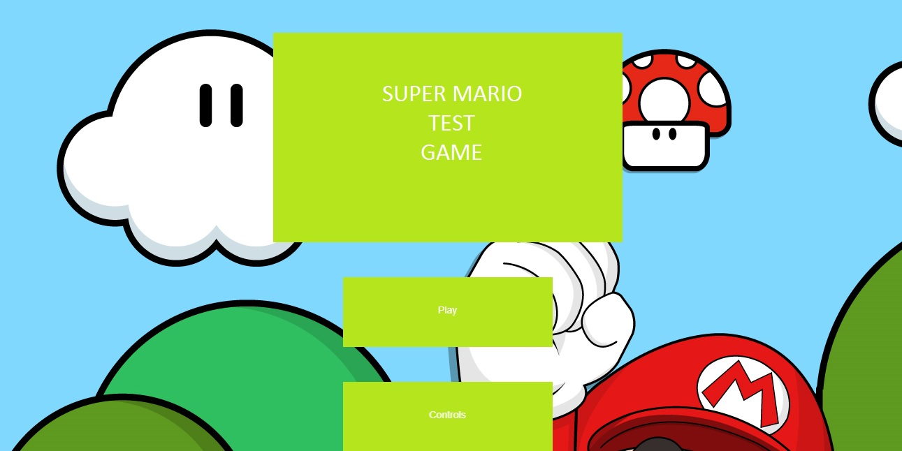
   
   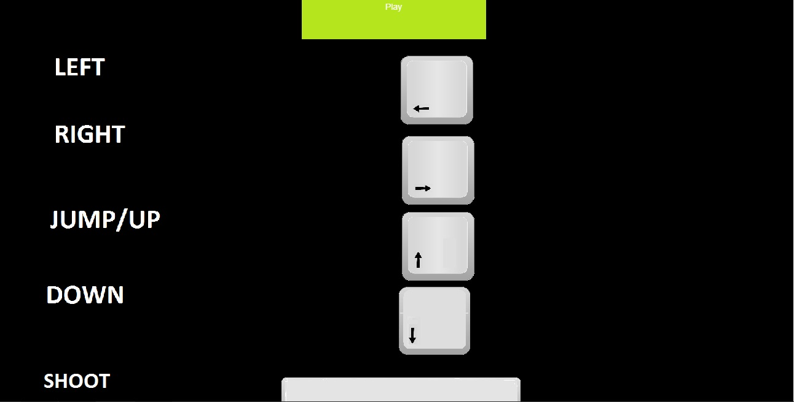
   
   Η αφήγηση που προστέθηκε βοηθά τον χρήστη να ταυτιστεί με τον χαρακτήρα του παιχνιδιού και του δίνει και χρήσιμες πληροφορίες σχετικά με την εξέλιξη του παιχνιδιού.
   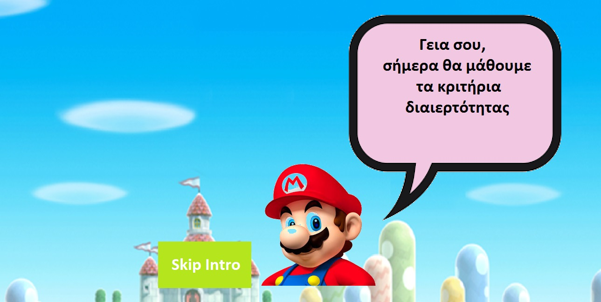
   
   Ο χρήστης μπορεί να επιλέξει με ποιον αριθμό θα παίξει. Οι διαθέσιμοι αριθμοί είναι το 2, το 3, το 5 και το 10.
   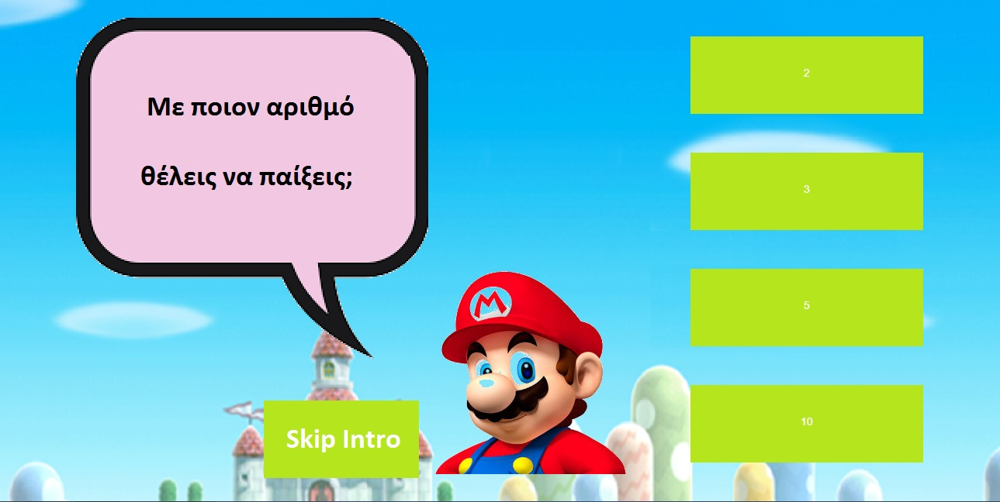
   
   Επίσης ο χρήστης μπορεί να επιλέξει με ποιον χαρακτήρα θέλει να παίξει ανάμεσα στον 'Mario' και τον 'Luigi'.
   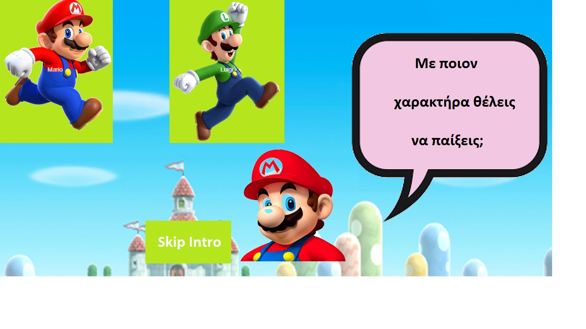
   
   Κατά την διάρκεια της αφήγησης υπάρχει διαθέσιμο ένα κουμπί 'Skip Intro' με το οποίο ο χρήστης μπορεί να αποφύγει την αφήγηση αν το επιθυμεί και να μεταφερθεί κατευθείαν στην επιλογή αριθμού και χαρακτήρα.
 
   Αυτή είναι η αρχική εικόνα του παιχνιδιού με τον χρήστη να ελέγχει τον χαρακτήρα μέσω της 3d person λειτουργίας.
   
   Υπάρχει ένα σύστημα ζωών και ένα σύστημα score. Οι ζωές αρχικά είναι 3 και το score 0. Επίσης στο πάνω αριστερά μέρος της οθόνης, ο χρήστης μπορεί να δει και τον αριθμό που έχει επιλέξει να παίξει.
   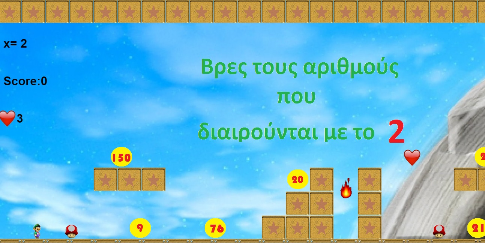
   
  
  
   
  Ο χρήστης πρέπει να βρει 10 αριθμούς που να διαιρούνται ακριβώς με τον αριθμό που έχει επιλέξει. Οι αριθμοί που μπορεί να επιλέξει βρίσκονται κατά μήκος της πίστας. Αν επιλέξει έναν σωστό αριθμό, το score θα αυξηθεί κατά 100, ο αριθμός θα εμφανιστεί στο επάνω μέρος της οθόνης και ο χρήστης θα χρειάζεται έναν λιγότερο αριθμό για να φτάσει στους 10 σωστούς. Αν ο αριθμός που επιλέξει είναι λανθασμένος, τότε θα του εμφανιστεί ένα μήνυμα που θα τον ενημερώνει για τον αντίστοιχο κανόνα διαιρετότητας και ο αριθμός θα εξαφανίζεται.
   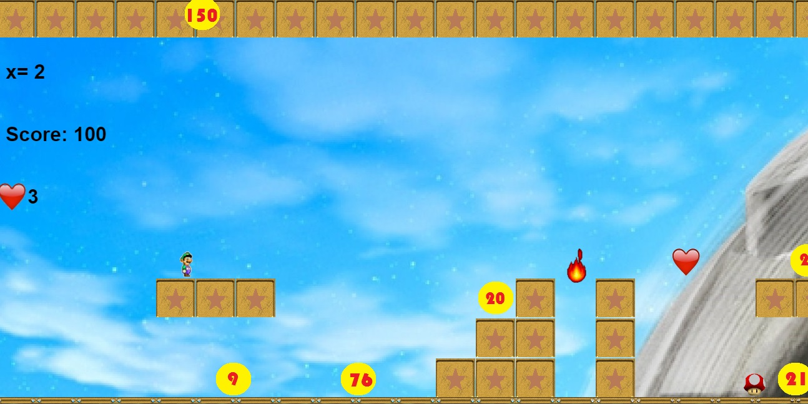
   
   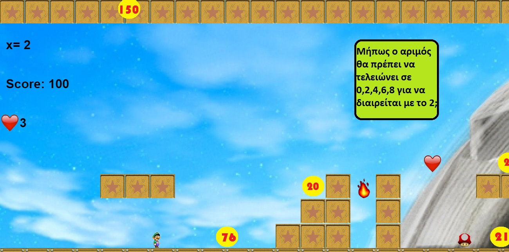
   
   Επίσης έχει προστεθεί η λειτουργία shooting ώστε ο χρήστης να μπορεί να 'σκοτώσει' έναν αριθμό που θεωρεί λανθασμένο και τον εμποδίζει να προχωρήσει παρακάτω. Κάθε φορά που πυροβολεί έναν λανθασμένο αριθμό κερδίζει μια ζωή. Επίσης αν καταφέρει να πυροβολήσει 5 λανθασμένους αριθμούς, τότε ως εκπαιδευτικό bonus, θα υπάρξει στο τέλος της πίστας ένας extra σωστός αριθμός που μπορεί να επιλέξει ο χρήστης και να χρειάζεται έναν αριθμό λιγότερο για να φτάσει στους 10 σωστούς.
   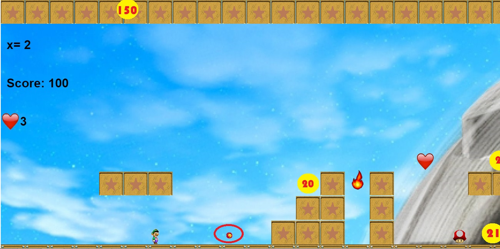
   
   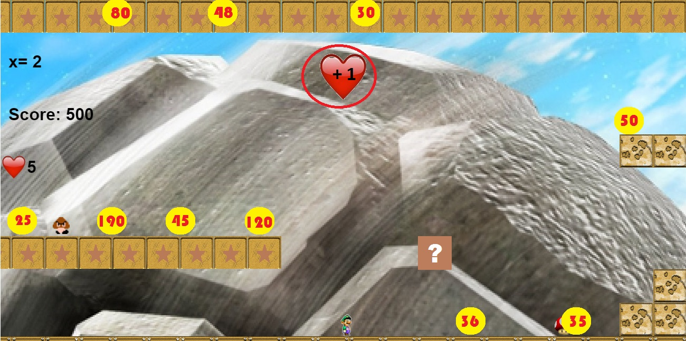
   
   Σαν ένα ακόμα εκαπιδευτικό bonus, όταν ο χρήστης καταφέρει να επιλέξει τους πρώτους 5 σωστούς αριθμούς, θα κερδίσει μια ζωή.
   
   Ακόμα έχουν προστεθεί εχθροί που είναι χαρακτήρες του Super Mario ώστε ο χρήστης να νιώθει πιο γνώριμο το παιχνίδι. Οι εχροί μπορούν να εξουδετερωθούν με την shooting λειτουργία ή αν ο χαρατήρας του παιχνιδιού πηδήξει πάνω τους. Αν όμως ο χρήστης έρθει σε επαφή μαζί τους, τότε χάνει μια ζωή και μεταφέρεται πιο πίσω στην πίστα σε συγκεκριμένο σημείο, ανάλογα με το που βρισκόταν μέσα στην πίστα.
   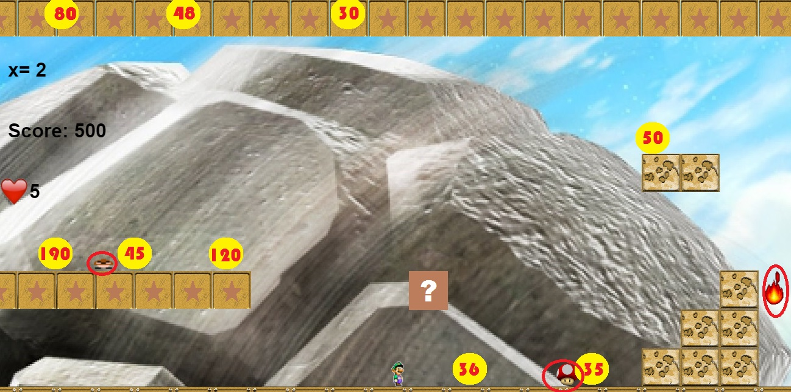
   
   Επίσης υπάρχει μια κρυφή βοήθεια μέσω ενός hint box το οποίο όταν το επιλέξει ο χρήστης, του εμφανίζει τον εκάστοτε κανόνα του κριτηρίου διαιρετότητας.
   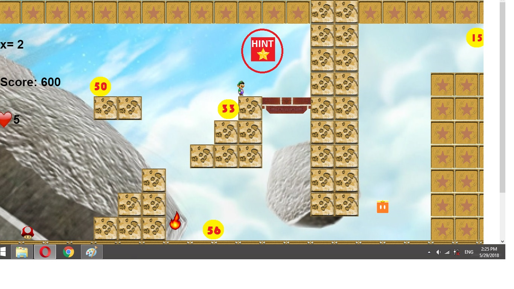
   
   Ακόμα υπάρχουν 2 luckyboxes τα οποία περιέχουν το καθένα έναν κρυμμένο αριθμό. Όταν ο χρήστης χτυπήσει αυτά τα luckyboxes, τότε ο αριθμός εμφανίζεται και ο χρήστης μπορεί να το νεπιλέξει αν θεωρεί πως είναι σωστός.
   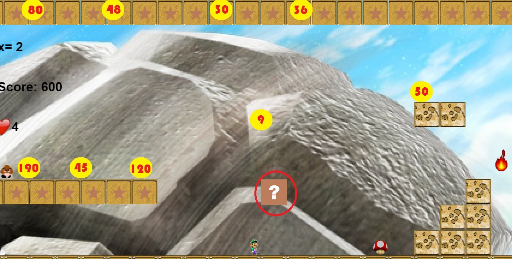
   
   Έχουν προστεθεί κάποια κομμάτια εντός της πίστας όπως ασανσέρ, έλικας και κολώνες τηλεμεταφοράς, ώστε να γίνει το παιχνίδι πιο διασκεδαστικό, πιο οικείο προς τον χρήστη και να αυξηθεί η πρόκληση.
   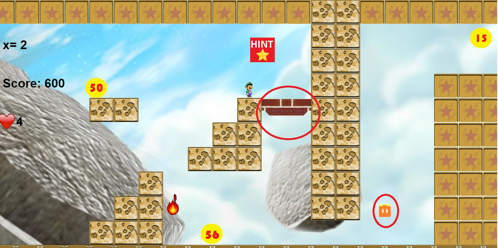
   
   Όταν ο χρήστης φτάσει στο τέλος της πίστας, αν επέλεξε σωστά 10 αριθμούς θα υπάρχει ένα κλειδί που θα τον οδηγεί στην οθόνη νίκης. Αντίστοιχα, αν δεν έχει βρει 10 σωστούς αριθμούς, θα υπάρχει μια πόρτα που θα τον οδηγεί στην οθόνη ήττας που θα τον ενθαρρύνει να ξαναπροσπαθήσει. 
   
   
   Αν κατά την διάρκεια του παιχνιδιού φτάσει τις 0 ζωές, τότε θα οδηγηθεί αυτόματα στην οθόνη ήττας.
  
   Ακόμα έχουν προστεθεί Learning Analytics. Είτε ο χρήστης οδηγηθεί στην οθόνη νίκης, είτε στην οθόνη ήττας, θα μπορέσει να δει κάποια δεδομένα αποτελεσμάτων σχετικά με το τι κατάφερε να κάνει κατά την διάρκεια του παιχνιδιού. Αρχικά μπορεί να δει πόσους σωστούς αριθμούς κατάφερε να επιλέξει μέσα στο παιχνίδι. Επίσης μπορεί να δει πόσοι ήταν συνολικά οι σωστοί αριθμοί που μπορούσε να επιλέξει μέσα στο παιχνίδι. Ακόμη μπορεί να δει πόσους αριθμούς επέλεξε λάθος. Τέλος μπορεί να δει ποιους αριθσμούς συγκεκριμένα επέλεξε λάθος.
   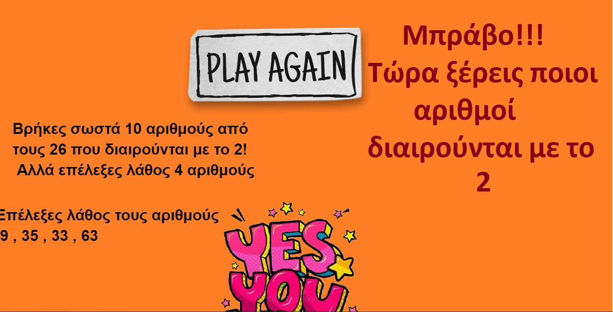
   
   Τέλος έχει προστεθεί να κουμπί 'Play again' ωστέ να μπορεί ο χρήστης να ξαναπαίξει το παιχνίδι.
   
   
   
  
  
  
  Χρονοδιάγραμμα
  
 1.Δήλωση θέματος και αρχικό πλάνο - εώς 15 Νοεμβρίου.
 
 2.Κατάληξη στην μορφή του παιχνιδιού. Αν δηλαδή για παράδειγμα λειτουργεί ως shooting παιχνίδι ή αν ο χαρακτήρας θα πρέπει να πέσει πανω στους αριθμούς μετά από δοκιμές, καθώς και άλλες δοκιμές σε ιδδές που μπορεί να προκύψουν - έως 9 Δεκεμβρίου
 
 3.Προσθήκη νέων λειτουργιών στο παιχνίδι - έως 15 Ιανουαρίου
 
 4.Αλλαγές μετά από δοκιμές και ολοκλήρωση του μεγαλύτερου μέρους της εφαρμογής αν οι δοκιμές και οι λειτουργίες δείξουν ότι είναι στο   επίπεδο που θέλουμε - έως 15 Φευρουαρίου
 
 5.Συγγραφή του πρώτου κομματιού της αναφοράς - έως 15 Μαρτίου
 
 6.Συγγραφή του δεύτερου κομματιού της αναφοράς - έως 15 Απριλίου
 
 7.Τελικό προσχέδιο αναφοράς και παρουσίασης για σχολιασμό - έως 15 Μαΐου.

 8.Τελική αναφορά και παρουσίαση - 1η Ιουνίου
  
