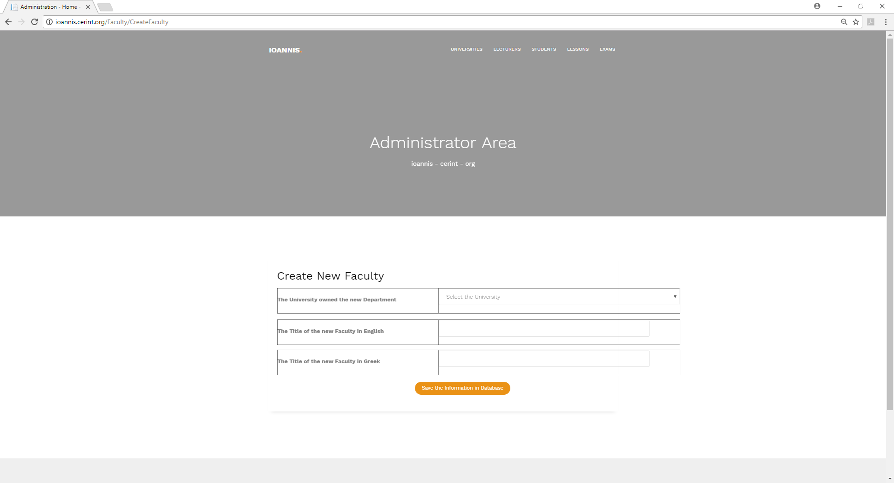
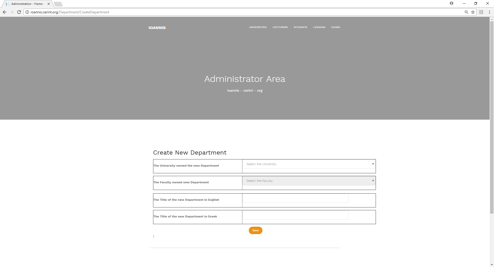
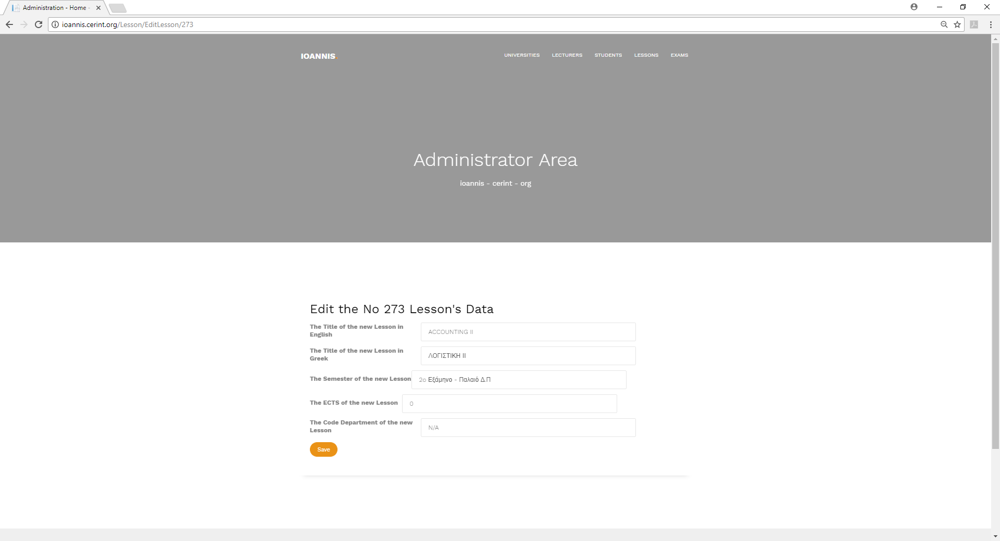
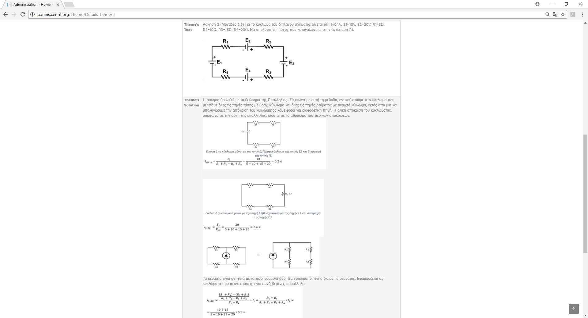

ΤΑΞΙΝΟΜΗΣΗ ΚΑΙ ΧΑΡΑΚΤΗΡΙΣΤΙΚΑ ΤΩΝ ΚΟΙΝΩΝΙΚΩΝ ΔΙΚΤΥΩΝ
====================================================

Εισαγωγή
--------

Γίνεται φανερό πως εξαιτίας του πλήθους των κοινωνικών δικτύων που εμφανίζονται
καθημερινά στον κυβερνοχώρο, ότι είναι απαραίτητη η περαιτέρω ταξινόμησή τους
ανά κατηγορία. Αυτό που μπορεί να θεωρηθεί σίγουρα είναι ότι η ταξινόμηση των
κοινωνικών δικτύων πρέπει να γίνεται με βάση τις εφαρμογές που πρέπει η κάθε
κατηγορία να εξυπηρετεί. Η κατηγοριοποίηση των κοινωνικών δικτύων γίνεται
βασιζόμενη σε διάφορες θεωρίες που αναπτύσσονται στην έρευνα των μέσων και για
τις κοινωνικές διαδικασίες που αποτελούν τα δύο βασικά χαρακτηριστικά των
κοινωνικών μέσων.

Μια από τις θεωρίες που σχετίζονται με τα κοινωνικά μέσα είναι η θεωρία της
κοινωνικής παρουσίας σύμφωνα με την οποία τα μέσα διαφέρουν στον βαθμό της
«κοινωνικής παρουσίας». Με τον όρο «κοινωνική παρουσία» εννοείται η ακουστική,
οπτική και φυσική επαφή που μπορεί να επιτευχθεί και επιτρέπει την επικοινωνία
μεταξύ δυο ατόμων. Η κοινωνική παρουσία επηρεάζεται από την οικειότητα και την
αμεσότητα του μέσου και μπορεί να έχει μικρότερο βαθμό διαμεσολάβησης από
διαπροσωπικές σχέσεις, σύγχρονη και ασύγχρονη επικοινωνία. Σε κάθε περίπτωση όσο
μεγαλύτερη είναι η κοινωνική παρουσία τόσο μεγαλύτερη είναι η κοινωνική επίδραση
που ασκείται ανάμεσα στους εταίρους της επικοινωνίας[[1]](#bookmark152).

Με βάση αυτά η ταξινόμηση των κοινωνικών μέσων μπορεί να πραγματοποιηθεί με βάση
τον εμπλουτισμό του μέσου και το βαθμό της κοινωνικής παρουσίας που επιτρέπουν.
Το βασικό στοιχείο των κοινωνικών δικτύων είναι η αυτοπροβολή του χρήστη η οποία
ορίζεται ως η κοινωνική αλληλεπίδραση ανάμεσα στους ανθρώπους που έχουν την τάση
να ορίζουν τις εντυπώσεις που έχουν οι άλλοι για αυτούς[[2]](#bookmark153). Αυτό
μπορεί να επιτευχθεί επηρεάζοντας τους άλλους για να κερδίσουν ανταμοιβές ή
δημιουργώντας μια εικόνα ταυτόσημη με την ταυτότητά τους. Για παράδειγμα ο
κύριος λόγος που κάποιος δημιουργεί μια προσωπική ιστοσελίδα είναι το ότι θέλει
να προβάλλει τον εαυτό του στους άλλους.

Η αυτοπροβολή είναι το βασικό στοιχείο στα κοινωνικά μέσα και περιλαμβάνει την
συνειδητή ή ασυνείδητη παρουσίαση προσωπικών πληροφοριών που υποβοηθούν στην
εικόνα που θέλει ο χρήστης να δημιουργήσει για τον εαυτό του. Η αυτοπροβολή
βοηθάει στη δημιουργία στενών σχέσεων ακόμα και μεταξύ αγνώστων. Κατά συνέπεια
μια δεύτερη ταξινόμηση των κοινωνικών δικτύων μπορεί να γίνει ανάλογα με το
βαθμό αυτοπροβολής των χρηστών τους και το είδος της αυτοπαρουσίασης τους που
επιτρέπουν.

Με βάση τα παραπάνω τα blogs, τα δίκτυα κοινωνικής δικτύωσης (π.χ Facebook) και
οι εικονικοί κοινωνικοί κόσμοι απαιτούν υψηλό βαθμό αυτοπροβολής και
αυτοπαρουσίασης ενώ τα συνεργατικά έργα (π.χ Wikipedia), οι κοινότητες όπως το
Youtube και τα εικονικά παιχνίδια απαιτούν χαμηλότερο βαθμό αυτοπροβολής του
χρήστη. Στο κεφάλαιο αυτό γίνεται εκτενής αναφορά των κοινωνικών μέσων με βάση
αυτές τις δύο διαστάσεις ανά κατηγορία κοινωνικού μέσου.

Συνεργατικά έργα
----------------

Με τον όρο συνεργατικά έργα εννοείται η ταυτόχρονη δημιουργία του περιεχομένου
μιας σελίδας από πολλούς τελικούς χρήστες. Η κατηγορία αυτή περιλαμβάνει τα
wikis που είναι κείμενα τα οποία επιτρέπουν στους χρήστες να προσθέτουν,
μετακινούν και να αλλάζουν το περιεχόμενό τους και τους κοινωνικούς
σελιδοδείκτες που επιτρέπουν την ομαδοποίηση των ιστοσελίδων ή του περιεχόμενου
των μέσων. Τα συνεργατικά έργα βασίζονται στην άποψη πως η συνδυασμένη
προσπάθεια πολλών χρηστών μπορεί να επιτύχει καλύτερα αποτελέσματα από ότι
μπορεί να πετύχει καθένας μόνος του[[3]](#bookmark154).

Blogs
-----

Τα blogs είναι ισοδύναμα κοινωνικά μέσα με τις προσωπικές ιστοσελίδες και μπορεί
να έχουν διάφορες μορφές όπως προσωπικά ημερολόγια που περιγράφουν τη ζωή των
συγγραφέων μέχρι την καταγραφή των σχετικών πληροφοριών σε μια συγκεκριμένη
περιοχή. Τα blogs δημιουργούνται συνήθως από ένα άτομο αλλά δίνουν την
δυνατότητα αλληλεπίδρασης με άλλα άτομα μέσω της προσθήκης σχολίων. Τα blogs
μπορεί να έχουν τη μορφή κειμένων στο περιεχόμενο τους ενώ, στην σύγχρονη μορφή
τους μπορεί να περιλαμβάνουν επίσης βίντεο ή άλλα μέσα. Το κύριο αντικείμενο των
κοινοτήτων περιεχομένου είναι η κοινή χρήση του περιεχομένου των μέσων ανάμεσα
στους χρήστες. Οι κοινότητες περιεχομένου υπάρχουν για ένα ευρύ πεδίο διαφόρων
στοιχείων όπως κείμενα, φωτογραφίες, βίντεο και παρουσιάσεις. Οι χρήστες σε
αυτές τις κοινότητες δεν χρειάζεται να δημιουργούν προσωπικές σελίδες και αν το
κάνουν αυτές οι σελίδες περιλαμβάνουν μόνο βασικές πληροφορίες όπως η μέρα που
έγινε ο χρήστης μέλος της κοινότητας και ο αριθμός των βίντεο που μοιράζεται με
άλλους χρήστες. Οι συγκεκριμένες κοινότητες όμως έχουν το μειονέκτημα πως
αναπαράγουν βίντεο και υλικό το οποίο υπόκειται σε πνευματικά δικαιώματα με
αποτέλεσμα πολλές φορές να αναπαράγεται και να μοιράζεται υλικό ανάμεσα στους
χρήστες που δεν θα έπρεπε. Από την άλλη μεριά η δημοφιλικότητα των συγκεκριμένων
καναλιών επικοινωνίας μπορεί να λειτουργήσει θετικά για διαφημιστικούς
σκοπούς[[4]](#bookmark155).

Ιστοσελίδες κοινωνικής δικτύωσης
--------------------------------

Οι ιστοσελίδες κοινωνικής δικτύωσης είναι εφαρμογές που επιτρέπουν στους χρήστες
τους να συνδέονται δημιουργώντας το προφίλ τους που περιέχει προσωπικές
πληροφορίες να προσκαλούν φίλους τους και συνεργάτες να έχουν πρόσβαση σε αυτά
τα προφίλ και να ανταλλάσσουν ηλεκτρονικά μηνύματα ή άμεσα μηνύματα μεταξύ τους.
Αυτά τα προσωπικά προφίλ μπορούν να περιλαμβάνουν κάθε είδος πληροφορίας
συμπεριλαμβανομένου φωτογραφιών, βίντεο, ηχητικών αρχείων και ιστοσελίδων. Η πιο
γνωστή ιστοσελίδα κοινωνικής δικτύωσης είναι το Facebook [[5]](#bookmark156).

Ένα κοινωνικό δίκτυο όπως προκύπτει από τα παραπάνω μπορεί να οριστεί ως μια
οριοθετημένη ομάδα συνδεόμενων κοινωνικών μονάδων. Ο συγκεκριμένος ορισμός
εισάγει τρία βασικά χαρακτηριστικά του κοινωνικού δικτύου. Αρχικά ορίζεται πως
το κοινωνικό δίκτυο έχει όρια γεγονός που προσδιορίζει τα μέλη που μπορεί να
έχει ένα δίκτυο[[6]](#bookmark157).

Το δεύτερο βασικό χαρακτηριστικό των κοινωνικών δικτύων είναι η συνεκτικότητα
τους. Βασική προϋπόθεση για να είναι μέρος ενός κοινωνικού δικτύου ένα άτομο θα
πρέπει να έχει πραγματικούς δεσμούς ή εν δυνάμει δεσμούς με τουλάχιστον ένα από
τα ήδη υπάρχοντα μέλη του δικτύου. Τέλος το τρίτο βασικό χαρακτηριστικό των
κοινωνικών δικτύων είναι ο ορισμός της κοινωνικής μονάδας. Η ανάλυση των δικτύων
αποτελεί αντικείμενο που αφορά σε διάφορες κοινωνικές μονάδες οι οποίες μπορεί
να είναι μεμονωμένες ομάδες όπως στην περίπτωση υποστήριξης των κοινωνικών
δικτύων ή μπορεί να αφορά κοινωνικές υπηρεσίες σε τοπικές κοινωνίες ή
οργανισμούς και εταιρείες[[6]](#bookmark157).

Οι ιδιότητες των κοινωνικών δικτύων ταξινομούνται σε δύο μεγάλες κατηγορίες
[[6]](#bookmark157): τις σχετικές και τις δομικές ιδιότητες. Οι σχετικές
ιδιότητες εστιάζουν στην σχέση ανάμεσα στα μέλη του δικτύου και στην μορφή αυτών
των σχέσεων και χαρακτηρίζονται από το περιεχόμενο των συναλλαγών τους και από
τη φύση των σχέσεων. Οι δομικές ιδιότητες ενός κοινωνικού δικτύου περιγράφουν
τον τρόπο με τον οποίο τα μέλη ενός κοινωνικού δικτύου συνδέονται μεταξύ τους
και περιλαμβάνει τρεις (3) κατηγορίες [[7]](#bookmark158):

-   τα μεμονωμένα μέλη του δικτύου

-   τις υποομάδες

-   τα συνολικά δίκτυα.

Οι χρήστες και η χρήση των κοινωνικών δικτύων
---------------------------------------------

Οι χρήστες των κοινωνικών δικτύων πρωταρχικά ανήκουν στην κατηγορία των νέων
ανθρώπων. Υπάρχει μία ιστοσελίδα, η comStore.com [[8]](#bookmark159) στην οποία
παρέχονται πληροφορίες σχετικά με τη χρήση του διαδικτύου παγκοσμίως και σύμφωνα
με την οποία η μεγαλύτερη χρήση διαδικτύου και κοινωνικών δικτύων
πραγματοποιείται στην Ασία, ακολουθεί η Ευρώπη και η Νότιος Αμερική και τέλος η
Αυστραλία. Επίσης το ποσοστό χρήσης των κοινωνικών δικτύων διαφέρει από χώρα σε
χώρα [10].

Εικόνα 1 Οι χρήστες του Internet στον Κόσμο [[9]](#bookmark160)

Το γεγονός πως τα κοινωνικά δίκτυα γνωρίζουν μεγάλη δημοφιλικότητα η οποία
αυξάνεται ραγδαία, μπορεί να εξηγηθεί κατά κύριο λόγο από το γεγονός πως τα
κοινωνικά δίκτυα ικανοποιούν την ανθρώπινη ανάγκη να διερευνούν και να συζητούν
για τις ανθρώπινες σχέσεις [[14]](#bookmark165). Η ανάγκη αυτή έχει μελετηθεί
από την ψυχολογία και έχει βρεθεί ως μια πρωτόγονη ανάγκη που βοηθάει στην
κοινωνικοποίηση των ανθρώπων αλλά και στη δημιουργία αμυνών απέναντι σε
καταστάσεις όπως την αντιμετώπιση της ζήλιας από τις γυναίκες ή την
ανταγωνιστικότητα που αναπτύσσεται ανάμεσα στους άνδρες. [[14]](#bookmark165).

Πολλές από τις πληροφορίες που παρέχονται από τα κοινωνικά δίκτυα αφορούν στις
σχέσεις και στα χαρακτηριστικά των φίλων και γνωστών δηλαδή πόσους φίλους έχει
στο δίκτυο κάποιος, που μένουν που εργάζονται και τι κάνουν κάθε στιγμή
[[15]](#bookmark166). Ανάλογα με τις δυνατότητες του κοινωνικού δικτύου
παρέχονται και τα κατάλληλα κίνητρα για τη χρήση του. Για παράδειγμα έχει βρεθεί
πως το βασικό κίνητρο για τη χρήση ενός κοινωνικού δικτύου όπως το Facebook
είναι η ανάγκη για επικοινωνία ή το μοίρασμα με άλλους χρήστες φωτογραφιών και
προσωπικών απόψεων, ψυχαγωγία μέσω των παιχνιδιών που αυτό προσφέρει αλλά και η
παρακολούθηση της ζωής των ανθρώπων[[16]](#bookmark167).

Εκτός από τους λόγους χρήσης των κοινωνικών δικτύων στη βιβλιογραφία αναφέρονται
και αιτίες μη χρήσης του. Έτσι τα κοινωνικά δίκτυα αποφεύγεται να
χρησιμοποιούνται όταν οι χρήστες δεν είναι σίγουροι για την ασφάλεια την οποία
παρέχουν ή όταν δεν έχουν συνεχή πρόσβαση στο δίκτυο ενώ καταγράφονται και
απόψεις σχετικά με το πόσο ανούσια είναι η συμμετοχή σε
αυτά[[14]](#bookmark165).

ΑΝΑΛΥΣΗ ΚΟΙΝΩΝΙΚΟΥ ΔΙΚΤΥΟΥ
==========================

Εισαγωγή
--------

Όπως ήδη αναφέρθηκε το κοινωνικό δίκτυο είναι μια κοινωνική δομή που
σχηματίζεται από μεμονωμένα άτομα που αποτελούν τους κόμβους και οι οποίοι
συνδέονται μεταξύ τους με ένα ή περισσότερα είδη αλληλεξάρτησης όπως η φιλία, τα
κοινά ενδιαφέροντα, τα οικονομικά συμφέροντα, οι σεξουαλικές σχέσεις τα κοινά
πιστεύω κλπ.

Η ανάλυση ενός κοινωνικού δικτύου εξετάζει τις κοινωνικές σχέσεις σε όρους
θεωρίας δικτύου που αποτελείται από κόμβους και δεσμούς. Οι κόμβοι είναι τα
μεμονωμένα στοιχεία του δικτύου ενώ οι δεσμοί οι σχέσεις που συνδέουν τα
συγκεκριμένα στοιχεία. Το αποτέλεσμα της σύνδεσης μεταξύ των κόμβων είναι ο
σχηματισμός ενός χάρτηγραφήματος που τις περισσότερες φορές είναι ιδιαίτερα
σύνθετος. Διάφορες έρευνες έχουν δείξει πως τα κοινωνικά δίκτυα επιδρούν σε
διάφορους τομείς από το επίπεδο της οικογένειας μέχρι και στις σχέσεις μεταξύ
ανθρώπων διαφορετικών εθνών ενώ έχουν ρόλο και στην επίλυση προβλημάτων και στον
τρόπο διαχείρισης των επιχειρήσεων.

Στο κεφάλαιο αυτό θα αναλυθεί το κοινωνικό δίκτυο ως μια χαρτογράφηση
συγκεκριμένων στοιχείων ανάμεσα στους συγκεκριμένους κόμβους. Θα παρουσιαστούν
τα διάφορα στοιχεία ενός κοινωνικού δικτύου και θα γίνει μια σύντομη αναφορά στη
θεωρία του κοινωνικού δικτύου πάνω στην οποία βασίζεται η ανάλυση του.

Ο ορισμός του δικτύου
---------------------

Σύμφωνα με τη θεωρία των δικτύων το δίκτυο μπορεί να οριστεί ως ένα σύνολο
σχέσεων. Σε μια πιο τυπική μορφή το δίκτυο αποτελείται από ένα σύνολο
αντικειμένων που μαθηματικά ονομάζονται κόμβοι και από τη χαρτογράφηση δηλαδή
την περιγραφή των σχέσεων ανάμεσα στους κόμβους[[17]](#bookmark168).

Η απλούστερη μορφή δικτύου αποτελείται από δύο κόμβους οι οποίοι μπορεί να
συνδέονται με διαφορετικούς τρόπους μεταξύ τους είτε με μια απλή σχέση είτε με
αμφίδρομες σχέσεις[[17]](#bookmark168). Εκτός από την άμεση σύνδεση των κόμβων ή
την έλλειψή της οι σχέσεις που συνδέουν δύο κόμβους μπορεί να είναι κάτι
περισσότερο από ένα κοινό χαρακτηριστικό. Εκτός από την σύνδεση απλών κόμβων
είναι εφικτή σύμφωνα με την θεωρία των δικτύων και η σύνδεση ανάμεσα σε ζεύγη
κόμβων η οποία πραγματοποιείται με τη βοήθεια ενός ενδιάμεσου κόμβου.
[[17]](#bookmark168).

Αναδρομή στην ιστορία της ανάλυση των κοινωνικών δικτύων
--------------------------------------------------------

H ανάπτυξη της ανάλυσης των κοινωνικών δικτύων όπως ήδη έχει αναφερθεί ξεκινάει
από τις προσεγγίσεις στη δομή και στις αναπτυσσόμενες σχέσεις όπως αυτές
εμφανίζονται στην κλασσική επιστήμη της κοινωνιολογίας. Για πολλούς θεωρητικούς
που ασχολούνταν με την κοινωνιολογική πλευρά των κοινωνικών δικτύων αυτά
αποτελούσαν στην αρχική τους ιδέα μια μορφή αλληλεπίδρασης που μεταφέρει και
περιέχει διάσπαρτα στοιχεία που καθορίζουν τις ενέργειες των ατόμων. Αυτή η
βασική ιδέα χρησιμοποιήθηκε στις αρχές του 20ου αιώνα για τη διερεύνηση και τη
διατύπωση των χαρακτηριστικών της θεωρίας ανάλυσης των κοινωνικών
δικτύων[[18]](#bookmark169).

Η πρώτη μαθηματική διατύπωση των κοινωνικών δικτύων πραγματοποιήθηκε στις αρχές
του 1930 όπου για πρώτη φορά ο Wiese αντιστοίχησε σημεία του δικτύου σε
«ετικέτες» σημειώνοντας τα με γράμματα και εισήγαγε ως έννοιες την αμεσότητα και
την περιοδικότητα των συνδέσεων[[18](#bookmark169)].Η πρώτη εμπειρική έρευνα που
πραγματοποιήθηκε σε μικρές ομάδες και κοινότητες βασίστηκε στα ψυχολογικά και
ψυχαναλυτικά αίτια της δημιουργίας φιλιών στο σχολικό περιβάλλον.
[[19](#bookmark170)].

O Moreno [[20]](#bookmark171) εισήγαγε πρώτος στις αρχές τις δεκαετίας του 1930
τυπικές μορφές απεικόνισης των κοινωνικών σχέσεων που αναπτύσσονται ανάμεσα στα
παιδιά με σκοπό την μέτρηση και την απεικόνιση των κοινωνικών σχέσεων. Κατά
συνέπεια αυτός πρώτος εισήγαγε τους όρους κοινωνιομετρία και κοινωνιογράμματα.
Στην πραγματικότητα, ο Moreno παρατήρησε την αλληλεπίδραση των παιδιών και
μέτρησε των αριθμό των επιλογών φιλίας που πραγματοποίησε και έλαβε από
διαφορετικά μέλη της τάξης που επέλεξε ως δείγμα και συνδύασε τα δεδομένα του σε
κοινωνιογράμματα. Σε αυτά κάθε παιδί αποτελούσε ένα σημείο και οι επιλεγμένοι
φίλοι του απεικονίζονταν σαν γραμμές με βέλη. Τα βέλη κατευθύνονταν προς την
επιλογή που έκανε κάθε παιδί. Οι επιλογές χωρίζονταν σε εξερχόμενες οι οποίες
κατευθύνοντας από το παιδί προς τους άλλους και σε εισερχόμενες στις οποίες κάθε
παιδί αποτελούσε επιλογή κάποιου άλλου. Με τη συγκεκριμένη μέθοδο ήταν εφικτός ο
προσδιορισμός τόσο των «δημοφιλών» παιδιών στην τάξη όσο και των «απομονωμένων»
παιδιών δηλαδή των παιδιών που έχουν λίγους ή καθόλου
φίλους[[20]](#bookmark171).

Εικόνα 2 Το σοσιόγραμμα του Moreno[[20]](#bookmark171)

Μια μεταγενέστερη προσέγγιση από αυτή του Moreno ήταν αυτή του Lewin, o οποίος
προσπάθησε να αποδείξει πως οι κοινωνικές δομές των ομάδων αποτελούν τα μέσα με
τα οποία οργανώνονται και κατασκευάζονται οι πράξεις. Η έρευνα του Lewin
αποτέλεσε έναυσμα για τη δημιουργία μαθηματικών μοντέλων για την περιγραφή της
δομής των ομάδων και την ανάπτυξη της γραφικής θεωρίας μέσω της οποίας μπορεί να
μελετηθούν οι τυπικές ιδιότητες ενός δικτύου. Η γραφική θεωρία εισήγαγε για
πρώτη φορά τις έννοιες της πυκνότητας και του επίκεντρου στα κοινωνικά δίκτυα.

Τα σημεία με τα οποία αναπαρίστανται τα τυπικά μοντέλα της δομής του δικτύου
είναι το Υ η αλυσίδα και ο κύκλος και οι δομές αυτές θεωρείται πως επιδρούν
διαφορετικά στην επικοινωνία ανάμεσα στα άτομα με δεδομένο ότι κάποια άτομα θα
είναι τοποθετημένα σε κεντρικές θέσεις και κάποια άλλα σε περιφερειακές. Τα πιο
δυναμικά μέλη μιας ομάδας θεωρείται πως ανήκουν στο κέντρο σχηματισμών
«αστεριών». Μεγάλη ερευνητική δραστηριότητα έχει παρατηρηθεί σχετικά με τους
τρόπους με τους οποίους συσχετίζονται οι ομάδες και μπορούν να ενισχύσουν ή να
περιορίσουν τη δυναμική τους στο δίκτυο που συμμετέχουν[[21]](#bookmark172).

Η ανάπτυξη της τεχνολογίας και ιδιαίτερα των ηλεκτρονικών υπολογιστών τη
δεκαετία του 1960 οδήγησε σε διεύρυνση της ιδέας των κοινωνικών δικτύων. Μια από
τις απόψεις που διατυπώθηκαν ήταν πως οι σχέσεις φιλίας μπορούσαν να αποτελέσουν
πηγές πληροφόρησης για διάφορα θέματα όπως για την αναζήτηση εργασίας
διατυπώνοντας την πεποίθηση πως οι πιο χρήσιμες πληροφορίες μπορούν να αντληθούν
ακόμα και από απομακρυσμένες συνδέσεις[[22]](#bookmark173).

Οι μικρές κοινωνικές ομάδες μελετήθηκαν από τον Homans [[23]](#bookmark174) ο
οποίος χρησιμοποίησε τις κοινωνιομετρικές ιδέες της συχνότητας και της
κατεύθυνσης των κοινωνικών σχέσεων όπως επίσης και τις μεθόδους πινακοποίησης
για τον καθορισμό των στενών κοινωνικών ομάδων. Η γραφική θεωρία χρησιμοποιήθηκε
επίσης για τη μέτρηση της απόστασης από ένα μεμονωμένο άτομο σε ένα άλλο με βάση
τον αριθμό των συνδέσεων που απαιτούνται για την σύνδεση μεταξύ τους. Σε ένα
κοινωνιόγραμμα η φυσική διευθέτηση των σημείων περιορίζεται μόνο από την
προσπάθεια να ελαχιστοποιηθεί η απόσταση ανάμεσα στις γραμμές. Το μέτρο της
φυσικής απόστασης απαιτεί μια μη αυθαίρετη αναπαράσταση των
δεδομένων[[24]](#bookmark175) [25].

Μια πιο τυπική ιδέα του κοινωνικού χώρου διαμορφώθηκε με ψυχολογικές μεθόδους
κλιμακοποίησης και υπέδειξε τη σχετική δύναμη των συμπεριφορών οδηγώντας στην
προσπάθεια να μετρηθεί η συμπεριφορά του ατόμου σε έναν χώρο και να συσχετιστεί
με τη νόηση.Στο σχεδιασμό των δικτύων ιδιαίτερη έμφαση δόθηκε στην απεικόνισή
τους για την οποία χρησιμοποιήθηκαν δυο μέθοδοι [[26]](#bookmark177): η ανάλυση
παραγόντων και η ανάλυση των βασικών στοιχείων που και οι δυο εστιάζουν στην
κατασκευή κοινωνικών χώρων μικρότερων διαστάσεων στους οποίους μπορούν να
αναπαρασταθούν τα πλέγματα των ατόμων αλλά και των θέσεων τους
[[26]](#bookmark177) [27].

Οι πιο πολλές από τις αρχικές έρευνες που πραγματοποιήθηκαν για την ανάλυση των
κοινωνικών δικτύων ήταν στατικές και περιγραφικές ενώ αντιμετώπιζαν τα
χαρακτηριστικά των κοινωνικών δικτύων σαν να υπήρχαν σε δεδομένες χρονικές
στιγμές, χωρίς να προσπαθούν να περιγράψουν την δυναμική των συγκεκριμένων
δικτύων[[18]](#bookmark169). Τα τελευταία χρόνια όμως αρχίζει να εμφανίζεται και
το ενδιαφέρον για τη δυναμική των δικτύων.

Η ανάλυση του κοινωνικού δικτύου
--------------------------------

Η ανάλυση του κοινωνικού δικτύου αποτελεί μια σοβαρή και κύρια τεχνική η οποία
έχει τις ρίζες της στις κοινωνικές επιστήμες. Η ιδέα του κοινωνικού δικτύου για
περισσότερο από έναν αιώνα χρησιμοποιήθηκε για τη συρραφή σύνθετων ομάδων
σχέσεων των κοινωνικών συστημάτων σε όλες τις κλίμακες, από τα μικρά
οικογενειακά δίκτυα που εκφράζουν διαπροσωπικές σχέσεις στα μεγάλα διεθνή
δίκτυα[[28]](#bookmark179).

O πρώτος που χρησιμοποίησε τον όρο κοινωνικό δίκτυο ήταν ο Barnes το 1954 για να
ορίσει τους δεσμούς και τις έννοιες που χρησιμοποιούνται παραδοσιακά από το
κοινό αλλά και από τους κοινωνιολόγους. Τέτοιες χαρακτηριστικές έννοιες είναι
οριακές ομάδες όπως για παράδειγμα φυλές και η οικογένεια και οι κοινωνικές
ομάδες όπως το φύλλο και η εθνότητα[[28]](#bookmark179).

Σύμφωνα με την ανάλυση των κοινωνικών δικτύων τα δίκτυα διακρίνονται σε πλήρη
δίκτυα στα οποία όλοι οι δεσμοί περιέχουν ειδικές σχέσεις σε έναν προκαθορισμένο
πληθυσμό και σε προσωπικά δίκτυα, τα οποία είναι γνωστά ως εγωκεντρικά δίκτυα
στα οποία οι δεσμοί που υπάρχουν σε προκαθορισμένα άτομα αποτελούν τις
προσωπικές τους κοινότητες[[29]](#bookmark180).H διάκριση ανάμεσα στο πλήρες
δίκτυο και στο εγωκεντρικό δίκτυο γίνεται με βάση το πώς οι αναλυτές συλλέγουν
τα δεδομένα τους. [[30]](#bookmark181).

Με βάση αυτό το διαχωρισμό στα πλήρη δίκτυα όλα τα μέλη που το απαρτίζουν
προσδιορίζονται εκ των προτέρων. Για παράδειγμα ο αναλυτής του δικτύου γνωρίζει
από την αρχή τα ονόματα όλων των ανθρώπων σε μια εταιρεία, σε ένα σχολείο ή σε
οποιοδήποτε άλλο τυπικό οργανισμό με αποτέλεσμα οι ερευνητές να μπορούν να
ζητάνε από τα μέλη του δικτύου να προσδιορίσουν από την αρχή με ποιον έχουν
σχέση ή με ποιον αλληλεπιδρούν[[31]](#bookmark182)

Εικόνα 3 Αναπαράσταση πλήρους κοινωνικού δικτύου [[54]](#bookmark182)

Στην περίπτωση όμως που οι μεταβολές δεν είναι γνωστές από την αρχή τότε όπως
αναφέρθηκε το δίκτυο είναι εγωκεντρικό. Στην περίπτωση αυτή το δίκτυο παράγει
μια λίστα μεταβολών που αφορούν στη διαδικασία της ολοκλήρωσης μιας έρευνας.
Παράδειγμα αυτής της κατηγορίας των δικτύων μπορεί να θεωρηθεί όταν ένας
αναλυτής δικτύου ενδιαφέρεται να μελετήσει την κοινωνική υποστήριξη που παρέχει
ένα δίκτυο θα πρέπει να μελετήσει εκτός από το στενό κύκλο (συναδέλφους-
οικογένεια) και απομακρυσμένους φίλους τους οποίους όμως δεν μπορεί να γνωρίζει
εκ των προτέρων. Σε αυτό το δίκτυο κάθε μονάδα (ego) δημιουργεί ένα δίκτυο το
οποίο είναι ανεξάρτητο από τα δίκτυα των άλλων μονάδων[[31]](#bookmark182).

Εικόνα 4 Γραφική αναπαράσταση εγωκεντρικού δικτύου[[31]](#bookmark182)

Εκτός από αυτές τις δύο κατηγορίες κοινωνικών δικτύων υπάρχουν και τα υβριδικά
κοινωνικά δίκτυα τα οποία είναι γνωστά ως δίκτυα «χιονοστιβάδας». Τα
συγκεκριμένα δίκτυα ξεκινάνε ως πλήρη δίκτυα και στη συνέχεια επεκτείνονται με
τη προσθήκη μονάδων και μεταβολών και μετατρέπονται σε εγωκεντρικά δίκτυα.
[[31]](#bookmark182).

Εικόνα 5 Δίκτυο σε μορφή χιονοστιβαδας [[31]](#bookmark182).

Η ανάλυση των κοινωνικών δικτύων καθορίζεται από διάφορες αναλυτικές τάσεις.
Καταρχάς κατά την ανάλυση των κοινωνικών δικτύων δεν πραγματοποιείται καμιά
βασική υπόθεση που να θεωρεί τις ομάδες βασικό δομικό στοιχείο της κοινωνίας.
Eπιπλέον εκτός από τη μελέτη των μονάδων (άτομα, οργανισμοί, καταστάσεις) ως
μεμονωμένες μονάδες, εστιάζει και στη δομή των δεσμών και πως αυτοί επηρεάζουν
τα άτομα και τις σχέσεις μεταξύ τους [[28]](#bookmark179). Αντίθετα με τις
αναλύσεις που θεωρούν ότι η κοινωνικοποίηση στο πλαίσιο προτύπων καθορίζει την
ανθρώπινη συμπεριφορά, η ανάλυση των κοινωνικών δικτύων εστιάζει στο πως η δομή
και οι δεσμοί που αναπτύσσονται στο δίκτυο επηρεάζουν τα πρότυπα.

Το σχήμα του κοινωνικού δικτύου βοηθάει στον καθορισμό της χρησιμότητάς του για
τα μεμονωμένα άτομα. Τα μικρότερα δίκτυα μπορεί να είναι λιγότερο χρήσιμα στα
μέλη του δικτύου σε σχέση με τα δίκτυα που έχουν υπερβολικό πλήθος χαλαρών
συνδέσεων μεταξύ των μελών του δικτύου και ατόμων που βρίσκονται έξω από το
δίκτυο. Τα περισσότερα ανοικτά δίκτυα που έχουν πολλούς χαλαρούς δεσμούς και
κοινωνικές συνδέσεις είναι πιο πιθανό να προσφέρουν νέες ιδέες και ευκαιρίες στα
μέλη τους σε σχέση με τα κλειστά δίκτυα που έχουν πολλούς και περιττούς δεσμούς.
Αυτό πρακτικά σημαίνει πως μια ομάδα ατόμων που συνδέονται σε ένα δίκτυο μέσω
φιλίας για παράδειγμα θα μοιράζονται μεταξύ τους την ίδια γνώση και τις ίδιες
ευκαιρίες αντίθετα με τα άτομα που σε ένα δίκτυο συνδέονται με άλλα άτομα από
άλλα κοινωνικά δίκτυα που πιθανώς να έχουν πρόσβαση σε μεγαλύτερο εύρος
πληροφοριών[[18]](#bookmark169).

Αξιοποιώντας τη Δύναμη της Κοινωνικής Δικτύωσης
===============================================

Οι εταιρείες συχνά αργούν να βρουν τον τρόπο με τον οποίο θα αξιοποιήσουν μια
νέα τεχνολογία, χωρίς να την «στραγγαλίσουν» λόγω υπερβολικού ελέγχου. Στα πρώτα
χρόνια λειτουργίας του Διαδικτύου, από τα μέσα και έως τα τέλη της δεκαετίας του
1990, πολλές επιχειρήσεις φοβούνταν ότι οι εργαζόμενοι θα έχαναν χρόνο
σερφάροντας άσκοπα, για αυτό προσπάθησαν να ελέγξουν την πρόσβασή τους σε αυτό.
Παρότι ορισμένοι εργαζόμενοι όντως σέρφαραν άσκοπα, πολλοί ανακάλυψαν τρόπους να
αξιοποιήσουν τη δύναμη του Internet ώστε να βελτιώσουν τη δουλειά τους, και το
διαδίκτυο γρήγορα εξελίχθηκε σε πολύτιμη πηγή πληροφοριών, εξαιρετικό εργαλείο
έρευνας και μέσο παρακολούθησης του ανταγωνισμού.

Η τελευταία τεχνολογική καινοτομία που εμφανίστηκε στον χώρο εργασίας είναι τα
social media - Facebook, LinkedIn, Twitter, Ning, Plaxo, Hi5 και Second Life -
τα οποία έφεραν επανάσταση στον τρόπο που επικοινωνούμε, δημιουργούμε δίκτυα και
ανταλλάσσουμε πληροφορίες.

Τα κοινωνικά δίκτυα αναπτύχθηκαν θεαματικά, οι άνθρωποι τα χρησιμοποιούν παντού,
ακόμη και στον χώρο εργασίας, κι αυτό ανησυχεί τις επιχειρήσεις. Ποιες είναι οι
ανησυχίες αυτές και πόσο ρεαλιστικές είναι;

-   *Μείωση της παραγωγικότητας.* Ενώ σε πρόσφατη έρευνα υπολογίζεται ότι το
    social networking κοστίζει -λόγω μείωσης της παραγωγικότητας- στις
    επιχειρήσεις του Ηνωμένου Βασιλείου 1,38 δις. λίρες ετησίως, δεν είναι σαφές
    πόσο σοβαρό ή διαδεδομένο είναι το πρόβλημα στην πραγματικότητα [40] Σύμφωνα
    με πρόσφατη έρευνα της Manpower, με τη συμμετοχή περίπου 34.400 εργοδοτών
    παγκοσμίως, διαπιστώθηκε ότι μόνο το 20% των εταιρειών διαθέτουν επίσημες
    πολιτικές σχετικές με τη χρήση των social media, και το 63% αυτών αναφέρει
    ότι η πολιτική που εφαρμόζουν βοηθάει στην αποφυγή της μείωσης της
    παραγωγικότητας [41]

-   *Εταιρική Φήμη.* Το 2008 η Virgin Atlantic απέλυσε 13 ιπτάμενους συνοδούς
    που δημοσίευσαν τις πραγματικές τους σκέψεις για την εταιρεία στο Facebook.
    Τέτοια περιστατικά είναι ολοένα πιο συχνά. Ωστόσο, η έρευνα της Manpower
    δείχνει ότι μόνο το 4% των εργοδοτών παγκοσμίως θεωρούν ότι η φήμη τους έχει
    επηρεαστεί αρνητικά από τη χρήση των social media από τους εργαζομένους τους
    [42].

-   Ασφάλεια. Ο διαρκής κίνδυνος που κρύβει η χρήση των social networking sites
    είναι οι εξωτερικές «εισβολές» στα εταιρικά ΙΤ δίκτυα. Τέτοιες επιθέσεις
    μπορεί να οδηγήσουν σε απώλεια απόρρητων πληροφοριών και να δημιουργήσουν
    προβλήματα στα συστήματα πληροφορικής της εταιρείας. Ωστόσο, δεν γνωρίζουμε
    με σαφήνεια πόσο συχνά ευθύνεται η χρήση μέσων κοινωνικής δικτύωσης για
    τέτοιες επιθέσεις και το είδος της ζημιάς που μπορεί να προκληθεί. Τα
    εταιρικά συστήματα ασφάλειας δικτύων μπορούν σίγουρα να συμβάλουν στον
    περιορισμό τέτοιων κινδύνων, μέσω της φραγής πρόσβασης σε συγκεκριμένα
    sites. Και πάλι όμως, μεγάλο μέρος του κινδύνου οφείλεται στη μη ασφαλή
    χρήση του internet από τους εργαζομένους. Μόνο αλλάζοντας αυτές τις
    συμπεριφορές θα μπορέσουν οι εταιρείες να κάνουν ένα σημαντικό βήμα προς την
    ενίσχυση της ασφάλειας.

Είναι γεγονός ότι η κοινωνική δικτύωση εγείρει ζητήματα και ανησυχίες όσον αφορά
τις επιπτώσεις της στην παραγωγικότητα, τη φήμη και την ασφάλεια των
επιχειρήσεων. Η έρευνα της Manpower αποκαλύπτει ότι μόνο 1 στις 5 επιχειρήσεις
έχει θεσπίσει επίσημη πολιτική για τη χρήση εξωτερικών κοινωνικών δικτύων από
τους εργαζομένους, με βασικό στόχο να αποτρέψει τη μείωση της παραγωγικότητας
[43]. Ωστόσο, αυτό δεν σημαίνει ότι οι επιχειρήσεις δεν θα πρέπει να αναπτύξουν
και να εφαρμόσουν συγκεκριμένες κατευθυντήριες γραμμές σχετικά με τη χρήση και
την κατάχρηση της κοινωνικής δικτύωσης.

Προσθέτοντας αξία
-----------------

Οι διαδικασίες εταιρικής διακυβέρνησης όχι μόνο δεν θα πρέπει να περιορίζουν τη
δημιουργικότητα των εργαζομένων, ειδικά όταν αυτή προσθέτει αξία στην
επιχείρηση, αντιθέτως θα πρέπει να συμβάλλουν στη δημιουργία ενός κλίματος που
θα ενθαρρύνει τέτοιες προσπάθειες. Η Manpower συστήνει στις επιχειρήσεις να
αξιοποιήσουν τις δυνατότητες διασύνδεσης που προσφέρει το social networking για
να αντιμετωπίσουν τα ακόλουθα ζητήματα:

-   Παραγωγικότητα. To social networking μπορεί να δώσει πραγματική ώθηση στην
    παραγωγικότητα. Σύμφωνα με την εταιρεία δημοσίων σχέσεων Burson-Marsteller,
    πάνω από τις μισές εταιρείες της λίστας Fortune 100 διατηρούν λογαριασμό στο
    Twitter, κι από αυτές τα δύο τρίτα τον χρησιμοποιούν για λειτουργίες που
    ενισχύουν την παραγωγικότητα, όπως η εξυπηρέτηση πελατών.[44].

-   Συνεργασία. Ο κόσμος της εργασίας έχει ήδη αλλάξει σημαντικά από την
    αυξανόμενη ανάγκη συνεργασίας και την πληθώρα των τεχνολογιών που προάγουν
    την ομαδική εργασία. Περισσότερο από το 91% των εταιρειών που συμμετείχαν σε
    έρευνα της Palo Alto Networks, το 2009, χρησιμοποιούν κάποιο είδος εταιρικής
    πλατφόρμας συνεργασίας[45]. Πώς θα είναι ο τέλειος κόσμος για πολλούς νέους
    εργαζόμενους; «Αντί για περιγραφές θέσεων εργασίας ορίστε εργασιακούς
    στόχους και δώστε τους τα εργαλεία, την ευελιξία και την καθοδήγηση για να
    τους επιτύχουν»[45]. Οι εργοδότες που θα συμφιλιωθούν με την ιδέα αυτής της
    νέας σχέσης με τους εργαζομένους τους, θα είναι αυτοί που θα αξιοποιήσουν
    τις εξαιρετικές δυνατότητες συνεργασίας που προσφέρουν τα social media.

-   Διαχείριση Γνώσης. Εδώ και καιρό οι επιχειρήσεις αναζητούν τρόπους
    «άντλησης» των γνώσεων και των ιδεών που βρίσκονται κλειδωμένες στο μυαλό
    των εργαζομένων τους. H είσοδος των social media στη ζωή μας προσφέρει
    νέους, δημιουργικούς τρόπους συστηματοποίησης αυτής της προσπάθειας. Η
    Capgemini, εταιρεία συμβούλων και υπηρεσιών πληροφορικής, ξεκίνησε ένα
    φιλόδοξο έργο που μέσω blogs και wikis στοχεύει να διασυνδέσει τους 90.000
    υπαλλήλους της.[46].

-   Καινοτομία. Οι επιχειρήσεις που είναι εστιασμένες στην καινοτομία,
    βρίσκονται σε αναζήτηση νέων ιδεών, πέρα από τις επίσημες ομάδες έρευνας και
    ανάπτυξης που διαθέτουν και τις παραδοσιακές διαδικασίες που ακολουθούν. Η
    άνοδος των social media έρχεται να ενισχύσει αυτές τις προσπάθειες «ανοικτής
    καινοτομίας», επιτρέποντας στις εταιρείες να αναπτύξουν κανάλια επικοινωνίας
    με πελάτες, ακαδημαϊκούς και ειδικούς, τους οποίους πριν δεν μπορούσαν να
    προσεγγίσουν.

-   Ευθυγράμμιση και Δέσμευση Εργαζομένων. Η επιτυχία μιας εταιρείας εξαρτάται
    άμεσα από τη ικανότητά της να κρατά τους εργαζομένους της πνευματικά και
    συναισθηματικά δεσμευμένους με την εργασία τους. Τα social media μπορούν να
    λειτουργήσουν ενισχυτικά προς αυτή την κατεύθυνση, αποτελώντας, για
    παράδειγμα, το μέσο για την ανάπτυξη διαλόγου ανάμεσα στους εργαζόμενους και
    τη διοίκηση. Ομοίως, οι εταιρείες που αναπτύσσουν τα δικά τους social
    networks πετυχαίνουν να φέρουν κοντά ομάδες εργαζομένων που βρίσκονται σε
    απομακρυσμένα γραφεία, ενισχύουν το δέσιμο μεταξύ των εργαζομένων και τους
    βοηθούν να λειτουργήσουν πιο αποτελεσματικά στο έργο που έχουν αναλάβει.

-   Προσλήψεις. Τα μέσα κοινωνικής δικτύωσης, ιδίως εκείνα που έχουν
    επαγγελματικό χαρακτήρα, όπως το LinkedIn, μπορούν να λειτουργήσουν ως μέσα
    για την ανάπτυξη επαγγελματικών επαφών και προσέλκυσης υποψηφίων. Μελέτη της
    Deloitte αποκαλύπτει ότι το 23% των επιχειρήσεων ήδη χρησιμοποιούν τα social
    media ως εργαλείο προσλήψεων.[46]

-   Διαχείριση Φήμης. Η αυξανόμενη χρήση αυτών των δικτύων εγείρει ανησυχίες
    σχετικά με τη φήμη, τόσο των επιχειρήσεων («Οι άνθρωποί μας λένε ότι η
    εταιρεία μας είναι καλός εργοδότης;») όσο και των ατόμων («Μπορεί η
    φωτογραφία που έχω στο Facebook από ένα μπαρ να αποθαρρύνει κάποιον δυνητικό
    εργοδότη;»). Το προσωπικό και εταιρικό branding έχουν σήμερα μεγαλύτερη
    σημασία από ποτέ. Τα νέα δεδομένα θέτουν και νέα ερωτήματα. Για παράδειγμα,
    πόσο δεοντολογικό είναι να αντλούμε στοιχεία από το Facebook για να
    αξιολογήσουμε έναν υποψήφιο; (Ποιοι είναι οι περιορισμοί που διέπουν τις
    φωτογραφίες του; Χρειαζόμαστε την άδειά του για να χρησιμοποιήσουμε στοιχεία
    από το δίκτυό του;).

-   **Μάρκετινγκ/Branding/Δημόσιες Σχέσεις.** *Το 54% των* επιχειρήσεων της
    λίστας Fortune 100 χρησιμοποιούν το Twitter για να επικοινωνούν με τους
    πελάτες τους και το 29% διατηρεί fan page στο Facebook[47]. Επίσης, το
    «brand building» είναι, σύμφωνα με όσους συμμετείχαν στην έρευνα της
    Manpower, η πλέον υποσχόμενη λειτουργία των social media.[48].

-   Business Continuity και Αντιμετώπιση Καταστροφών. Σε περιπτώσεις που οι
    συνηθισμένες μορφές επικοινωνίας δεν είναι δυνατές, η ταυτόχρονη επικοινωνία
    με μεγάλο αριθμό ανθρώπων που προσφέρουν τα κοινωνικά δίκτυα μπορεί να είναι
    σωτήρια. Ήδη κάποιοι οργανισμοί - δημόσιοι και ιδιωτικοί- χρησιμοποιούν
    τεχνολογίες κοινωνικής δικτύωσης, όπως το Twitter, για να επικοινωνήσουν σε
    περιπτώσεις έκτακτης ανάγκης.

-   **Προκαλέστε τους εργαζομένους να καινοτομήσουν.** Προωθήστε τη θετική χρήση
    των social media, ενθαρρύνοντας τους εργαζόμενους να αναζητήσουν τρόπους
    χρήσης τους που θα κάνουν τη δουλειά τους καλύτερη.

-   Αξιοποιήστε τους ειδικούς. Ενθαρρύνετε εκείνους που χρησιμοποιούν τακτικά τα
    social media στη δουλειά να συζητούν με τους υπόλοιπους εργαζομένους για τη
    χρήση τους. Σημειώνετε τις νέες ιδέες που προκύπτουν και μοιραστείτε τις,
    μαζί με τις καλές πρακτικές που ανακαλύπτετε.

-   Αφήστε τους εργαζόμενους να «αναλάβουν» τη διακυβέρνηση. Το θεμέλιο κάθε
    υγιούς κοινωνικού δικτύου είναι η ύπαρξη μίας «δεμένης» κοινότητας. Δώστε
    στους εργαζόμενους τη δυνατότητα να συμβάλουν στην ανάπτυξη και την εφαρμογή
    των πολιτικών της επιχείρησής σας. Εμπνεύστε τους εμπιστοσύνη και κερδίστε
    το σεβασμό τους για τις πολιτικές που τελικά θα θεσπιστούν.

Οι πολιτικές που θα αναπτυχθούν δεν θα πρέπει να θεωρούνται αλάνθαστες, αλλά θα
πρέπει να υπάρχει περιθώριο αλλαγής και εξέλιξής τους. Στόχος είναι να
δημιουργηθεί ένα σύστημα διακυβέρνησης στο πλαίσιο του οποίου η κοινωνική
δικτύωση δεν θα αποτελεί την εξαίρεση, αλλά μία δραστηριότητα στενά συνδεδεμένη
με τις γενικότερες πρακτικές της επιχείρησής σας.

Πρόκειται για μία οργανωτική αλλαγή που απαιτεί προσεκτικό σχεδιασμό και
διαχείριση. Αρχικά θα πρέπει να κατανοήσετε τους τρόπους με τους οποίους τα
social media μπορούν να βοηθήσουν την εταιρεία σας και ακολούθως να στραφείτε
στους εργαζόμενους αναζητώντας ιδέες. Ομοίως, δεδομένης της φύσης των social
media, είναι σημαντικό οι εργαζόμενοι να έχουν τη δυνατότητα να ηγηθούν της
εξέλιξης. Κάθε τεχνολογική αλλαγή συνοδεύεται, έστω και αργοπορημένα, από
αλλαγές στην εταιρική κουλτούρα, καθώς οι οργανισμοί προσαρμόζονται σε νέους
τρόπους εργασίας και επαναπροσδιορίζουν την ίδια την έννοια της εργασίας. Στην
περίπτωση του social networking, τα οφέλη είναι πραγματικά. Ωστόσο, μόνο εάν οι
οργανισμοί σκεφτούν δημιουργικά για το πλαίσιο χρήσης των social media θα
καταφέρουν να αποκομίσουν αυτά τα οφέλη, αποκτώντας διαρκές ανταγωνιστικό
πλεονέκτημα.

Δημιουργία εφαρμογής στο Facebook
=================================

Εξερευνήστε τη σελίδα προγραμματιστών του Facebook (developers.facebook.com).
-----------------------------------------------------------------------------

Εδώ μπορείτε να βρείτε tutorials, εξηγήσεις και εργαλεία για να κάνετε την
εφαρμογή σας στο Facebook την καλύτερη δυνατή. Αυτός είναι επίσης ο τόπος όπου
θα εγγραφείτε ως προγραμματιστής και θα κατεβάσετε την εφαρμογή προγραμματιστή.

Εικόνα 1

Εγγραφή ως προγραμματιστής 
---------------------------

Η εγγραφή σας ως προγραμματιστής γίνεται απλά κάνοντας κλικ στο κουμπί «Οι
εφαρμογές μου» από την επάνω γραμμή πλοήγησης, τσεκάρεται την επιλογή ότι ι
συμφωνείτε με τους όρους και τις προϋποθέσεις στο επόμενο αναδυόμενο παράθυρο
και έπειτα είστε έτοιμοι να χρησιμοποιήσετε το Facebook Canvas.

Αποδεχτείτε τους όρους της Πολιτικής Πλατφόρμας του Facebook και της Πολιτικής
Απορρήτου του Facebook.

Εικόνα 2

Παρέχετε έναν αριθμό κινητού τηλεφώνου μέσω του οποίου το Facebook επιβεβαιώνει
ότι δεν χρησιμοποιείτε αυτοματοποιημένα μέσα για τη ρύθμιση πολλών λογαριασμών
προγραμματιστών. Το Facebook σας στέλνει έναν κωδικό επαλήθευσης που εισάγετε
για να συνεχίσετε την εγγραφή

Επιλογή του καμβά της πλατφόρμας σας
------------------------------------

Στην ιστοσελίδα του προγραμματιστή, επιλέξτε Καμβάς κάνοντας κλικ στην επιλογή
"Οι εφαρμογές μου" από την επάνω γραμμή πλοήγησης. Επιλέγοντας "Προσθήκη νέας
εφαρμογής" στο αναπτυσσόμενο μενού και επιλέγοντας "πλατφόρμα Facebook" ως
πλατφόρμα έχετε επιλέξει τον καμβά τον οποίο θα εμφανίζεται.

Εικόνα 3

Μεταβείτε στην Επισκόπηση καμβά 
--------------------------------

Κάντε κλικ στην καρτέλα docs στην επάνω μπλε γραμμή πλοήγησης για να μεταβείτε
στην αρχική σελίδα με τα αρχεία τεκμηρίωσης ή μεταβείτε στο:
"developers.facebook.com/docs/" . Στα αριστερά θα υπάρχουν διάφορες επιλογές,
συμπεριλαμβανομένων των "Παιχνιδιών", Κάντε κλικ στα παιχνίδια θα δείτε την
επιλογή "Καμβάς". Εδώ μπορείτε να εξοικειωθείτε με όλες τις ιδιότητες του καμβά
Facebook [4].

Εικόνα 4

Δημιουργήστε τη νέα σας εφαρμογή
--------------------------------

Για τη δημιουργία μίας νέας εφαρμογής επιλέγετε "Οι εφαρμογές μου" από την
επάνω, μπλε γραμμή πλοήγησης και πατάτε "Προσθήκη νέας εφαρμογής" από το
αναπτυσσόμενο μενού ή απλά εισάγετε την ακόλουθη διεύθυνση URL:
developers.facebook.com/apps. Κάντε κλικ στην επιλογή "Δημιουργία νέας
εφαρμογής" στο πράσινο κουμπί στα δεξιά της σελίδας.

Το Facebook θα ελέγξει το όνομα της εφαρμογής σας για να δει αν είναι διαθέσιμο
προτού σας επιτρέψει να συνεχίσετε.

Εικόνα 5.

Επαλήθευση Χρήστη 
------------------

Ως μέρος του ελέγχου ταυτότητας και της ασφάλειας του Facebook, θα πρέπει να
επαληθεύσετε ότι είστε ο χρήστης που λέτε ότι είστε και ότι είστε άνθρωπος. Θα
χρειαστεί να δώσετε κάποιες προσωπικές πληροφορίες, όπως τον αριθμό τηλεφώνου ή
τις πληροφορίες της πιστωτικής σας κάρτας, και να πληκτρολογήσετε ένα κείμενο
που σας δίνεται ώστε να αποδείξετε ότι δεν είστε ρομπότ (Captcha text).

Εικόνα 6

Εισαγωγή δεδομένων 
-------------------

Η εφαρμογή σας στο Facebook, αν και δημιουργήθηκε, δεν έχει περιεχόμενο. Θα
χρειαστεί να κάνετε χρήση του δείγματος κώδικα, να γράψετε ο ίδιος τον κώδικα ή
να αναπτύξετε το περιεχόμενό σας.

Εικόνα 7

Εισαγωγή δεδομένων στην εφαρμογή 
=================================

Αλλαγή ρυθμίσεων
----------------

Θα χρειαστεί να αλλάξετε τις ρυθμίσεις του λογαριασμού σας για να μπορείτε να
βλέπετε τη σελίδα. Παρόλο που πληρώνετε για την ασφαλή φιλοξενία της εφαρμογής,
θα είναι διαθέσιμη μόνο στα άτομα που υποδεικνύετε μέσω των ρυθμίσεών σας. Για
να αλλάξετε τις ρυθμίσεις λογαριασμού σας επιλέγεται την πτυσσόμενη καρτέλα
“Ρυθμίσεων” στην μπλε γραμμή πλοήγησης και διαλέγετε “Ρυθμίσεις προγραμματιστή”.
Στον πίνακα αριστερά, θα πρέπει να δείτε την επικεφαλίδα "Ασφάλεια", στην οποία
μπορείτε να κάνετε κλικ για να αποκτήσετε πρόσβαση σε ένα νέο μενού, όπου θα
υπάρχει η επιλογή "Ασφαλής περιήγηση". Θα χρειαστεί να απενεργοποιήσετε αυτήν τη
λειτουργία και να αποθηκεύσετε τις αλλαγές.

Με την ενέργεια αυτή θα μπορείτε να λάβετε προειδοποιητικά μηνύματα που σας
ζητούν να ενεργοποιήσετε την ασφαλή περιήγηση, αλλά για αναπτυξιακούς σκοπούς,
θα πρέπει να τα αγνοήσετε ενώ εργάζεστε στην εφαρμογή σας. Επίσης όσο έχετε
απενεργοποιημένη την ασφαλή περιήγηση, θα μπορείτε να προβάλετε την εφαρμογή
σας. Όσοι επιθυμούν να δουν την εφαρμογή σας σε αυτό το στάδιο θα πρέπει επίσης
να απενεργοποιήσουν την ασφαλή περιήγηση

Εικόνα 8

Το κύριο πράγμα που πρέπει να σημειώσετε από τη σελίδα ρυθμίσεων εφαρμογής είναι
το αναγνωριστικό εφαρμογής και το μυστικό εφαρμογής κοντά στην κορυφή. Αυτές οι
τιμές είναι τα διαπιστευτήρια της εφαρμογής σας στο Facebook. Χρειάζεστε αυτά τα
διαπιστευτήρια για να κάνετε σχεδόν οτιδήποτε με το Facebook,
συμπεριλαμβανομένης της ροής εξουσιοδότησης OAuth και της συνεργασίας με το
Graph API του Facebook. Στην Spring Boot είναι το spring.social.facebook.appId
και spring.social.facebook.appSecret αντίστοιχα.

Verify the registration
=======================

One way you can use your newly registered application’s App ID and App Secret is
to use them in an application that retrieves information about itself. The
sample utility application in GitHub fetches information about a registered
application and displays it on the console.

Clone the utility project from GitHub:

**\$ git clone https://github.com/spring-guides/gs-register-facebook-app.git**

To run the utility, simply run it from the command line using Gradle like this:

**./gradlew clean build && java -jar
build/libs/gs-register-facebook-app-0.1.0.jar**

Or if you are using Maven, run it like this:

**mvn package && java -jar target/gs-register-facebook-app-0.1.0.jar**

You can alternatively run the app directly from Gradle like this:

**./gradlew bootRun**

With mvn, you can run mvn spring-boot:run.

A dialog prompts you for the application’s App ID, followed by a dialog that
asks for the App Secret. Copy and paste them from the Facebook Developer’s site.

After supplying the App ID and App Secret, the utility application queries
Facebook’s Graph API for a few details about your application. You should see
something similar to this on the console from which you launched the app:

APPLICATION DETAILS

=========================

ID: 137465826441449

Name:

Namespace:

Contact Email:

Website URL: ioannis.cerint.gr

Of course, the exact data varies based on the answers you gave to Facebook when
you registered your application. The Website URL is null unless you chose to
configure your application as a "Website with Facbeook Login".

Επαληθεύστε την εγγραφή

Ένας τρόπος με τον οποίο μπορείτε να χρησιμοποιήσετε το πρόσφατα καταχωρισμένο
αναγνωριστικό της εφαρμογής σας και το Secret Secret είναι να τα χρησιμοποιήσετε
σε μια εφαρμογή που ανακτά πληροφορίες σχετικά με τον εαυτό της. Η εφαρμογή
χρησιμότητας δείγματος στο GitHub συγκεντρώνει πληροφορίες για μια καταχωρημένη
εφαρμογή και την εμφανίζει στην κονσόλα.

Δοκιμή με τη χρήση του sandbox mode κατά τη διάρκεια της δημιουργίας της εφαρμογής
----------------------------------------------------------------------------------

Η λειτουργία αυτή θα περιορίσει τον αριθμό των ατόμων που επιθυμούν να δουν την
εφαρμογή σας και είναι ιδανικό για το αναπτυξιακό στάδιο. [5] Αυτές οι
ρυθμίσεις, μαζί με άλλα δικαιώματα προβολής, μπορείτε να τις αναζητήσετε στο
μενού “Ρυθμίσεις λογαριασμού” επιλέγοντας "Κατάσταση και κριτική".

Εικόνα 9

Ανεβάστε ιστοσελίδες στον online server 
----------------------------------------

Ο διακομιστής (server) σας θα κρατήσει τις πληροφορίες που θα χρησιμοποιήσει το
Facebook για την τροφοδοσία της εφαρμογής σας και αυτές οι πληροφορίες παίρνουν
τη μορφή κωδικοποιημένων ιστοσελίδων, πιθανώς σε μορφή αρχείου HTML ή PHP.
Δημιουργήστε έναν κατάλληλο κατάλογο για τη νέα σας εφαρμογή και μεταφορτώστε τα
αρχεία σε αυτήν.

Εικόνα 10

Χρησιμοποιήστε προ-κωδικοποιημένα αρχεία PHP
--------------------------------------------

Το Facebook διαθέτει τον προπαρασκευασμένο κώδικα στους χρήστες για να βοηθήσει
με την ενσωμάτωση της εφαρμογής σας και άλλα προβλήματα. Συνήθως, αυτός ο
κώδικας περιέχει ενέργειες όπου θα πρέπει να βάλετε το αναγνωριστικό της
εφαρμογής σας (ID) και τον μυστικό κωδικό αναγνώρισης (ID code).

Βρείτε τον αναγνωριστικό της εφαρμογής σας και τους μυστικούς κωδικούς
αναγνώρισης, ελέγχοντας τη σελίδα ρυθμίσεων λογαριασμού, όπου μπορείτε να τα
βρείτε με τα στοιχεία του προφίλ σας. Όταν εξετάζετε τον κώδικα, μπορείτε να
βρείτε το σημείο όπου θα εφαρμόσετε τις πληροφορίες ταυτοποίησης αναζητώντας τις
καταχωρήσεις "appId" και "secret".

Εικόνα 11

Δημιουργήστε τον κώδικα 
------------------------

Θα χρειαστεί να συμπληρώσετε κάποιες καθορισμένες πληροφορίες. [6] Αυτές οι
λειτουργίες είναι συνήθως γνωστές στο χρήστη, με εξηγήσεις για το πού μπορεί να
βρεθεί ο απαραίτητος κώδικας. Αν δεν μπορείτε να κατεβάσετε ένα αρχείο PHP αλλά
έχετε πρόσβαση στον πλήρη κώδικα, μπορείτε να κάνετε αποκοπή του τμήματος του
κώδικα που σας ενδιαφέρει και επικόλληση σε ένα πρόγραμμα επεξεργασίας κειμένου
(το σημειωματάριο ++ χρησιμοποιείται ευρέως) και να αποθηκεύσετε το αρχείο με
την τελική επέκταση ".php".

Εικόνα 12

Περιγραφή της εφαρμογής (Ιστοχώρου) Ενότητα Home Page
=====================================================

H εισαγωγική σελίδα Home Page παρουσιάζει μερικές πληροφορίες για τα θέματα του
e-learning. H βασική αυτή σελίδα έχει ένα μενού το οποίο μεταφέρει το χρήστη
στις διάφορες επιλογές. H επιλογή admin αναφέρεται στο γεγονός της διαχείρισης
της βάσης δεδομένων που έχει η εφαρμογή. Σε άλλο κεφάλαιο θα αναφερθούμε στη
βάση δεδομένων και θα επεξηγείσουμε τους πίνακες. Στο παρακάτω υποκεφάλαιο εμείς
έχουμε ένα print screen της homepage και ακολουθεί ο κώδικας ο οποίος υπάρχει. Ο
κώδικας χωρίζεται σε δύο μεγάλα κομμάτια: στο κομμάτι της homepage και στο
κομμάτι της σελίδας η οποία περιβάλλει τις πληροφορίες της homepage. Στα
ξεχωριστά υποκεφάλαια εμείς παρουσιάζουμε τους κώδικες αυτούς

Εικόνα 18

Στην εικόνα 18 έχουμε το print screen της homepag. Στο μενού εμφανίζονται οι
επιλογές home η οποία συνδέει την homepage της εφαρμογής, τις εξετάσεις επιλογή
η οποία δείχνει τις βασικές εξετάσεις που έχουμε εισάγει στο σύστημά μας (η
εφαρμογή το σχετικά με μας και η επικοινωνία είναι οι στάνταρ σελίδες που πρέπει
να έχει ένας ιστοχώρος) και τέλος έχουμε την εφαρμογή admin η οποία εμφανίζεται
μόνο την παρουσίαση και αργότερα θα μπορεί να τη διαχειριστεί μόνο ο
administrator ή οι διαχειριστές του συστήματος στους οποίους θα δώσουμε τα
κατάλληλα παζλ για να μπορούνε να ενημερώνουν και να διαχειρίζονται τη βάση
δεδομένων.

\@{

ViewBag.Title = "Home Page Ioannis FB App";

Layout = "\~/Views/Shared/\_HomeLayout.cshtml";

}

\

\<article class="grid\_6"\>

\

\
Εκπαίδευση από απόσταση\</div\>

\<p\>

Τα πανεπιστήμια κυρίως στην Ελλάδα έχουν συρρικνώσει τους προϋπολογισμούς τους
και ψάχνουν εναγωνίως διέξοδο στη μεγάλη ζήτηση πτυχίων τριτοβάθμιας
εκπαίδευσης.

Το e-learning αποτελεί μια διέξοδο αλλά θα πρέπει να σχεδιαστούν και να
αναπτυχθούν αποδοτικά προγράμματα e-learning τα οποία να είναι και αποδοτικά.

Στο σημείο αυτό εστιάζεται και η έρευνά μας. Ο σχεδιασμός και η ανάπτυξη
προγραμμάτων e-learning απαιτεί πολλές αποφάσεις όπως σε παιδαγωγικά ζητήματα,
σε θέματα χρήσης και περιβάλλον μάθησης.

Η μελέτη μας εστιάζεται σε θέματα χρήσης καθώς και στην επιλογή του κατάλληλου
μέσου για να παρουσιάσουμε τα περιεχόμενα ενός προγράμματος e-learning, έχοντας
ως απώτερο σκοπό την αυξημένη αποτελεσματικότητα μάθησης.

Η μελέτη μας επικεντρώνεται στην πρόθεση των σπουδαστών να χρησιμοποιήσουνε
συστήματα e-learning ή πληροφοριακά συστήματα εκπαίδευσης.

\</p\>

\<!-- \<a href="\~/Views/Home/DistanceLearning.html" class="link1"\>Learn
More\</a\> --\>

\<a href="\@Url.Action("DistanceLearning")"
class="link1"\>\<span\>more\</span\>\</a\>

\</div\>

\</article\>

\<article class="grid\_6 last-col"\>

\

\
DiGiLib E-Learning System \</div\>

\<p\>

The problem of laboratories in tertiary education, especially in polytechnic
universities, is particularly acute.

DiGiLib E-Learning System (el-Chem) is an application deployed to assist
students in the Aristotle University of Thessaloniki, Chemistry Department.

A multi-agent system was used in this application, which is a great tool for
students who are not able, for a number of reasons, to attend laboratory
courses.

This multi-agent application, described further down in this paper, uses
intelligent agents and is a great tool for both students and professors.

Its importance for teaching staff is two-fold, since it frees them from
bureaucratic procedures and also provides for professor and student
self-assessments.

\</p\>

\<!-- \<a href="\~/Views/Home/DiGiLibELearning.html" class="link1"\>Learn
More\</a\> --\>

\<a href="\@Url.Action("DiGiLibELearning")"
class="link1"\>\<span\>more\</span\>\</a\>

\</div\>

\</article\>

\</div\>

Πλαίσιο 1

Στο πλαίσιο ένα έχουμε τον κώδικα της homepage και στην αρχή του Πλαισίου
εμφανίζεται η σελίδα η οποία χρησιμοποιείται από την home page για να εμφανίσει
τις πληροφορίες. Η σελίδα την οποία χρησιμοποιούμε είναι home layout και είναι
γραμμένη σε C\#.

\<!DOCTYPE html\>

\<html lang="en"\>

\<head\>

\<title\>Home\</title\>

\<meta charset="utf-8"\>

\<meta name="viewport" content="width=device-width; initial-scale=1.0"\>

\<link rel="icon" href="/images/favicon.ico" type="image/x-icon"\>

\<link rel="shortcut icon" href="/images/favicon.ico" type="image/x-icon" /\>

\<link rel="stylesheet" type="text/css" media="screen" href="/css/style.css"\>

\<script type="text/javascript" src="/js/jquery.js"\>\</script\>

\<script type="text/javascript" src="/js/superfish.js"\>\</script\>

\<script type="text/javascript" src="/js/jquery.responsivemenu.js"\>\</script\>

\<script type="text/javascript" src="/js/jquery.mobilemenu.js"\>\</script\>

\<script type="text/javascript" src="/js/jquery.flexslider.js"\>\</script\>

\<script type="text/javascript" src="/js/jquery.easing.1.3.js"\>\</script\>

\<script type="text/javascript" src="/js/jquery.ui.totop.js"\>\</script\>

\<link rel="stylesheet" type="text/css" href="\~/Content/jquery.dataTables.css"
/\>

\<script type="text/javascript" charset="utf8"
src="\~/js/jquery.dataTables.js"\>\</script\>

\<script src="/js/script.js"\>\</script\>

\<script type="text/javascript"\>

\$(window).load(function() {

\$('.flexslider').flexslider({

animation: "slide"

});

});

\</script\>

\<!--[if lt IE 8]\>

\

\<a
href="http://windows.microsoft.com/en-US/internet-explorer/products/ie/home?ocid=ie6\_countdown\_bannercode"\>

\

\</a\>

\</div\>

\<![endif]--\>

\<!--[if lt IE 9]\>

\<script type="text/javascript" src="js/html5.js"\>\</script\>

\<link rel="stylesheet" type="text/css" media="screen" href="css/ie.css"\>

\<![endif]--\>

\<!--====================== Global Site Tag (gtag.js) - Google Analytics
Begin=========================--\>

\<script async
src="https://www.googletagmanager.com/gtag/js?id=UA-107262803-1"\>\</script\>

\<script\>

window.dataLayer = window.dataLayer \|\| [];

function gtag(){dataLayer.push(arguments)};

gtag('js', new Date());

gtag('config', 'UA-107262803-1');

\</script\>

\<!--========================= Global Site Tag (gtag.js) - Google Analytics
End=========================--\>

\</head\>

\<body id="main\_page"\>

\<!--=========================================== header Begin
==========================================--\>

\<header\>

\

\

\

\<h1\>\<a class="logo" href="index.html"\>SpesialEDUExams\</a\>\</h1\>

\

\<a href="\#" title="Twitter"\>\\</a\>

\<a href="\#" title="Facebook"\>\\</a\>

\<a href="\#" title="AIM"\>\\</a\>

\<a href="\#" title="Dribble"\>\\</a\>

\</div\>

\</div\>

\<!-- =================================== Menu Begin
=================================== --\>

\@Html.Partial("\_MenuApplication")

\<!-- =================================== Menu End
=================================== --\>

\

\

\<ul class="slides"\>

\<li\>

\

\

\
Courses\</div\>

\</div\>

\</li\>

\<li\>

\

\

\
Programs\</div\>

\</div\>

\</li\>

\<li\>

\

\

\
Exams\</div\>

\</div\>

\</li\>

\</ul\>

\</div\>

\</div\>

\</div\>

\
\</div\>

\</div\>

\</header\>

\<!--============================== header Begin
=================================--\>

\<!--==============================content================================--\>

\<section id="content" class="cont\_pad"\>

\

\

\<!--=============================================== Render Body Begin
===============================================--\>

\@RenderBody()

\<!--=============================================== Render Body End
===============================================--\>

\

\<article class="grid\_8"\>

\<h2 class="ind"\>Online Education Advantages\</h2\>

\

\<figure\>

\<a href="\#" class="img\_wrap1"\>\\</a\>

\</figure\>

\<div\>

\<strong class="white"\>Critical success factors in online
education.\</strong\>\<br\>

The Internet is a major technological advancement reshaping not only our society
but also that of universities worldwide. In the light of this, universities have
to capitalise

on the Internet for teaching, and one progressive development of this is the use
of online delivery methods. This work identifies three critical success factors
in

online delivery: technology (ease of access and navigation, interface design and
level of interaction); the instructor (attitudes towards students, instructor
technical

competence and classroom interaction); and the previous use of the technology
from a student's perspective.\<br\>

\<!-- \<a href="\~/Views/Home/EducationAdvantages.html"
class="button"\>\<span\>more\</span\>\</a\> --\>

\<a href="\@Url.Action("EducationAdvantages")"
class="button"\>\<span\>more\</span\>\</a\>

\</div\>

\</div\>

\<h2 class="ind1"\>Πιστοποιημένα Προγράμματα Τριτοβάθμιας Εκπαίδευσης:\</h2\>

\

\

\<ul class="list1"\>

\<li\>\<a href="\~/Views/Home/Courses.html"\>Αλγόριθμοι και Δομές\</a\>\</li\>

\</ul\>

\</div\>

\

\<ul class="list1"\>

\<li\>\<a href="\~/Views/Home/Courses.html"\>Προγραμμετισμός C++\</a\>\</li\>

\</ul\>

\</div\>

\</div\>

\</article\>

\<article class="grid\_4 last-col"\>

\<h2 class="ind"\>Ο Σκοπός Μας\</h2\>

\
\<a href="\#" class="img\_wrap1"\>\\</a\>\</p\>

\<strong class="white"\>Σωστες Λύσεις Θεμάτων\</strong\>\<br\>

Μια και κανένας δεν δίνει λύσεις θεμάτων να δώσουμε εμείς αφου και τα ξέρουμε
και μπορούμε.\<br\>

\<!-- \<a href="\#" class="button"\>\<span\>more\</span\>\</a\> --\>

\<a href="\@Url.Action("OurPurpose")"
class="button"\>\<span\>more\</span\>\</a\>

\</article\>

\</div\>

\</div\>

\</div\>

\</section\>

\<!--============================== footer Begin
=================================--\>

\<footer\>

\

\

\<article class="grid\_12"\>

\

\

\\&nbsp;

\<span\>\&copy; 2017 \&middot; \<a href="PrivacyPolicy.html"\>Privacy Policy for
Spesial-EDU-Exams\</a\>\</span\>\<br\>

More \<a rel="nofollow" href="http://ioannis.cerint.org"
target="\_blank"\>University Spesial EDU Exams\</a\>

\</div\>

\
tel. 123123123\</div\>

\</div\>

\</article\>

\</div\>

\</div\>

\</footer\>

\<!--============================== footer End
=================================--\>

\</body\>

\</html\>

Πλαίσιο 2

Στο πλαίσιο 2 παραθέτουμε τον κώδικα από τη σελίδα home layout η οποία είναι
γραμμένη σε κώδικα C\# και χρησιμοποιούμε την html5. Επίσης σε αυτήν τη σελίδα
χρησιμοποιούμε την σελίδα για το μενού Διότι έχουμε διαφορετικά μενού όσον αφορά
τον διαχειριστή της εφαρμογής και τους χρήστες της εφαρμογής Επίσης
χρησιμοποιούμε κώδικα Java Script ο οποίος κώδικας συνδέεται με το Google
analytics για να έχουμε διάφορα στατιστικά στοιχεία για τους χρήστες οι οποίοι
χρησιμοποιούν την εφαρμογή μας.

\<nav\>

\<ul class="sf-menu"\>

\<li class="current"\>\<a
href="\@Url.Action("Index")"\>\<span\>Home\</span\>\</a\>\</li\>

\<li\>\<a
href="\@Url.Action("Index","ThemeFB")"\>\<span\>ΕΞΕΤΑΣΕΙΣ\</span\>\</a\>\</li\>

\<li\>\<a href="\@Url.Action("Index")"\>\<span\>ΣΧΕΤΙΚΑ ΜΕ
ΕΜΑΣ\</span\>\</a\>\</li\>

\<li\>\<a a
href="\@Url.Action("Index")"\>\<span\>ΕΠΙΚΟΙΝΩΝΙΑ\</span\>\</a\>\</li\>

\<li\>\<a a
href="\@Url.Action("Index","Admin")"\>\<span\>Admin\</span\>\</a\>\</li\>

\</ul\>

\<form id="search" action="search.php" method="GET" accept-charset="utf-8"\>

\<input type="text" name="s" value="SEARCH" onBlur="if(this.value=='')
this.value='SEARCH'" onFocus="if(this.value =='SEARCH' ) this.value=''" /\>

\<a onclick="document.getElementById('search').submit()"\>\</a\>

\</form\>

\
\</div\>

\</nav\>

Πλαίσιο 3

Στο πλαίσιο 3 έχουμε τον κώδικα του μενού ο οποίος χρησιμοποιείται για τις
σελίδες home page, τις διάφορες σελίδες που συνδέονται με τη home page καθώς και
τις σελίδες οι οποίες αναφέρονται στο Σχετικά με εμάς και Επικοινωνία.

Distance Learning - Εκπαίδευση από απόσταση
-------------------------------------------

Εικόνα 19

Στην εικόνα 19 έχουμε το print screen της σελίδας Εκπαίδευση από απόσταση.
Ησελίδα αυτή περιέχει πληροφορίες για την εκπαίδευση από απόσταση. Οπως
παρατηρείτε έχουμε το ίδιο μενού την βασική σελίδα και έχουμε διαφοροποίηση τον
κώδικα της σελίδας Εκπαίδευση από απόσταση.

\@{

ViewBag.Title = "DistanceLearning";

Layout = "\~/Views/Shared/\_ApplicationView.cshtml";

}

\<h2\>Distance Learning Εκπαίδευση από απόσταση\</h2\>

\<section id="content"\>

\

\

\

\<article class="grid\_12"\>

\<h2\>Εκπαίδευση από απόσταση Distance Learning\</h2\>

\<p\>

\<strong class="white"\>Εισαγωγή\</strong\>\<br\>

Τα πανεπιστήμια κυρίως στην Ελλάδα έχουν συρρικνώσει τους προϋπολογισμούς τους
και ψάχνουν εναγωνίως διέξοδο στη μεγάλη ζήτηση πτυχίων τριτοβάθμιας
εκπαίδευσης. Το e-learning αποτελεί μια διέξοδο αλλά θα πρέπει να σχεδιαστούν
και να αναπτυχθούν αποδοτικά προγράμματα e-learning τα οποία να είναι και
αποδοτικά. Στο σημείο αυτό εστιάζεται και η έρευνά μας. Ο σχεδιασμός και η
ανάπτυξη προγραμμάτων e-learning απαιτεί πολλές αποφάσεις όπως σε παιδαγωγικά
ζητήματα, σε θέματα χρήσης και περιβάλλον μάθησης. Η μελέτη μας εστιάζεται σε
θέματα χρήσης καθώς και στην επιλογή του κατάλληλου μέσου για να παρουσιάσουμε
τα περιεχόμενα ενός προγράμματος e-learning, έχοντας ως απώτερο σκοπό την
αυξημένη αποτελεσματικότητα μάθησης. Η μελέτη μας επικεντρώνεται στην πρόθεση
των σπουδαστών να χρησιμοποιήσουνε συστήματα e-learning ή πληροφοριακά συστήματα
εκπαίδευσης. Επίσης επικεντρωθήκαμε σε μια συγκεκριμένη απόφαση η οποία έχει να
κάνει με την επιλογή του κατάλληλου μέσου για την παρουσίαση των περιεχομένων
ενός προγράμματος e-learning. Οι αποφάσεις αυτές έχουν σημαντικές επιπτώσεις στο
κόστος σχεδιασμού και της ανάπτυξης ενός προγράμματος e-learning και αυξάνει
σημαντικά την αποδοτικότητα του συγκεκριμένου προγράμματος. Παρόλο που η
επικρατούσα αντίληψη φαίνεται να είναι ότι οι σπουδαστές θέλουν να
χρησιμοποιήσουν τα πληροφοριακά συστήματα στην εκπαίδευση και ότι η δυνατότητα
της επιλογής ενός συστήματος που παρουσιάζει το multimedia περιεχόμενο θα
οδηγήσει σε πιο αποτελεσματική μάθηση σε γενικές γραμμές δεν επιβεβαιώνεται έτσι
το γενικό ερώτημα που απευθύνουμε είναι εάν ένα σύστημα – εφαρμογή e-learning
που κοστίζει περισσότερο (αυξημένη περιπλοκότητα, πλούσιο multimedia περιεχόμενο
και μεγάλη διάρκεια) αυξάνει σημαντικά την αποτελεσματικότητα της εκμάθησης. Το
ερευνητικό μοντέλο και τα ερευνητικά στοιχεία που παρουσιάζονται στο παρόν άρθρο
επεξηγούν πως οι διάφορες παραλλαγές των εφαρμογών e- learning εξαρτώνται κατά
πολύ από την πρόθεση χρήσης καθώς και από την επιλογή των μέσων παρουσίασης του
multimedia υλικού. Με την επιφύλαξη των διαφόρων χαρακτηριστικών της ύλης καθώς
και από τα ιδιαίτερα χαρακτηριστικά των σπουδαστών. Όσο αναφορά τα ευρήματα για
το αν οι επιλογές των μέσων παρουσίασης του multimedia περιεχομένου οι οποίες
είναι πολύπλοκες και ακριβές θα πρέπει να είμαστε προσεκτικοί διότι δεν έχουμε
υψηλότερη αποτελεσματικότητα μάθησης για όλους τους συνδυασμούς μεταξύ subject
matters and learners. Πιστεύουμε ότι το μοντέλο μας ερευνά με έναν
αποτελεσματικό τρόπο την πρόθεση χρήσης των σπουδαστών των e-learning εφαρμογών
καθώς και την επίπτωση στο μέσο παρουσίασης των multimedia περιεχομένων. Το
υπόλοιπο της εργασίας οργανώνεται ως εξής: Στην επόμενη ενότητα εξετάζεται η
σχετική βιβλιογραφία και παρέχονται οι θεωρητικές βάσεις για το πρότυπο της
έρευνας μας. Η επόμενη ενότητα περιγράφει το μοντέλο έρευνας και παρέχει τη
λογική για τις υποθέσεις. Επίσης παρουσιάζονται και οι ερευνητικές μέθοδοι που
υιοθετήθηκαν για τη δοκιμή του μοντέλου έρευνας. Το επόμενο τμήμα καλύπτει την
ανάλυση των εμπειρικών δεδομένων και το τελευταίο τμήμα περιέχει μια συζήτηση
των αποτελεσμάτων της έρευνας και των πιθανών επεκτάσεων της έρευνας
αυτής(Arbaugh, Desai, Rau, & Sridhar, 2010; Zhang & Nunamaker, 2003).

\</p\>

\<p\>

\<strong class="white"\>Βιβλιογραφική ανασκόπηση\</strong\>\<br\>

Εδώ και πολλά χρόνια η ακαδημαϊκή κοινότητα συζητάει για την χρήση της
πληροφορικής στην εκπαίδευση. Οι απόψεις τους καλύπτουν όλο το φάσμα από αυτούς
που δεν δέχονται καμία επίδραση από αυτούς που δεν δέχονται καμία επίδραση στην
μαθησιακή αποτελεσματικότητα έως αυτούς που πιστεύουν την αναγκαστική
χρησιμοποίηση τους. Ο Clark, R.E.(1994) έχει δηλώσει με έμφαση ότι οι multimedia
εφαρμογές εκπαίδευσης δεν επηρεάζουν την αποτελεσματικότητα της μάθησης αλλά
συμφώνησε ότι η επιλογή του μέσου παρουσίασης του multimedia περιεχομένου
επηρεάζει το κόστος και την ταχύτητα της μάθησης. Ο Kozma, R.B. (1994 – 2000)
υποστήριξε ότι τα πληροφοριακά συστήματα θα πρέπει να μελετηθούν σε βάθος για
την επίδρασή τους στην αποτελεσματικότητα της εκμάθησης. Οι διαφορετικές απόψεις
που παρουσιάζονται στα παραπάνω άρθρα αποτελούν εφαλτήριο της σκέψης σχετικά με
την βαθύτερη μελέτη των πληροφορικών συστημάτων σχετικά με την χρησιμότητα τους
στην εκπαίδευση. Φυσικά το πρωταρχικό ερώτημα είναι η πρόθεση χρήσης των
συστημάτων αυτών τόσο από τους εκπαιδευτές όσο και τους εκπαιδευτικούς. Σε
δεύτερο επίπεδο θα πρέπει να ερευνηθεί από την ομάδα μας ο τρόπος παρουσίασης
του περιεχομένου καθώς και την επίπτωση του τρόπου αυτού στην αποτελεσματικότητα
της μάθησης.

Η εργασία του Daft and Lengel(1986), Daft, Lengel, and Trevino (1987) πρότεινε
μία θεωρία όσο αναφορά τον πλούτο της πολυμεσικής εφαρμογής η οποία καθορίζεται
από την ικανότητα της να μειώσει την αβεβαιότητα των πληροφοριών προκειμένου να
επιτευχθεί το επιθυμητό επίπεδο απόδοσης. Πολλοί όμως ερευνητές έχουν θέση υπό
αμφισβήτηση την εφαρμογή της θεωρίας τους. Ο κύριος λόγος είναι ότι ασχολήθηκε
με την καταλληλότητα της τεχνολογίας αι όχι με τα χαρακτηριστικά του ατόμου που
εκτελεί την εφαρμογή αυτή.

Η εργασία του Cheng (2011) εφάρμοσε ένα μοντέλο το οποίο προσδιορίζει την
αποδοχή των προγραμμάτων e-learning. Σε αυτή την μελέτη όπως και στη δική μας
μελετώνται διάφοροι παράγοντες όπως η λειτουργικότητα , η διαδραστικότητα κλπ. Ο
Liu et al (2009) μελέτησε σε βάθος το περιεχόμενο των προγραμμάτων e- learning
δηλαδή κείμενο, ήχο και video και την αποδοχή αυτών από τον σπουδαστή που
χρησιμοποιεί e-learning συστήματα. Ιδιαίτερη έμφαση δόθηκε στην επίδραση που
ασκούν τα παραπάνω στη συγκέντρωση του σπουδαστή. Αυτό που βρήκαν είναι ότι ο
πλούτος του περιεχομένου σχετίζεται θετικά με την συγκέντρωση των χρηστών αλλά
είχαν ανάμεικτα αποτελέσματα όταν συσχετίστηκε με την αντιληπτή χρησιμότητα
(perceived usefulness). Τα αποτελέσματα αυτά υποδεικνύουν μια πιθανή
αλληλεπίδραση μεταξύ της επιλογής παρουσίασης του multimedia περιεχομένου και
άλλων μεταβλητών που επηρεάζουν όχι μόνο (perceived usefulness) αλλά και την
αποτελεσματικότητα της εκμάθησης (Campbell, 2006; Carlson & Davis, 1998; Dennis
& Kinney, 1998; El-Shinnawy & Markus, 1992, 1998; Trevino, Lengel, Bodensteiner,
Gerloff, & Muir, 1990).

Η ανάγκη να διερευνηθούν και πρόσθετες μεταβλητές εκτός από τις παραπάνω έχουν
αναφερθεί και στην εργασία του Zhang et al. (2003) γεγονός το οποίο υποδηλώνει
την ανάγκη να εξετασθούν τα χαρακτηριστικά ενός σπουδαστή και η επίδραση που
έχει στην αποτελεσματικότητα του συστήματος e- learning της εφαρμογής. Στο ίδιο
πλαίσιο κινείται και η εργασία των Arbaugh et al.(2010) στην οποία τονίζεται η
ανάγκη της δημιουργία περισσότερων επεξηγηματικών μεταβλητών. Στις εργασίες των
(Leidner and Jarvenpaa(1995), Alavi and Leidner(2001), Piccoli et al(2001),
Arbaugh(2005a), Arbaugh(2005b)) Περιγράφεται η ανάγκη της διερεύνησης του ρόλου
της πληροφορικής, των χαρακτηριστικών των μαθητών και το μαθησιακό πλαίσιο.

\</p\>

\<p\>

\<strong class="white"\>Διαμόρφωση των ερευνητικών υποθέσεων και το εννοιολογικό
πλαίσιο της έρευνας\</strong\>\<br\>

Οι μεταβλητές που χρησιμοποιούνται στην παρούσα έρευνα προέρχονται από μια
εκτεταμένη ανασκόπηση της βιβλιογραφίας κυρίως σε διεθνή επίπεδο(). Μέσα από την
μελέτη προηγούμενων εμπειρικών ερευνών καταλήγουμε σε ένα μοντέλο που
αποτελείται από 7 μεταβλητές. Αυτές είναι:

1. Χρήση εκπαιδευτικών προγραμμάτων.

2. Χώρος και μέσα για το e-learning.

3. Χρήση βοηθητικού-εκπαιδευτικού υλικού.

4. Αποτελεσματικότητα εκπαιδευτικού υλικού.

5. Περιεχόμενο εκπαιδευτικού υλικού.

6. Περιβάλλον εφαρμογής.

7. Επίβλεψη-υποστήριξη εφαρμογής.

Η εξαρτημένη μεταβλητή μας όπως προκύπτει από τις διάφορες έρευνες της διεθνής
βιβλιογραφίας είναι: αξιολόγηση αποτελεσμάτων.

Μεταξύ των παραπάνω 7 μεταβλητών δημιουργούνται ορισμένες σχέσεις. Κάποιες από
αυτές έχουν διερευνηθεί από προηγούμενες μελέτες ενώ κάποιες άλλες δεν έχουν
ακόμα γνωρίσει ευρεία ανάλυση από την ελληνική ερευνητική κοινότητα. Αυτό το
«ερευνητικό κενό» έρχεται να καλύψει η έρευνα που θα διεξάγουμε. Ο σκοπός αυτής
της ερευνητικής προσπάθειας υλοποιείται μέσα από τον έλεγχο 7 υποθέσεων οι
οποίες αφορούν σχέσεις ανάμεσα στις 7 ανεξάρτητες μεταβλητές μας και της
εξαρτημένης μεταβλητής.

\ \ \<b\>Η ενημέρωση και η χρήση εκπαιδευτικών
προγραμμάτων\</b\>\ \ 

Σε περίπτωση που ο σπουδαστής κάνει χρήση εκπαιδευτικών προγραμμάτων και εκτός
αυτού ενημερώνετε για τα εκπαιδευτικά προγράμματα που υπάρχουν γενικά μπορούμε
να υποθέσουμε ότι η ενασχόληση του με το e-learning δεν είναι περιστασιακή και
ότι σοβαρά αντιμετωπίζει το όλο ζήτημα. Έτσι μπορούμε να υποθέσουμε ότι:

\ \<strong\>Υπόθεση 1:\</strong\> Η χρήση εκπαιδευτικών προγραμμάτων
σχετίζεται θετικά με την αποτελεσματικότητα της e-learning διαδικασίας.

\ \ \<b\>Χώρος και μέσα για το e-learning\</b\>\ \ 

Σε αυτήν την μεταβλητή εμείς εξετάζουμε τον χώρο στο οποίο ο χρήστης ασχολείται
με τα εκπαιδευτικά προγράμματα. Σκοπός μας είναι να διερευνήσουμε κατά πόσο η
χρήση και ο χώρος επηρεάζουν την αποτελεσματικότητα της e-learning εφαρμογής.
Έτσι υποθέτουμε ότι:

\ \<strong\>Υπόθεση 2:\</strong\> Ο χώρος επηρεάζει θετικά τα αποτελέσματα
της e-learning διαδικασίας.

\ \ \<b\>Χρήση βοηθητικού υλικού\</b\>\ \ 

Σε αυτή τη μεταβλητή ο χρήστης περιγράφει κατά πόσο το βοηθητικό υλικό του
e-learning συστήματος τον βοήθησε να το χρησιμοποιήσει εύκολα. Επίσης εμείς
εξετάζουμε κατά πόσο το βοηθητικό υλικό ήταν κατανοητό στο περιεχόμενο του και
οι διαδικασίες τις οποίες περιγράφει ήταν κατανοητές, κατάλληλες και οδηγούσαν
στο σωστό αποτέλεσμα( επίλυση προβλημάτων χρήσης και εγκατάστασης εφαρμογής).
Έτσι υποθέτουμε ότι:

\ \<strong\>Υπόθεση 3:\</strong\> Η ύπαρξη κατάλληλου βοηθητικού υλικού
σχετίζετε θετικά με την αποτελεσματικότητα της e-learning διαδικασίας.

\ \ \<b\>Αποτελεσματικότητα εκπαιδευτικού υλικού\</b\>\ \ 

Με αυτήν τη μεταβλητή προσπαθούμε να μετρήσουμε την αποτελεσματικότητα του
εκπαιδευτικού υλικού. Επειδή το εκπαιδευτικό υλικό αφορά μάθημα χημείας εμείς
εξετάζουμε κατά πόσο το εκπαιδευτικό υλικό βοήθησε στην κατανόηση των ορισμών,
των χημικών εξισώσεων και των εργαστηριακών διατάξεων. Έτσι υποθέτουμε ότι:

\ \<strong\>Υπόθεση 4:\</strong\> Η αποτελεσματικότητα του εκπαιδευτικού
υλικού σχετίζετε θετικά με την αποτελεσματικότητα της e-learning διαδικασίας.

\ \ \<b\>Περιεχόμενο εκπαιδευτικού υλικού\</b\>\ \ 

Στην μεταβλητή περιεχόμενο εκπαιδευτικού υλικού εμείς εξετάζουμε κατά πόσο ο
σπουδαστής βρίσκει το περιεχόμενο κατανοητό. Επίσης εξετάζουμε εάν η διδακτέα
ύλη βασίζετε σε καθιερωμένα μαθησιακά πρότυπα, εάν το περιεχόμενο είναι
μοναδικό, αν περιλαμβάνει γνώσης που είναι σχετικές με το μάθημα που καλείται ο
σπουδαστής να μάθει και τέλος εάν υπάρχουν πρότυπα και στόχοι για την εκμάθηση
της ύλης. Είναι πολύ σημαντικό να διερευνηθεί κατά πόσο το περιεχόμενο της
e-learning εφαρμογής επηρεάζει την χρήση και την αποτελεσματικότητα της
e-learning εφαρμογής. Έτσι υποθέτουμε ότι:

\ \<strong\>Υπόθεση 5:\</strong\> Η ποιότητα-σχετικότητα του περιεχομένου
σχετίζετε θετικά με τη χρήση και την αποτελεσματικότητα της e-learning
διαδικασίας.

\ \ \<b\>Περιβάλλον εφαρμογής\</b\>\ \ 

Με αυτήν τη μεταβλητή εμείς εξετάζουμε το περιβάλλον στο οποίο γίνεται η χρήση
της εφαρμογής e-learning. Δηλαδή εάν το εργαστήριο το οποίο είναι διατεθειμένο
για να γίνεται η χρήση της e-learning εφαρμογής είναι επαρκές και αν οι Η/Υ οι
οποίοι χρησιμοποιούνται για την e-learning εφαρμογή είναι ασφαλείς (δεν
περιέχουν ιούς, κ.α). έτσι υποθέτουμε ότι:

\ \<strong\>Υπόθεση 6:\</strong\> Το περιβάλλον σχετίζετε θετικά με τη
χρήση και την αποτελεσματικότητα της e-learning διαδικασίας.

\ \ \<b\>Επίβλεψη-υποστήριξη εφαρμογής\</b\>\ \ 

Θεωρούμε ότι ένα από τα πιο σημαντικά σημεία τα οποία έχουν να κάνουν με την
χρήση εφαρμογών στους Η/Υ είναι η υποστήριξη τους. Οι χρήστες έχουν τον έμφυτο
φόβο ο οποίος μεγαλώνει στην περίπτωση αξιολόγησης όταν χρησιμοποιούνε εφαρμογές
Η/Υ. Οι φόβοι αυτοί καθησυχάζονται όταν είναι γνωστό ότι υπάρχει υπηρεσία οι
οποία θα μπορέσει να λύση τα προβλήματα που τυχόν θα δημιουργηθούν από την κα΄κη
χρήση της εφαρμογής. Έτσι υποθέτουμε ότι:

\ \<strong\>Υπόθεση 7:\</strong\> Η δυνατότητα υποστήριξης της e-learning
εφαρμογής σχετίζετε θετικά με τη χρήση και την αποτελεσματικότητα της e-learning
διαδικασίας.

\</p\>

\<p\>

\<strong class="white"\>Βιβλιογραφία\</strong\>

\<br\>Alavi, M., & Leidner, D. E. (2001). Research commentary:
technology-mediated learning – a call for greater depth and breadth of research.
Information Systems Research, 12(1),1–10.

\ Arbaugh(2005a) How much does ‘subject matter’ matter? A study of
disciplinary effects in on-line MBA courses. Academy of Management Learning &
Education, 4(1), 57–73.

\ Arbaugh(2005b)Is there an optimal design for on-line MBA courses?
Academy of Management Learning & Education, 4(2), 135–149.

\ Bloom, B. S., & Krathwohl, D. R. (1956). Taxonomy of educational
objectives: The classification of educational goals, by a committee of college
and university examiners. (Handbook I: Cognitive Domain). New York: Longmans.

\ Bloom, B. S., Hastings, J. T., & Madaus, G. F. (1971). Handbook on
formative and summative evaluation of student learning. New York: McGraw-Hill.

\ Campbell, 2006Media richness, communication apprehension and
participation in group videoconferencing. Journal of Information, Information
Technology, and Organization,1, 87–96.

\ Carlson & Davis, 1998An investigation of media selection among directors
and managers: from “self” to “other” orientation. MIS Quarterly, 25(3), 335–362.

\ Cheng, Y. M. (2011). Antecedents and consequences of E-learning
acceptance. Information Systems Journal, 21(3), 269–299.

\ Clark, R.E.(1994). Media will never influence learning. Education
Technology Research and Development, 42(2), 21-29.

\ Daft, R. L., & Lengel, R. H. (1986). Organizational information
requirements, media richness and structural design. Management Science, 32(5),
554–571.

\ Daft, R. L., Lengel, R. H., & Trevino, L. K. (1987). Message
equivocality, media selection, and manager performance: implications for
information systems. MIS Quarterly, 11(3), 355–366.

\ Dennis & Kinney, 1998 Testing media richness theory in the new Media:
the effects of cues, feedback, and task equivocality. Information Systems
Research, 9(3),256–274.

\ El-Shinnawy & Markus, 1992Media richness theory and new electronic
communication media: a study of voice mail and electronic mail. In Proceedings
of the13th International Conference on Information Systems (pp. 91–105).

\ El-Shinnawy & Markus, 1998Acceptance of communication media in
organizations: richness or features? IEEE Transactions on Professional
Communication, 41(4),242–253.

\ Kozma, R.B. (1994). Will media influence learning? Reframing the debate.
Education Technology Research and Development, 42(2), 7-19.

\ Kozma, R.B. (2000). Reflections on the state of educational technology
research and development. Education Technology Research and Development, 48(1),
5-15.

\ Leidner and Jarvenpaa(1995)The use of information technology to enhance
management school education: a theoretical view. MIS Quarterly, 19(3), 265–291

\ Liu, S. H., Liao, H. L., & Pratt, J. A. (2009). Impact of media richness
and flow on e-learning technology acceptance. Computers and Education, 52,
599–607.

\ Piccoli, G., Ahmad, R., & Ives, B. (2001). Web-based virtual learning
environment: a research framework and a preliminary assessment of effectiveness
in basic it skills training. MIS Quarterly, 25(4), 401–426.

\ Trevino, Lengel, Bodensteiner, Gerloff, & Muir, 1990The richness
imperative and cognitive style: the role of individual differences in media
choice behavior. Management Communication Quarterly, 4(2), 176–197.

\ Zhang, D., & Nunamaker, J. F. (2003). Powering e-learning in the new
millennium: an overview of e-learning and enabling technology. Information
Systems Frontiers, 5(2), 207–218.

\ Zhang, D., & Nunamaker, J. F. (2003). Powering e-learning in the new
millennium: an overview of e-learning and enabling technology. Information
Systems Frontiers, 5(2), 207–218.

\</p\>

\</article\>

\</div\>

\</div\>

\</div\>

\</section\>

Πλαίσιο 4

Στο Πλαίσιο 4 έχουμε τον κώδικα της σελίδας Εκπαίδευση απόσταση - distance
learning.

DiGiLib e-Learning
------------------

Εικόνα 20

\@{

ViewBag.Title = "DiGiLibELearning";

Layout = "\~/Views/Shared/\_ApplicationView.cshtml";

}

\<h2\>DiGiLib e-Learning\</h2\>

\<section id="content"\>

\

\

\

\<article class="grid\_12"\>

\<h2\>Smart e-learning systems in tertiary education\</h2\>

\<p\>

\<strong class="white"\>Introduction:\</strong\>\<br\>

\ Tertiary education in Greece is characterized by many peculiarities. One
of the most important is that students are able to enroll in the next year of
studies, regardless of how many courses they have managed to complete
successfully. The second peculiarity is that the term of studies is not fixed.
In accordance with the most recent law on new enrollments, the years of study
correspond to n+2 years (where n is the standard years of study at any faculty).
The term of studies is 2n+2 for old students, which leads to the phenomenon of
so called "eternal students". Thus, it is concluded that Greek students can
attend the final semester of their studies even if they have not already passed
their first semester courses. Bearing in mind that attendance of certain
theory-based courses is not compulsory at Greek universities, many students
focus on laboratory courses; as a result they fail to pass the theory-based
courses for their regular teaching semester. A large number of students who had
to move from their fixed residence to another city for the sake of their
studies, return back home upon successful completion of their laboratory
courses. Being far away from University, these students are obliged to prepare
themselves for exams. It is a fact that distance and place of residence
reinforces inequalities among students. In his study, Hamnett [1] shows that
distance constitutes a determining factor that reinforces inequalities among
students. Similarly, Peterson [2] focuses not only on distance, but also on the
differentiation of students’ residence. The same results are described in
Rivkin’s study [3].

\ In tertiary education, and especially in natural sciences, one further
laboratory-related problem needs also to be tackled. Hofstein [4] makes
particular reference to the importance of laboratories for the consolidation of
theoretical concepts, particularly of chemistry concepts. Our study conducted at
the Aristotle University of Thessaloniki (Department of Chemistry) revealed many
alarming findings:

\<ul\>

\<li\>First semester students have better knowledge of water chemistry compared
to final semester students;\</li\>

\<li\>Students who have successfully passed laboratory courses in their regular
teaching semester, but failed to do so for the theory-based course, find it more
difficult to pass the course.\</li\>

\</ul\>

\ The studies of Hofstein [3] and Rivkin [4] confirm that natural science
education laboratories, especially chemistry laboratories, are key to the
successful learning of chemical phenomena.

\ In the context of aiding students, a presentation-based learning system
was developed for the Physics-Chemistry and Environment laboratory course. This
application, apart from the theory-based part, also includes audiovisual
materials thoroughly describing the experiments carried out for the said
laboratory course.

\ The target of this application is to assist students attending the
Physics-Chemistry course, as well as the graduates of the Department of
Chemistry at the Aristotle University of Thessaloniki. This application is
composed of the following parts:

\<ul\>

\<li\>The theory-based part which describes the basic principles of the subject
matter for a certain laboratory.\</li\>

\<li\>A video showing all steps of the experiment.\</li\>

\<li\>Multiple-choice test questions to assess the learner’s comprehension of
the particular subject matter.\</li\>

\<li\>Project exercises aiming at improving the learners’ grades.\</li\>

\</ul\>

\<ol\>

\<li\> The scope of the overall system begins when students are enrolled at the
Department of Chemistry. Passwords are automatically issued allowing students to
sign in the application. Once logged in, students may access and study the
theory-based part, and then watch the experiment video.\</li\>

\<li\> Students may only proceed to the assessment questions once they have
accessed both the theory-based part and the video. These questions, four in
total, are randomly selected out of 10 questions from the database. Each
question is followed by 4 suggested answers; only one is true. Therefore,
provided that they have accessed the theory-based part and video, learners are
then able to answer the multiple-choice questions. The difficulty level of these
questions is varied; there are two low level (easy) questions, one medium level
question and one high level (difficult) question.\</li\>

\</ol\>

\</p\>

\<p\>

\<strong class="white"\>Multi-agent Systems in Distance Learning
Systems.\</strong\>\<br\>

\ The process of determining the architecture of a Multi-Agent System
which is able to support the formative assessment in learning management systems
consists of the following main processes:

\ • Requirements specification

\ • Analysis and design process based on the Gaia methodology [7].

\ The stages of such a system are briefly described below:

\ Specification requirements

\ The first step of determining a multi-agent system architecture is to
prepare the specifications. The main requirements of such a system have been
adopted from the studies of Hadji [8] and Perrenoud [9], the practical
experience of the research team of Otsuka and Rocha [10], Ferreira, Otsuka and
Rocha [11], in computing e-courses as well as from the work of Thorpe [12],
Hopper [13], Nelson [14], Cerny [15] and Gomez [16] regarding the assessment of
learning in distance education.

\ The requirements of the el-Chem system have two main parameters
regarding the formation of the assessment process. These parameters are
instructors and students. Thus, the requirements to support the needs of
instructors are as follows:

\ • Instructors should receive on a continuous basis relevant and reliable
information regarding the participation of learners in every suggested activity
throughout the learning process.

\ • Instructors should receive information about learners’ participation
in all activities suggested, in order to monitor participation in educational
processes and identify their participation.

\ • Mechanisms have been set up in order to assist the analysis and
interpretation of the abovesaid information just-in-time, with coherence and
impartiality.

\ • Instructors should be supported regarding the activities assessment
through the pre-analysis of learners’ participation based on criteria determined
in the activities plan. To provide detailed feedback on a continuous basis
regarding this assessment.

\ • Flexibility should prevail and assessment criteria should be specified
for each activity.

\ The system requirements on the part of learners are as follows:

\ • To receive on a continuous basis monitoring and learning reports for
their profiles, which should contain feedback on every participation and for
every suggested action. These reports shall be available throughout their course
and shall help learners be aware of the difficulties throughout their
developmental course.

\ • To also send feedback thus updating the profile of other learners in
order to create a reliable learning profile of the whole team, which could
potentially lead to collaborative learning improvements.

\ The next step is to specify the roles of system agents, i.e. the
behaviors that should be implemented by agents to support the abovesaid
requirements.

\ Analysis and design of a Multi-Agent System.

\ There are a lot of methodologies which can be used to describe the roles
of agents in el-Chem. The methodology developed by Wooldridge, Jennings and
Kinny [7] is simple and efficient and provides sufficient support for the
specifications of behavior factors (roles model), the definitions of inter-role
protocols (interaction model), the definition factors of the agent types (agent
model), as well as the specification of communication among different agent
types (acquaintance model).

\ At the analysis stage, the roles model and interaction model should be
defined. The roles model determines a set of agent behaviors, necessary to
support the requirements presented in the previous section. The model of agent
interactions determines the communication protocols that should be specified to
enable interaction between inter-roles.

\</p\>

\<p\>

\<strong class="white"\>Conclusions\</strong\>\<br\>

\ New technologies create a new culture relating to social networks,
education, and e-learning in general, which employs a range of implementation
methods. E-learning is often understood as a presentation of teaching material,
and not as an interaction between application and student. The system described
in this paper attaches greater importance to the interaction between student and
application, than to simple presentation of teaching material. To achieve a
maximum interaction among application-students and application-instructors,
agent technologies were used. These technologies help both instructors and
learners to tackle the complex problem of education.

\  Agent-based applications offer many application possibilities, enabling
intelligence acquisition that assists the persons involved to better tackle
complex exercises and scenarios to be implemented. Indeed, agents can be useful
in many cases, including assessment. The application is designed in a way that
feedback is provided to both students and instructors. Furthermore, it is
possible to be informed about the results of the examination and the success of
knowledge acquisition using the assessment results based on the application
multiple-choice questions and the time allocated by students to various sections
of the application when comprehending the teaching material. What is required is
the possibility to improve the application, since the aim is formative
assessment. To achieve formative assessment in an e-learning environment,
intelligent agent technology is widely used. This technology allows us to
provide both artificial intelligence in the application and all necessary
information for instructors and learners, in order to achieve formative
assessment. The goal is to improve and accelerate learning. It is a fact that:
student self-assessment and quality information provided by the application to
students on how they manage their education, increase student confidence and
encourage them to reduce the gap between current and pursued performance.
Instructors are freed from the bureaucratic burden of monitoring students, since
this task is assumed by the application, and the provision of reliable
information allows teaching adaptability for better results. Thanks to the
above, it is possible to include assessment, thus making it a significant part
of teaching. Of course, the involvement of students in assessment should be on
the basis that they are aware of their learning objectives. That is not as
simple, however successful education is particularly rewarding and the
possibility to offer self-regulated learning is even greater. Successful
completion of this project (i.e. good learning performance) is very important
for all persons involved. The more the system is used, the more reliable the
statistical data exported from the application are. The initial impressions are
that students at the Department are increasingly using the application to
prepare themselves for the exams. This fact indicates that we are on the right
track to integrate more courses in this application.

\</p\>

\<p\>

\<strong class="white"\>References\</strong\>\<br\>

\ 1. Chris Hamnett, Tim Butler.(2011). Geography matters: the role
distance plays in reproducing educational inequality in East London Transactions
of the Institute of British Geographers Volume 36, Issue 4, pages 479-500,
October 2011.

\ 2. Peterson, Paul E. (2010). Saving Schools: From Horace Mann to Virtual
Learning. Cambridge, MA: Belknap Press of Harvard University Press.

\ 3. Rivkin, Steven and Geoffrey Woglom, “Testing for the Importance of
Small Sample Bias in Instrumental Variable Estimates,” Amherst College, 1997

\ 4. Hofstein A. (2004). The laboratory in chemistry education: thirty
years of experience with developments, implementation and evaluation, Chemistry
Education Research and Practice, 5,247-264.

\ 5. Mayer E Richard. (2001). Multimedia Learning Cambridge University
Press, 2001.

\ 6. Liu T.C. Liu, H.Y. Wang, J.K. Liang, T.W. Chan, H.W. Ko, J.C. Yang.
(2003).Wireless and mobile technologies to enhance teaching and learning Journal
of Computer Assisted Learning Volume 19, Issue 3, pages 371–382, September 2003.

\ 7. Wooldridge, M.; Jennings, N.R., Kinny, D. (2000). The Gaia
Methodology for Agent-Oriented Analysis and Design. Journal of Autonomous Agents
and Multi-Agent Systems Vol. 3. No. 3, 285 - 312.

\ 8. Hadji, C. (2001). Avaliação Desmistificada. Porto Alegre: Artmed,
2001.

\ 9. Perennoud, P. (1998). From formative evaluation to a controlled
regulation of learning processes: towards a wider conceptual field, Assessment
in Education, 5(1), 85–102.

\ 10. Otsuka, J. L.; Rocha, H. V. (2002). Avaliação Formativa em Ambientes
de EaD. In: Technical Report - IC-05-11.

\ 11. Ferreira, T. B.; Otsuka, J.; Rocha, H. (2003). Interface para
Auxílio à Avaliação Formativa no Ambiente TelEduc. In: Proceedings of XIV
Simpósio Brasileiro de Informática na Educação (SBIE 2003). Rio de Janeiro,
November, 2003.

\ 12. Thorpe, M. (1998). Assessment and 'Third Generation' Distance
Education. Distance Education 19, n. 2, 1998: 265-286. (EJ 582 131).

\ 13. Hopper, M. (1998). Assessment in WWW-Based Learning Systems:
Opportunities and Challenges. Journal of Universal Computer Science 4, no. 4
(1998): 329-347. Available at: http://www.jucs.org/jucs\_4\_4/assessment\_in\_
www\_based/paper.html.

\ 14. Nelson, G. E. (1998). On-Line Evaluation: Multiple Choice,
Discussion Questions, Essay, and Authentic Projects. In: Third Teaching in the
Community Colleges Online Conference, Kapiolani Community College, Hawaii, April
7-9, 1998. (ED 430 695).

\ 15. Cerny, R.Z. (2001). Uma reflexão sobre a avaliação formativa na
educação a distância. UFSC, 2001. Available at:
http://www.anped.org.br/24/tp1.htm

\ 16. Gomez S. M. Gómez Puente,M. van Eijck &W. JochemsTowards
(2011).Characterising design-based learning in engineering education: a review
of the literature European Journal of Engineering Education Volume 36, Issue 2,
2011.

\ 17. Protege 2000- Algernon http://algernon-j.sourceforge.net/

\ 18. Crooks, T. J. (1988). The impact of classroom evaluation practices
on students. Review of Educational Research, 58, 438-481.

\ 19. Ramaprasad, A. (1983). On the definition of feedback, Behavioural
Science, 28, pp. 4-13.

\ 20. Butler, D. L. & Winne, P. H. (1995). Feedback and self-regulated
learning: A theoretical synthesis. Review of Educational Research, 65, 245-281.

\ 21. Pintrich, P. R. (1995). Understanding self-regulated learning (San
Francisco, CA, Jossey-Bass).

\ 22. Zimmerman, B. J. & Schunk, D. H. (2001). Self-regulated learning and
academic achievement: theoretical perspectives (Mahwah, NJ, Lawrence Erlbaum
Associates).

\ 23. Pintrich, P. R. & Zusho, A. (2002). Student motivation and
self-regulated learning in the college classroom, in: J. C. Smart & W.G. Tierney
(Eds) Higher Education: handbook of theory and research (vol. XVII) (New York,
Agathon Press).

\ 24. EU Council (2002). Council Resolution of 27 June 2002 on Lifelong
Learning. Official Journal of the European Communities, July 9, 2002.

\ 25. Winne, P. H. (2005). A perspective on state-of-the-art research on
self-regulated learning. Instructional Science, 33, 559-565.

\ 26. Boekaerts, M. (1999). Self-regulated learning. Where we are today.
International Journal of Educational Research, 31, 445-457.

\ 27. Schraw, Crippen & Harley (2006). Promoting Self-Regulation in
Science Education: Metacognition as Part of aBroader Perspective onLearning
Research in Science Education 36: 111–139 DOI: 10.1007/s11165-005-3917-8

\ 28. Veenman, M.V.J., Van Hout-Wolters, H.A.M., & Afflerbach, P. (2006).
Metacognition and learning: conceptual and methodological considerations.
Metacognition and Learning, 1, 3-14.

\ 29. Waytens, K., Lens, W., & Vandenberghe, R. (2002). Learning to learn:
teachers conceptions of their supporting role. Learning and Instruction, 12,
305-322.

\</p\>

\<a href="ioannis.cerint.gr"
class="demo"\>antonopoulos.ioannisfb\@gmail.com\</a\>

\</article\>

\</div\>

\</div\>

\</div\>

\</section\>

Πλαίσιο 5

Στην εικόνα 20 και στο Πλαίσιο 5 έχουμε το print screen τον κώδικα της σελίδας
DiGiLib-learning αντίστοιχα.

Education Advantages e-Learning Systems
---------------------------------------

Εικόνα 21

\@{

ViewBag.Title = "EducationAdvantages";

Layout = "\~/Views/Shared/\_ApplicationView.cshtml";

}

\<h2\>Education Advantages e-Learning Systems\</h2\>

\<section id="content"\>

\

\

\

\<article class="grid\_12"\>

\<h2\>Education Advantages\</h2\>

\<p\>

\<strong class="white"\>Factor 1: ease of access and navigation\</strong\>\<br\>

This factor comprises the first five variablesof technology.

These variables all relate tothe ease with which the students can accessthe site
and the usability of the software ingeneral.

The instructor noticed through the student tracking facility that students took
full advantage of the access flexibility offered by WebCT.

For example, they logged in at any time during day and night.

There was no frustration experienced with access and navigation.

\</p\>

\<p\>

\<strong class="white"\>Factor 2: interface\</strong\>\<br\>

This factor comprises four variables of technology.

These all relate to the visual structure and design of the Internet course.

The Web page design was perceived to be appealing and well structured.

This ergonomic dimension was particularly important since it was discovered that
some students could spend up to two hours at a time on the Web site.

\</p\>

\<p\>

\<strong class="white"\>Factor 3: interaction\</strong\>\<br\>

This factor comprises the final three variables of technology.

These relate to the interactive abilities of the WebCT course between all
students and the instructor.

The technology made it possible to have a truly virtual classroom, as there was
no need to sit in a classroom to experience interaction with classmates and the
instructor.

The interaction dimension indicates that universities must not attempt to come
to terms with the Internet in a fetish way, i.e. to require their lecturers to
merely put their lecture notes on the Web.

The result of that approach is unfortunately too well-known: lectures become
even more rigid and boring.

The relationship between teaching effectiveness and instructor characteristics
was tested by a Pearson correlation (twotailed).

The Pearson correlation coefficient is 0.594 with a p-value of 0.001.

Thus, there is a significant relationship between teaching effectiveness and the
instructor.

Similar to technology, a factor analysis was conducted to detect the underlying
factors relating to the instructor.

\</p\>

\<p\>

\<strong class="white"\>Factor 4: attitudes towards students\</strong\>\<br\>

This factor comprises the first five variables of instructor characteristics.

These variables all relate to the instructor's personal approach and teaching
manner, and their ability to motivate the students in a classroom setting during
the intensive seminars.

In other words, the instructor must show some empathy towards students both in a
face-to-face setting and in cyberspace.

This implies, among other things, handling e-mail queries rapidly and solving
emerging problems efficiently in a remote fashion.

\</p\>

\<p\>

\<strong class="white"\>Factor 5: instructor technical
competence\</strong\>\<br\>

This factor comprises four variables of instructor characteristics.

These variables relate to the instructor's ability to use and promote the
Internet technology effectively.

The instructor vigorously encouraged the use of the technology and a lab session
was organised at the first intensive seminar to familiarise students with the
technology.

In addition, the instructor was clearly able to handle the technology and
believed in it.

This dimension also suggests that the lecturer is not only the repository of
knowledge but he or she can play an important role alongside the Internet as a
knowledge navigator.

\</p\>

\<p\>

\<strong class="white"\>Factor 6: classroom interaction\</strong\>\<br\>

This variable relates to the instructor's ability to encourage students to
interact and participate in class and through the Internet.

Students were encouraged to participate and interact during the Saturday
seminars.

In fact, the instructor gave a participation mark for the interaction on the Web
site and in the classroom. The Internet, however, allows a new level of
interactivity as it eliminates the temporal and spatial rigidity of office hours
or class meeting times.

It will virtualise the walls of the university, creating "elsewhere" learning.

\</p\>

\</article\>

\</div\>

\</div\>

\</div\>

\</section\>

Πλαίσιο 6

Στην εικόνα 21 και στο πλαίσιο 6 εμφανίζεται το print screen και ο κώδικας της
σελίδας education advantage e-learning systems.

Με την παρουσίαση των σελίδων αυτών έχουμε κλείσει την ενότητα home page.
Παρακάτω θα παρουσιάζουμε την ενότητα administrator και τις σελίδες οι οποίες
έχουν κατασκευαστεί για την διαχείριση των πληροφοριών που θα εμφανίζονται στην
εφαρμογή μας.

Περιγραφή της εφαρμογής (Ιστοχώρου) Ενότητα Administrator.
==========================================================

Εικόνα 22

Εικόνα 23

Στην εικόνα 22 και στην εικόνα 23 παρουσιάζεται η εισαγωγική σελίδα του
διαχειριστή της εφαρμογής. Στην εικόνα 22 βλέπουμε το μενού το οποίο ξεκινάει με
τον Ιωάννη που συνδέεται με την home page και τις επιλογές

-   Universities. Συνδέεται με τις σελίδες που διαχειρίζονται το ακαδημαϊκό
    ίδρυμα για το οποίο θα γίνονται οι εισαγωγές των θεμάτων

-   Lexus. Αναφέρεται στις σελίδες στις οποίες θα γίνεται η εισαγωγή και η
    διαχείριση των καθηγητών που θα παρουσιάζονται οι εξετάσεις

-   Students. Είναι οι φοιτητές οι οποίοι θα έχουν πρόσβαση στην ιστοσελίδα και
    οι οποίοι θα πρέπει να έχουν λογαριασμό στο Facebook

-   Lesson. Τα μαθήματα τα οποία για τα οποία υπάρχουν θέματα και λύσεις θεμάτων

-   Exam, Oι εξετάσεις οι οποίες θα εισάγονται μέσα στο σύστημα

Στην εικόνα 6 παρουσιάζεται η βάση δεδομένων και η σύνδεση σε διάγραμμα object.
Τα αντικείμενα και οι συνδέσεις θα παρουσιαστούν στο επόμενο κεφάλαιο όπου θα
γίνει παρουσίαση της βάσης δεδομένων και θα αναφερθούμε αναλυτικότερα στα πεδία
του κάθε πίνακα.

\@{

ViewBag.Title = "Index";

Layout = "\~/Views/Shared/\_ApplicationViewAdminExam.cshtml";

}

\<h1\>Introduction to admin pages\</h1\>

\<h2\> Database for the application ioannis.cerint.org \</h2\>

\
\ \</p\>

Πλαίσιο 7

\<!DOCTYPE HTML\>

\<html\>

\<head\>

\<meta charset="utf-8"\>

\<meta http-equiv="X-UA-Compatible" content="IE=edge"\>

\<title\>Administration - Home - Exam\</title\>

\<meta name="viewport" content="width=device-width, initial-scale=1"\>

\<meta name="description" content="Education" /\>

\<meta name="keywords" content="free education" /\>

\<meta name="author" content=Ioannis Antonopoulos" /\>

\<!--

//////////////////////////////////////////////////////

FREE HTML5 TEMPLATE

DESIGNED & DEVELOPED by FreeHTML5.co

Website: http://ioannis.cerint.org/

Email: ioannis.antonopoulos\@gmail.com

Twitter: http://twitter.com/ioannis.antonopoulos

Facebook: https://www.facebook.com/ioannis.antonopoulos

//////////////////////////////////////////////////////

\--\>

\<!-- Facebook and Twitter integration --\>

\<meta property="og:title" content="Education" /\>

\<meta property="og:image" content="" /\>

\<meta property="og:url" content="" /\>

\<meta property="og:site\_name" content="" /\>

\<meta property="og:description" content="" /\>

\<meta name="twitter:title" content="" /\>

\<meta name="twitter:image" content="" /\>

\<meta name="twitter:url" content="" /\>

\<meta name="twitter:card" content="" /\>

\<link
href="https://fonts.googleapis.com/css?family=Work+Sans:300,400,500,700,800"
rel="stylesheet"\>

\<!-- Animate.css --\>

\<link rel="stylesheet" href="\~/cssAdmin/animate.css"\>

\<!-- Icomoon Icon Fonts--\>

\<link rel="stylesheet" href="\~/cssAdmin/icomoon.css"\>

\<!-- Bootstrap --\>

\<link rel="stylesheet" href="\~/cssAdmin/bootstrap.css"\>

\<!-- Magnific Popup --\>

\<link rel="stylesheet" href="\~/cssAdmin/magnific-popup.css"\>

\<!-- Owl Carousel --\>

\<link rel="stylesheet" href="\~/cssAdmin/owl.carousel.min.css"\>

\<link rel="stylesheet" href="\~/cssAdmin/owl.theme.default.min.css"\>

\<!-- Theme style --\>

\<link rel="stylesheet" href="\~/cssAdmin/style.css"\>

\<!-- Modernizr JS --\>

\<script src="\~/JsAdmin/modernizr-2.6.2.min.js"\>\</script\>

\<!-- jQuery --\>

\<script src="\~/jsAdmin/jquery.min.js"\>\</script\>

\<!-- jQuery Easing --\>

\<script src="\~/jsAdmin/jquery.easing.1.3.js"\>\</script\>

\<!-- Bootstrap --\>

\<script src="\~/jsAdmin/bootstrap.min.js"\>\</script\>

\<!-- Waypoints --\>

\<script src="\~/jsAdmin/jquery.waypoints.min.js"\>\</script\>

\<!-- Stellar Parallax --\>

\<script src="\~/jsAdmin/jquery.stellar.min.js"\>\</script\>

\<!-- Carousel --\>

\<script src="\~/jsAdmin/owl.carousel.min.js"\>\</script\>

\<!-- countTo --\>

\<script src="\~/jsAdmin/jquery.countTo.js"\>\</script\>

\<!-- Magnific Popup --\>

\<script src="\~/jsAdmin/jquery.magnific-popup.min.js"\>\</script\>

\<script src="\~/jsAdmin/magnific-popup-options.js"\>\</script\>

\<!-- Main --\>

\<script src="\~/jsAdmin/main.js"\>\</script\>

\<!--Table data --\>

\<script src="\~/js/superfish.js"\>\</script\>

\<script src="\~/js/jquery.easing.1.3.js"\>\</script\>

\<script src="\~/js/jquery.mobilemenu.js"\>\</script\>

\<link rel="stylesheet" type="text/css" href="\~/Content/jquery.dataTables.css"
/\>

\<script type="text/javascript" charset="utf8"
src="\~/js/jquery.dataTables.js"\>\</script\>

\<!-- FOR IE9 below --\>

\<!--[if lt IE 9]\>

\<script src="\~/jsAdmin/respond.min.js"\>\</script\>

\<![endif]--\>

\<!--====================== Global Site Tag (gtag.js) - Google Analytics
Begin=========================--\>

\<script async
src="https://www.googletagmanager.com/gtag/js?id=UA-107262803-1"\>\</script\>

\<script\>

window.dataLayer = window.dataLayer \|\| [];

function gtag(){dataLayer.push(arguments)};

gtag('js', new Date());

gtag('config', 'UA-107262803-1');

\</script\>

\<!--========================= Global Site Tag (gtag.js) - Google Analytics
End=========================--\>

\</head\>

\<body\>

\
\</div\>

\

\<nav class="fh5co-nav" role="navigation"\>

\

\

\

\</div\>

\</div\>

\</div\>

\

\

\

\

\
\<a href="\@Url.Action("Index",
"Home")"\>Ioannis\<span\>.\</span\>\</a\>\</div\>

\</div\>

\@Html.Partial("\_MenuApplicationAdmin")

\</div\>

\</div\>

\</div\>

\</nav\>

\<header id="fh5co-header" class="fh5co-cover fh5co-cover-sm" role="banner"
style="background-image:url(\~/imagesAdmin/img\_bg\_2.jpg);"
data-stellar-background-ratio="0.5"\>

\
\</div\>

\

\

\

\

\

\<h1\>Administrator Area\</h1\>

\<h2\> ioannis - cerint - org\</h2\>

\</div\>

\</div\>

\</div\>

\</div\>

\</div\>

\</header\>

\

\

\

\

\

\

\<p\> \@RenderBody() \</p\>

\</div\>

\</div\>

\</div\>

\</div\>

\</div\>

\</div\>

\<footer id="fh5co-footer" role="contentinfo"\>

\

\

\

\<p\>

\<small class="block"\>\&copy; 2017 Ioannis Andonopoulos All Rights
Reserved.\</small\>

\<small class="block"\>Designed & Programming by Ioannis Andonopoulos \</small\>

\</p\>

\<p\>

\<ul class="fh5co-social-icons"\>

\<li\>\<a href="\#"\>\<i class="icon-twitter"\>\</i\>\</a\>\</li\>

\<li\>\<a href="\#"\>\<i class="icon-facebook"\>\</i\>\</a\>\</li\>

\<li\>\<a href="\#"\>\<i class="icon-linkedin"\>\</i\>\</a\>\</li\>

\<li\>\<a href="\#"\>\<i class="icon-dribbble"\>\</i\>\</a\>\</li\>

\</ul\>

\</p\>

\</div\>

\</div\>

\</div\>

\</footer\>

\</div\>

\

\<a href="\#" class="js-gotop"\>\<i class="icon-arrow-up"\>\</i\>\</a\>

\</div\>

\@RenderSection("scripts", required: false)

\</body\>

\</html\>

Πλαίσιο 8

Στο πλαίσιο 7 παρουσιάζουμε τον κώδικα της εισαγωγικής σελίδας για τους
διαχειριστές της εφαρμογής και στο πλαίσιο 8 εμφανίζεται η σελίδα η οποία
χρησιμοποιείται για να παρουσιάσει όλες τις σελίδες του διαχειριστή και στην
οποία εμείς κάνουμε αναφορά στα css στα Java Script καθώς επίσης και σε όλα
εκείνα τα στοιχεία τα οποία θα χρησιμοποιήσουμε για να παρουσιάσουμε τις σελίδες
των διαχειριστών.

Ενότητα Universities
--------------------

### Σελίδες Universities –Index - Universities

Εικόνα 24

\@model IEnumerable\<ioannisCerintORG.Models.University\>

\@{

ViewBag.Title = "Index Universities";

Layout = "\~/Views/Shared/\_ApplicationViewAdminExam.cshtml";

}

\<h1\>Index - List of Universities in DataBase\</h1\>

\<p\> \</p\>

\<section id="content"\>

\

\

\

\<article class="grid\_12"\>

\@if (!Model.Any())

{

\<p\>We don't have any Data for Universities yet.\</p\>

}

else

{

\<table id="AllUniversities" class="table table-bordered table-hover" border="1"
\>

\<thead\>

\<tr\>

\<th width="\*"\> \<strong class="white"\>The Title of the University
EN\</strong\>\</th\>

\<th width="30%"\> \<strong class="white"\>The Title of the University
EL\</strong\>\</th\>

\<th width="25%"\>\<strong class="white"\>The Telephone of the
University\</strong\>\</th\>

\<th width="25%"\>\<strong class="white"\>The email of the
University\</strong\>\</th\>

\</tr\>

\</thead\>

\<tbody\>

\@foreach (var university in Model)

{

\<tr\>

\<td\>

\@Html.ActionLink(university.universityDesignationEN, "DetailsUniversity",
"University", new { id = university.universityId }, null)

\</td\>

\<td\>

\@university.universityDesignationEL

\</td\>

\<td\>

\@university.universityTelephoneHeadquarters

\</td\>

\<td\>

\@university.universityEmailHeadquarters

\</td\>

\</tr\>

}

\</tbody\>

\</table\>

}

\</article\>

\</div\>

\</div\>

\</div\>

\</section\>

\<script\>

\$(document).ready(function () { \$('\#AllUniversities').DataTable(); });

\</script\>

Πλαίσιο 9

Στην εικόνα 24 παρουσιάζεται η σελίδα που χρησιμοποιούν οι διαχειριστές για να
δουν τη λίστα των πανεπιστημίων που είναι στη βάση δεδομένων η λίστα περιέχει
όλα τα πανεπιστήμια σε μορφή πίνακα ο οποίος πίνακας μπορεί να ταξινομηθεί ανά
στήλες μπορεί να γίνει αναζήτηση και εμφανίζεται σε σελίδες τον 10 έως και τον
εκατό Πανεπιστημίου στο Πλαίσιο 9 παρουσιάζεται ο κώδικας ο οποίος έχει η σελίδα
με τη λίστα των πανεπιστημίων όπως επίσης και το JavaScript το οποίο
χρησιμοποιείται για τη δημιουργία του πίνακα για όλα τα αντικείμενα όπως
πανεπιστήμια σχολές και τμήματα ακολουθείται η ίδια διαδικασία δηλαδή πρώτα
κάνουμε Την λίστα με τα αντικείμενα που βρίσκονται μέσα στη βάση δεδομένων
δηλαδή όλες οι εγγραφές του πίνακα με τα ακολουθείται ακολουθεί η σελίδα που
δείχνει τις λεπτομέρειες της εγγραφής που επιλέγουμε από τη λίστα και τέλος
ακολουθεί η σελίδα στην οποία μπορούμε να κάνουμε εμείς διορθώσεις της εγγραφής
την οποία έχουμε επιλέξει με αυτόν τον τρόπο διευκολύνουμε την διαχείριση των
εγγράφων και των αντικειμένων στη βάση δεδομένων εδώ θέλουμε να επιστήσουμε την
προσοχή ότι ο κώδικας ο οποίος παρουσιάζεται θα πρέπει να εισαχθεί στη βασική
σελίδα και επίσης να εισαχθεί και ο κώδικας για το μενού για να μπορεί να
παρουσιαστεί σελίδα την οποία βλέπουμε στην εικόνα 24

### Σελίδες Universities –Details – University

Εικόνα 25

\@model ioannisCerintORG.Models.University

\@{

ViewBag.Title = "Details University";

Layout = "\~/Views/Shared/\_ApplicationViewAdminExam.cshtml";

}

\<h1\>Details of \<u\>\@Model.universityDesignationEN\</u\> University\</h1\>

\<p\> \</p\>

\<section id="content"\>

\

\

\

\<article class="grid\_12"\>

\<table id="DetailsUniversity" class="table table-bordered table-hover"
border="1"\>

\<tr\>

\<th\>The Title of the University in English\</th\>

\<td\>

\@Html.ActionLink(Model.universityDesignationEN, "EditUniversity", "University",
new { id = Model.universityId }, null)

\</td\>

\</tr\>

\<tr\>

\<th\>The Title of the University in Greek\</th\>

\<td\>

\@Model.universityDesignationEL

\</td\>

\</tr\>

\<tr\>

\<th\>The Town Headquarters of the University\</th\>

\<td\>

\@Model.universityHeadquartersTown

\</td\>

\</tr\>

\<tr\>

\<th\>The Zip Code of the University\</th\>

\<td\>

\@Model.universityZipCodeHeadquarters

\</td\>

\</tr\>

\<tr\>

\<th\>The Telephone of the University\</th\>

\<td\>

\@Model.universityTelephoneHeadquarters

\</td\>

\</tr\>

\<tr\>

\<th\>The email of the new Universityr\</th\>

\<td\>

\@Model.universityEmailHeadquarters

\</td\>

\</tr\>

\</table\>

\</article\>

\</div\>

\</div\>

\</div\>

\</section\>

Πλαίσιο 10

Στην εικόνα 25 βλέπουμε τις λεπτομέρειες της εγγραφής για το πανεπιστήμιο το
οποίο έχουμε μέσα στην βάση δεδομένων και έχουμε επιλέξει από τον πίνακα σε αυτή
τη σελίδα και στις επόμενες σελίδες που έχουνε Adidas των εγγράφων έχουμε το
ίδιο σκεπτικό δηλαδή διαλέγουμε την εγγραφή που θέλουμε από τον πίνακα και μετά
επιλέγουμε το δεσμό link για να μπορέσουμε εμείς να δούμε τις λεπτομέρειες όλα
τα στοιχεία της εγγραφής που έχουν επιλέξει ο πίνακας με τις λεπτομέρειες έχει
ένα καινούργιο το οποίο θα μας οδηγήσει στην σελίδα που μπορούμε εμείς να
κάνουμε τις διάφορες αλλαγές στις λεπτομέρειες της εγγραφής και συγκεκριμένα
στις λεπτομέρειες του πανεπιστημίου

### Σελίδες Universities – Edit University

Εικόνα 26

Στην εικόνα 26 έχουμε το πίνακα με τις λεπτομέρειες του πανεπιστημίου και τη
δυνατότητα αυτές τις λεπτομέρειες να τις διαχειριστούμε να τις αλλάξουμε και να
αποθηκεύσουμε τις καινούργιες λεπτομέρειες, τα καινούργια στοιχεία, στον
αντιστιχο πίνακα στη βάση δεδομένων

\@model ioannisCerintORG.Models.University

\@{

ViewBag.Title = "Edit University Details";

Layout = "\~/Views/Shared/\_ApplicationViewAdminExam.cshtml";

}

\<h1\>Edit the University \<u\>\@Model.universityDesignationEN\</u\>
Details\</h1\>

\<p\>\</p\>

\@using (Html.BeginForm("UpdateUniversityInDatabase", "University"))

{

\<table border="1" width="1300"\>

\<tr\>

\<th width="40%" align="left"\>

Edit the Title of the University in English

\</th\>

\<td width="\*"\>

\@Html.TextBoxFor(m =\> m.universityDesignationEN, new { \@class =
"form-control", style = "width:680px;" })

\</td\>

\</tr\>

\<tr\>

\<th width="40%" align="left"\>

Edit the Title of the University in Greek

\</th\>

\<td width="\*"\>

\@Html.TextBoxFor(m =\> m.universityDesignationEL, new { \@class =
"form-control", style = "width:680px;" })

\</td\>

\</tr\>

\<tr\>

\<th width="40%" align="left"\>

Edit the Town Headquarters of the University

\</th\>

\<td width="\*"\>

\@Html.TextBoxFor(m =\> m.universityHeadquartersTown, new { \@class =
"form-control", style = "width:680px;" })

\</td\>

\</tr\>

\<tr\>

\<th width="40%" align="left"\>

Edit the Zip Code of the University

\</th\>

\<td width="\*"\>

\@Html.TextBoxFor(m =\> m.universityZipCodeHeadquarters, new { \@class =
"form-control", style = "width:680px;" })

\</td\>

\</tr\>

\<tr\>

\<th width="40%" align="left"\>

Edit the Telephone of the University

\</th\>

\<td width="\*"\>

\@Html.TextBoxFor(m =\> m.universityTelephoneHeadquarters, new { \@class =
"form-control", style = "width:680px;" })

\</td\>

\</tr\>

\<tr\>

\<th width="40%" align="left"\>

Edit the email of the University

\</th\>

\<td width="\*"\>

\@Html.TextBoxFor(m =\> m.universityEmailHeadquarters, new { \@class =
"form-control", style = "width:680px;" })

\</td\>

\</tr\>

\</table\>

\<p\> \</p\>

\<table border="0" width="1300"\>

\<tr\>

\<td width="\*" align="center"\>

\@Html.HiddenFor(m =\> m.universityId)

\@Html.AntiForgeryToken()

\<button type="submit" class="btn btn-primary"\>Update the Information in
Database\</button\>

\</td\>

\</tr\>

\</table\>

}

Πλαίσιο 11

### Σελίδες Universities – Create – University

Εικόνα 27

Τέλος στην εικόνα 27 έχουμε την σελίδα στην οποία μπορούμε να δημιουργήσουμε μία
καινούργια εγγραφή στον πίνακα πανεπιστήμιο για να μπορέσουμε να δημιουργήσουμε
αυτή την εργασία θα πρέπει η εγγραφή να είναι ολοκληρωμένη για αυτό το λόγο
Εμείς έχουμε προνοήσει σε περίπτωση που δεν είναι η εγγραφή ολοκληρωμένη να μην
δέχεται την εγγραφή και να επιστήσει στο χρήστη - διαχειριστή τις ελλείψεις που
υπάρχουν στα διάφορα παιδιά για να τα συμπληρώσει εάν η εγγραφή είναι
ολοκληρωμένη Τότε και μόνο τότε η εγγραφή μεταφέρεται στη βάση δεδομένων και
αποθηκεύονται οι πληροφορίες για το πανεπιστήμιο

\@model ioannisCerintORG.Models.University

\@{

ViewBag.Title = "Create new University";

Layout = "\~/Views/Shared/\_ApplicationViewAdminExam.cshtml";

}

\<h1\>Create New University\</h1\>

\@using (Html.BeginForm("CreateUniversityInDatabase", "University"))

{

\

\<table border="1" width="1300"\>

\<tr\>

\<th width="40%" align="left"\>

\@Html.LabelFor(m =\> m.universityDesignationEN)

\</th\>

\<td width="\*"\>

\@Html.TextBoxFor(m =\> m.universityDesignationEN, new { \@class =
"form-control", style = "width:680px;" })

\@Html.ValidationMessageFor(m =\> m.universityDesignationEN)

\</td\>

\</tr\>

\</table\>

\</div\>

\

\<table border="1" width="1300"\>

\<tr\>

\<th width="40%" align="left"\>

\@Html.LabelFor(m =\> m.universityDesignationEL)

\</th\>

\<td width="\*"\>

\@Html.TextBoxFor(m =\> m.universityDesignationEL, new { \@class =
"form-control", style = "width:680px;" })

\@Html.ValidationMessageFor(m =\> m.universityDesignationEL)

\</td\>

\</tr\>

\</table\>

\</div\>

\

\<table border="1" width="1300"\>

\<tr\>

\<th width="40%" align="left"\>

\@Html.LabelFor(m =\> m.universityHeadquartersTown)

\</th\>

\<td width="\*"\>

\@Html.TextBoxFor(m =\> m.universityHeadquartersTown, new { \@class =
"form-control", style = "width:680px;" })

\@Html.ValidationMessageFor(m =\> m.universityHeadquartersTown)

\</td\>

\</tr\>

\</table\>

\</div\>

\

\<table border="1" width="1300"\>

\<tr\>

\<th width="40%" align="left"\>

\@Html.LabelFor(m =\> m.universityZipCodeHeadquarters)

\</th\>

\<td width="\*"\>

\@Html.TextBoxFor(m =\> m.universityZipCodeHeadquarters, new { \@class =
"form-control", style = "width:680px;" })

\@Html.ValidationMessageFor(m =\> m.universityZipCodeHeadquarters)

\</td\>

\</tr\>

\</table\>

\</div\>

\

\<table border="1" width="1300"\>

\<tr\>

\<th width="40%" align="left"\>

\@Html.LabelFor(m =\> m.universityEmailHeadquarters)

\</th\>

\<td width="\*"\>

\@Html.TextBoxFor(m =\> m.universityEmailHeadquarters, new { \@class =
"form-control", style = "width:680px;" })

\@Html.ValidationMessageFor(m =\> m.universityEmailHeadquarters)

\</td\>

\</tr\>

\</table\>

\</div\>

\

\<table border="1" width="1300"\>

\<tr\>

\<th width="40%" align="left"\>

\@Html.LabelFor(m =\> m.universityTelephoneHeadquarters)

\</th\>

\<td width="\*"\>

\@Html.TextBoxFor(m =\> m.universityTelephoneHeadquarters, new { \@class =
"form-control", style = "width:680px;" })

\@Html.ValidationMessageFor(m =\> m.universityTelephoneHeadquarters)

\</td\>

\</tr\>

\</table\>

\</div\>

\<p\>\</p\>

\<table border="0" width="1300"\>

\<tr\>

\<td align="center" width="\*"\>

\@Html.AntiForgeryToken()

\<button type="submit" class="btn btn-primary"\>Save the Information in
Database\</button\>

\</td\>

\</tr\>

\</table\>

}

Πλαίσιο 12

### Σελίδες Universities – Index – Faculties

Εικόνα 28

Στην εικόνα 28 έχουμε το πίνακα με την Λίστα των σχολών του συγκεκριμένου
Πανεπιστημίου σε περίπτωση που εμείς έχουμε περισσότερα πανεπιστήμια η λίστα
μεγαλώνει και επιλέγουμε την αντίστοιχη σχολή και ακολουθούμε πάλι τα ίδια
βήματα όπως να δούμε όλες τις λεπτομέρειες της εγγραφής για τη συγκεκριμένη
σχολή την δυνατότητα να διορθώσουμε τα στοιχεία τα οποία έχουν για τη
συγκεκριμένη σχολή τέλος Εμείς έχουμε και την δυνατότητα της εισαγωγής μιας
καινούργιας σχολής εφόσον πρώτα επιλέξουμε το πανεπιστήμιο στο οποίο ανήκε αυτή
η σχολή όπως φαίνεται στην εικόνα 31

\@model IEnumerable \<ioannisCerintORG.Models.Faculty\>

\@{

ViewBag.Title = "Index - Faculties";

Layout = "\~/Views/Shared/\_ApplicationViewAdminExam.cshtml";

}

\<h1\>Index - List of Faculties in DataBase\</h1\>

\@if (!Model.Any())

{

\<p\> We don't have any Faculty yet.\</p\>

}

else

{

\<table id="AllFaculty" class="table table-bordered table-hover"\>

\<thead\>

\<tr\>

\<th width="30%"\>Title of the Faculty in Englisch\</th\>

\<th width="40%"\>Title of the Faculty in Greek\</th\>

\<th width="30%"\> The Designation of the University of the Faculty\</th\>

\</tr\>

\</thead\>

\<tbody\>

\@foreach (var faculty in Model)

{

\<tr\>

\<td\>

\@Html.ActionLink(faculty.descriptionFacultyEN, "DetailsFaculty", "Faculty", new
{ id = faculty.facultyId }, null)

\</td\>

\<td\>

\@faculty.descriptionFacultyEL

\</td\>

\<td\>

\@faculty.Universities.universityDesignationEN

\</td\>

\</tr\>

}

\</tbody\>

\</table\>

}

\<script\>

\$(document).ready(function () {\$('\#AllFaculty').DataTable();});

\</script\>

Πλαίσιο 13

### Σελίδες Universities – Details – Faculty

Εικόνα 29

\@model ioannisCerintORG.Models.Faculty

\@{

ViewBag.Title = "DetailsFaculty";

Layout = "\~/Views/Shared/\_ApplicationViewAdminExam.cshtml";

}

\<h1\>Details of \<u\>\@Model.descriptionFacultyEN\</u\> Faculty\</h1\>

\<p\> \</p\>

\<section id="content"\>

\

\

\

\<article class="grid\_12"\>

\<table class="table table-bordered table-hover" border="1" width="1300"\>

\<tr\>

\<th width="30%"\> The designation of the University in Englisch\</th\>

\<th width="30%"\> The designation of the University in Greeck\</th\>

\<th width="10%"\> The the Headquarters Town of the University\</th\>

\<th width="30%"\> The the Headquarters Email of the University\</th\>

\</tr\>

\<tr\>

\<td\>\@Model.Universities.universityDesignationEN\</td\>

\<td\>\@Model.Universities.universityDesignationEL\</td\>

\<td\>\@Model.Universities.universityHeadquartersTown\</td\>

\<td\>\@Model.Universities.universityEmailHeadquarters\</td\>

\</tr\>

\</table\>

\<p\> \</p\>

\<table id="DetailsFaculty" class="table table-bordered table-hover" border="1"
width="1300"\>

\<tr\>

\<th width="40%"\>Title of the Faculty in English\</th\>

\<td width="\*"\> \@Html.ActionLink(Model.descriptionFacultyEN, "EditFaculty",
"Faculty", new { id = Model.facultyId }, null) \</td\>

\</tr\>

\<tr\>

\<th\>Title of the Faculty in Greek\</th\>

\<td\>\@Model.descriptionFacultyEL\</td\>

\</tr\>

\</table\>

\</article\>

\</div\>

\</div\>

\</div\>

\</section\>

Πλαίσιο 14

### Σελίδες Universities – Edit – Faculty

Εικόνα 30

\@model ioannisCerintORG.ViewModels.FacultyIEUniversityViewModel

\@{

ViewBag.Title = "Edit Faculty";

Layout = "\~/Views/Shared/\_ApplicationViewAdminExam.cshtml";

}

\<h1\>Information about the University of the Faculty\</h1\>

\<p\> \</p\>

\<table border="1" width="1300"\>

\<tr\>

\<th width="40%"\>

The designation of the University in Englisch

\</th\>

\<td width="\*"\>

\@Model.Faculty.Universities.universityDesignationEN

\</td\>

\</tr\>

\<tr\>

\<th\>

The designation of the University in Greeck

\</th\>

\<td\>

\@Model.Faculty.Universities.universityDesignationEL

\</td\>

\</tr\>

\</table\>

\<p\>\</p\>

\<h1\>Edit the Faculty \<u\>\@Model.Faculty.descriptionFacultyEN\</u\>
Details\</h1\>

\<p\> \</p\>

\@using (Html.BeginForm("UpdateFacultyInDatabase", "Faculty"))

{

\<table border="1" width="1300"\>

\<tr\>

\<th width="40%" align="left"\>

Edit the Title of the Faculty in English

\</th\>

\<td width="\*"\>

\@Html.TextBoxFor(m =\> m.Faculty.descriptionFacultyEN, new { \@class =
"form-control", style = "width:680px;" })

\</td\>

\</tr\>

\<tr\>

\<th width="40%"\>

Edit the Title of the Faculty in Greek

\</th\>

\<td width="\*"\>

\@Html.TextBoxFor(m =\> m.Faculty.descriptionFacultyEL, new { \@class =
"form-control", style = "width:680px;" })

\</td\>

\</tr\>

\</table\>

\<p\>\</p\>

\<table border="0" width="1300"\>

\<tr\>

\<td width="\*" align="center"\>

\@Html.HiddenFor(m =\> m.Faculty.facultyId)

\@Html.HiddenFor(m =\> m.Faculty.universityId)

\@Html.AntiForgeryToken()

\<button type="submit" class="btn btn-primary"\>Update the Information in
Database\</button\>

\</td\>

\</tr\>

\</table\>

}

Πλαίσιο 15

### Σελίδες Universities – Create – Faculty

Εικόνα 31

\@model ioannisCerintORG.ViewModels.FacultyIEUniversityViewModel

\@{

ViewBag.Title = "Create new Faculty";

Layout = "\~/Views/Shared/\_ApplicationViewAdminExam.cshtml";

}

\<h1\>Create New Faculty\</h1\>

\@using (Html.BeginForm("CreateFacultyInDatabase", "Faculty"))

{

\

\<table border="1" width="1300"\>

\<tr\>

\<th width="40%" align="left"\>

\@Html.LabelFor(m =\> m.Faculty.universityId)

\</th\>

\<td width="\*"\>

\@Html.DropDownListFor(m =\> m.Faculty.universityId, new
SelectList(Model.UniversityData, "universityId", "universityDesignationEN"),
"Select the University", new { \@class = "form-control" })

\@Html.ValidationMessageFor(m =\> m.Faculty.universityId)

\</td\>

\</tr\>

\</table\>

\</div\>

\<p\>\</p\>

\

\<table border="1" width="1300"\>

\<tr\>

\<th width="40%" align="left"\>

\@Html.LabelFor(m =\> m.Faculty.descriptionFacultyEN)

\</th\>

\<td width="\*"\>

\@Html.TextBoxFor(m =\> m.Faculty.descriptionFacultyEN, new { \@class =
"form-control", style = "width:680px;" })

\@Html.ValidationMessageFor(m =\> m.Faculty.descriptionFacultyEN)

\</td\>

\</tr\>

\</table\>

\</div\>

\

\<table border="1" width="1300"\>

\<tr\>

\<th width="40%" align="left"\>

\@Html.LabelFor(m =\> m.Faculty.descriptionFacultyEL)

\</th\>

\<td width="\*"\>

\@Html.TextBoxFor(m =\> m.Faculty.descriptionFacultyEL, new { \@class =
"form-control", style = "width:680px;" })

\@Html.ValidationMessageFor(m =\> m.Faculty.descriptionFacultyEL)

\</td\>

\</tr\>

\</table\>

\</div\>

\<p\> \</p\>

\<table border="0" width="1200"\>

\<tr width="\*" align="center"\>

\<td\>

\@Html.AntiForgeryToken()

\<button type="submit" class="btn btn-primary"\>Save the Information in
Database\</button\>

\</td\>

\</tr\>

\</table\>

}

Πλαίσιο 16

### Σελίδες Department – Index

Εικόνα 32

\@model IEnumerable\<ioannisCerintORG.Models.Department\>

\@{

ViewBag.Title = "Index Departments";

Layout = "\~/Views/Shared/\_ApplicationViewAdminExam.cshtml";

}

\<h1\>Index - List of Departments in DataBase\</h1\>

\@if (!Model.Any())

{

\<p\> We don't have any Department of the University and Faculty yet.\</p\>

}

else

{

\<table id="AllDepartment" class="table table-bordered table-hover" border="1"\>

\<thead\>

\<tr\>

\<th width="30%"\>Description of the Department in English\</th\>

\<th width="40%"\>Description of the Department in Greek\</th\>

\<th width="30%"\>Description Faculty of the Department\</th\>

\</tr\>

\</thead\>

\<tbody\>

\@foreach (var department in Model)

{

\<tr\>

\<td\>

\@Html.ActionLink(department.descriptionDepartmentEN, "DetailsDepartment",
"Department", new { id = department.departmentId }, null)

\</td\>

\<td\>

\@department.descriptionDepartmentEL

\</td\>

\<td\>

\@department.Faculties.descriptionFacultyEN

\</td\>

\</tr\>

}

\</tbody\>

\</table\>

}

\<script\>

\$(document).ready(function () { \$('\#AllDepartment').DataTable(); });

\</script\>

Πλαίσιο 17

### Σελίδες Department – Details

Εικόνα 33

\@model ioannisCerintORG.ViewModels.DepartmentUniversityFaculty

\@{

ViewBag.Title = "DetailsDepartment";

Layout = "\~/Views/Shared/\_ApplicationViewAdminExam.cshtml";

}

\<h1\>Details of \<u\>\@Model.Department.descriptionDepartmentEN\</u\>
Department\</h1\>

\<p\>\</p\>

\<section id="content"\>

\

\

\

\<article class="grid\_12"\>

\<table class="table table-bordered table-hover" border="1" width="1300"\>

\<tr\>

\<th width="40%"\>

Information about University of the Department in English

\</th\>

\<td\>

\<b\>University Title:\</b\> \@Model.UniversityData.universityDesignationEN

\</td\>

\</tr\>

\<tr\>

\<th\>

Information about University of the Department in Greek

\</th\>

\<td\>

\<b\>University Title:\</b\> \@Model.UniversityData.universityDesignationEL

\</td\>

\</tr\>

\</table\>

\<p\>\</p\>

\<table class="table table-bordered table-hover" border="1" width="1300"\>

\<tr\>

\<th width="40%"\>

Information about Faculty of the Department in English

\</th\>

\<td\>

\<b\>Faculty Title:\</b\> \@Model.FacultyData.descriptionFacultyEN

\</td\>

\</tr\>

\<tr\>

\<th\>Information about Faculty of the Department in Greek \</th\>

\<td\>

\<b\>Faculty Title:\</b\> \@Model.FacultyData.descriptionFacultyEL

\</td\>

\</tr\>

\</table\>

\<p\>\</p\>

\<p\>\</p\>

\<table id="DetailsDepartment" class="table table-bordered table-hover"
border="1" width="1300"\>

\<tr\>

\<th width="40%"\>

Title description for the Faculty in English

\</th\>

\<td width="\*"\>

\@Html.ActionLink(Model.Department.descriptionDepartmentEN, "EditDepartment",
"Department", new { id = Model.Department.departmentId }, null)

\</td\>

\</tr\>

\<tr\>

\<th width="40%"\>

Title description for the Faculty in Greek

\</th\>

\<td width="\*"\>

\@Model.Department.descriptionDepartmentEL

\</td\>

\</tr\>

\</table\>

\</article\>

\</div\>

\</div\>

\</div\>

\</section\>

Πλαίσιο 18

### Σελίδες Department – Create

Εικόνα 34

\@model ioannisCerintORG.ViewModels.DepartmentIEFacultyIEUniversityViewModel

\@{

ViewBag.Title = "Create new Department";

Layout = "\~/Views/Shared/\_ApplicationViewAdminExam.cshtml";

}

\<h1\>Create New Department\</h1\>

\@using (Html.BeginForm("CreateDepartmentInDatabase", "Department"))

{

\

\<table border="1" width="1300"\>

\<tr\>

\<th width="40%"\>

\@Html.LabelFor(m =\> m.Department.Faculties.universityId)

\</th\>

\<td width="\*"\>

\@Html.DropDownListFor(m =\> m.Department.Faculties.universityId, new
SelectList(Model.UniversityData, "universityId", "universityDesignationEN"),
"Select the University", new { \@class = "form-control", id = "selectUniversity"
})

\@Html.ValidationMessageFor(m =\> m.Department.Faculties.universityId)

\</td\>

\</tr\>

\</table\>

\</div\>

\

\<table border="1" width="1300"\>

\<tr\>

\<th width="40%"\>

\@Html.LabelFor(m =\> m.Department.facultyId)

\</th\>

\<td width="\*"\>

\@Html.DropDownListFor(m =\> m.Department.facultyId, new
SelectList(Model.FacultyData, "facultyId", "descriptionFacultyEN"), "Select the
Faculty", new { \@class = "form-control", id = "selectFaculty" })

\@Html.ValidationMessageFor(m =\> m.Department.facultyId)

\</td\>

\</tr\>

\</table\>

\</div\>

\<p\>\</p\>

\

\<table border="1" width="1300"\>

\<tr\>

\<th width="40%" align="left"\>

\@Html.LabelFor(m =\> m.Department.descriptionDepartmentEN)

\</th\>

\<td width="\*"\>

\@Html.TextBoxFor(m =\> m.Department.descriptionDepartmentEN, new { \@class =
"form-control", style = "width:620px;" })

\@Html.ValidationMessageFor(m =\> m.Department.descriptionDepartmentEN)

\</td\>

\</tr\>

\</table\>

\</div\>

\

\<table border="1" width="1300"\>

\<tr\>

\<th width="40%" align="left"\>

\@Html.LabelFor(m =\> m.Department.descriptionDepartmentEL)

\</th\>

\<td width="\*"\>

\@Html.TextBoxFor(m =\> m.Department.descriptionDepartmentEL, new { \@class =
"form-control", style = "width:620px;" })

\@Html.ValidationMessageFor(m =\> m.Department.descriptionDepartmentEL)

\</td\>

\</tr\>

\</table\>

\</div\>

\<table border="0" width="1200"\>

\<tr\>

\<td width="\*" align="center"\>

\@Html.AntiForgeryToken()

\<button type="submit" class="btn btn-primary"\>Save the Information in
Database\</button\>

\</td\>

\</tr\>

\</table\>

}

{

\<script type="text/javascript"\>

\$(document).ready(function () {

\$("\#selectFaculty").prop("disabled", true);

//Dropdownlist Selectedchange event

\$("\#selectUniversity").change(function () {

\$("\#selectFaculty").empty();

\$.ajax({

type: 'POST',

url: '\@Url.Action("getUniversityFaculty", "Department")',

dataType: 'json',

data: { universityID: \$("\#selectUniversity").val() },

success: function (Faculties) {

\$("\#selectFaculty").prop("disabled", false);

\$("\#selectFaculty").append('\<option value="Please Select..."\>Select
Faculty\</option\>');

\$.each(Faculties, function (i, Faculty) {

\$("\#selectFaculty").append('\<option value="' + Faculty.facultyId + '"\>' +

Faculty.descriptionFacultyEN + '\</option\>');

});

},

error: function (ex) {

alert('Failed to retrieve Faculty.' + ex.responseText);

}

});

return false;

})

});

\</script\>

Εικόνα 35

Ενότητα Lecturer
----------------

### Σελίδες Lecturer – Index – Personal Data

Εικόνα 36

Στην εικόνα 36 Εμείς έχουμε την Λίστα των καθηγητών οι οποίοι κάνουν όλα τα
μαθήματα στο συγκεκριμένο ανώτατο Εκπαιδευτικό Ίδρυμα τα στοιχεία των καθηγητών
απαρτίζονται από δύο πίνακες ο πρώτος πίνακας παρουσιάζει τα προσωπικά στοιχεία
του καθηγητή ενώ ο δεύτερος πίνακας παρουσιάζει τα εκπαιδευτικά στοιχεία του
καθηγητή και ακολουθείται η ίδια διαδικασία δηλαδή έχουμε πρώτα τον πίνακα με
όλες τις εγγραφές που βρίσκονται στη βάση δεδομένων και στον πίνακα personal
data σε περίπτωση που διαλέξουμε μία έγγραφη έχουμε τις λεπτομέρειες των
στοιχείων του καθηγητή και ακολουθεί ο πίνακας με τη δυνατότητα αλλαγής των
στοιχείων αυτών τέλος έχουμε τη δυνατότητα της αγωγής των προσωπικών στοιχείων
του καθηγητή η ίδια διαδικασία ακολουθείται και για τα εκπαιδευτικά δεδομένα
πρέπει να επιστήσουμε την προσοχή ότι ένας καθηγητής μπορεί να έχει πολλά
εκπαιδευτικά δεδομένα δηλαδή ακαδημαϊκές ταυτότητες αυτή η ιδιότητα ότι δηλαδή
έχουμε πολλές ακαδημαϊκές ταυτότητες για ένα πρόσωπο δημιουργεί μία σχέση ένα
προς πολλά μεταξύ των πινάκων Personal data και educational data

\@model IEnumerable \<ioannisCerintORG.Models.LecturerPersonalData\>

\@{

ViewBag.Title = "Index";

Layout = "\~/Views/Shared/\_ApplicationViewAdminExam.cshtml";

}

\<h1\>Index - List of Lecturer and his / her Personal Data in DataBase\</h1\>

\@if (!Model.Any())

{

\<p\>We don't have any Lecturer yet.\</p\>

}

else

{

\<table id="AllLecturerPersonalData" class="table table-bordered table-hover"\>

\<thead\>

\<tr\>

\<th width="\*"\>Lecturer's Full Name\</th\>

\<th width="30%"\>Lecturer's Home Telefon\</th\>

\<th width="30%"\>Lecturer's Personal Mobile Telefon\</th\>

\<th width="30%"\>Lecturer's Personal Email\</th\>

\</tr\>

\</thead\>

\<tbody\>

\@foreach (var lecturerPersonalData in Model)

{

\<tr\>

\<td\>

\@Html.ActionLink(lecturerPersonalData.surnameLecturer + " " +
lecturerPersonalData.nameLecturer, "DetailsLecturerPersonalData",
"LecturerPersonalData", new { id = lecturerPersonalData.lecturerPersonalDataId
}, null)

\</td\>

\<td\>

\@lecturerPersonalData.telefonHomeLecturer

\</td\>

\<td\>

\@lecturerPersonalData.mobilePersonalLecturer

\</td\>

\<td\>

\@lecturerPersonalData.emailPersonalLecturer

\</td\>

\</tr\>

}

\</tbody\>

\</table\>

}

\<script\>

\$(document).ready(function () { \$('\#AllLecturerPersonalData').DataTable();
});

\</script\>

Πλαίσιο 19

### Σελίδες Lecturer – Details – Personal Data

Εικόνα 37

\@model ioannisCerintORG.Models.LecturerPersonalData

\@{

ViewBag.Title = "DetailsLecturerPersonalData";

Layout = "\~/Views/Shared/\_ApplicationViewAdminExam.cshtml";

}

\<h1\>Details for the \<u\>\@Model.surnameLecturer \@Model.nameLecturer (No
\@Model.lecturerPersonalDataId)\</u\> Lecturer\</h1\>

\<p\> \</p\>

\<section id="content"\>

\

\

\

\<article class="grid\_12"\>

\<table id="DetailsLecturerPersonalData" class="table table-bordered
table-hover" border="1"\>

\<tr\>

\<th\>Lecturer's Surname\</th\>

\<td\>

\@Html.ActionLink(Model.surnameLecturer, "EditLecturerPersonalData",
"LecturerPersonalData", new { id = Model.lecturerPersonalDataId }, null)

\</td\>

\</tr\>

\<tr\>

\<th\>Lecturer's Name\</th\>

\<td\>

\@Model.nameLecturer

\</td\>

\</tr\>

\<tr\>

\<th\>Lecturer's Birthdate\</th\>

\<td\>

\@Model.birthdateLecturer

\</td\>

\</tr\>

\<tr\>

\<th\>Lecturer's Home Telefon\</th\>

\<td\>

\@Model.telefonHomeLecturer

\</td\>

\</tr\>

\<tr\>

\<th\>Lecturer's Personal Mobile Phone\</th\>

\<td\>

\@Model.mobilePersonalLecturer

\</td\>

\</tr\>

\<tr\>

\<th\>Lecturer's Personal Email\</th\>

\<td\>

\@Model.emailPersonalLecturer

\</td\>

\</tr\>

\<tr\>

\<th\>Lecturer's Home Address\</th\>

\<td\>

\@Model.homeAddressLecturer

\</td\>

\</tr\>

\<tr\>

\<th\>Lecturer's Home Town Address\</th\>

\<td\>

\@Model.homeTownLecturer

\</td\>

\</tr\>

\<tr\>

\<th\>Lecturer's Home ZipCode Address\</th\>

\<td\>

\@Model.homeZipCodeLecturer

\</td\>

\</tr\>

\</table\>

\</article\>

\</div\>

\</div\>

\</div\>

\</section\>

Πλαίσιο 20

### Σελίδες Lecturer – Edit – Personal Data

Εικόνα 38

\@model ioannisCerintORG.Models.LecturerPersonalData

\@{

ViewBag.Title = "EditLecturerPersonalData";

Layout = "\~/Views/Shared/\_ApplicationViewAdminExam.cshtml";

}

\<h1\>Edit \<u\>\@Model.surnameLecturer \@Model.nameLecturer (No
\@Model.lecturerPersonalDataId)\</u\> Lecturer Personal Data\</h1\>

\@using (Html.BeginForm("UpdateLecturerPersonalDataInDatabase",
"LecturerPersonalData"))

{

\<table border="1" width="1300"\>

\<tr\>

\<th width="40%" align="left"\>

Edit the Surname of the Lecturer

\</th\>

\<td width="\*"\>

\@Html.TextBoxFor(m =\> m.surnameLecturer, new { \@class = "form-control", style
= "width:680px;" })

\</td\>

\</tr\>

\<tr\>

\<th width="\$0%" align="left"\>

Edit the Name of the Lecturer

\</th\>

\<td width="\*"\>

\@Html.TextBoxFor(m =\> m.nameLecturer, new { \@class = "form-control", style =
"width:680px;" })

\</td\>

\</tr\>

\<tr\>

\<th width="40%" align="left"\>

Edit the Birthdate of the Lecturer

\</th\>

\<td width="\*"\>

\@Html.TextBoxFor(m =\> m.birthdateLecturer, new { \@class = "form-control",
style = "width:680px;" })

\</td\>

\</tr\>

\<tr\>

\<th width="40%" align="left"\>

Edit the Birthdate of the Lecturer

\</th\>

\<td width="\*"\>

\@Html.TextBoxFor(m =\> m.telefonHomeLecturer, new { \@class = "form-control",
style = "width:680px;" })

\</td\>

\</tr\>

\<tr\>

\<th width="40%" align="left"\>

Edit the Mobile Phone of the Lecturer

\</th\>

\<td width="\*"\>

\@Html.TextBoxFor(m =\> m.mobilePersonalLecturer, new { \@class =
"form-control", style = "width:680px;" })

\</td\>

\</tr\>

\<tr\>

\<th width="40%" align="left"\>

Edit the eMail of the Lecturer

\</th\>

\<td width="\*"\>

\@Html.TextBoxFor(m =\> m.emailPersonalLecturer, new { \@class = "form-control",
style = "width:680px;" })

\</td\>

\</tr\>

\<tr\>

\<th width="40%" align="left"\>

Edit the Home Address of the Lecturer

\</th\>

\<td width="\*"\>

\@Html.TextBoxFor(m =\> m.homeAddressLecturer, new { \@class = "form-control",
style = "width:680px;" })

\</td\>

\</tr\>

\<tr\>

\<th width="40%" align="left"\>

Edit the Home Town of the Lecturer

\</th\>

\<td width="\*"\>

\@Html.TextBoxFor(m =\> m.homeTownLecturer, new { \@class = "form-control",
style = "width:680px;" })

\</td\>

\</tr\>

\<tr\>

\<th width="30%" align="left"\>

Edit the Home ZipCode of the Lecturer

\</th\>

\<td width="\*"\>

\@Html.TextBoxFor(m =\> m.homeZipCodeLecturer, new { \@class = "form-control",
style = "width:680px;" })

\</td\>

\</tr\>

\</table\>

\<p\>\</p\>

\<table border="0" width="1300"\>

\<tr\>

\<td align="center" width="\*"\>

\@Html.HiddenFor(m =\> m.lecturerPersonalDataId)

\@Html.AntiForgeryToken()

\<button type="submit" class="btn btn-primary"\>Update the Information in
Database\</button\>

\</td\>

\</tr\>

\</table\>

}

Πλαίσιο 21

### Σελίδες Lecturer – Create – Personal Data

Εικόνα 39

\@model ioannisCerintORG.Models.LecturerPersonalData

\@{

ViewBag.Title = "CreateLecturerPersonalData";

Layout = "\~/Views/Shared/\_ApplicationViewAdminExam.cshtml";

}

\<h1\>Create a new Lecturer and his Personal Data\</h1\>

\@using (Html.BeginForm("CreateLecturerPersonalDataInDatabase",
"LecturerPersonalData"))

{

\

\<table border="1" width="1300"\>

\<tr\>

\<th width="40%" align="left"\>

\@Html.LabelFor(m =\> m.surnameLecturer)

\</th\>

\<td width="\*"\>

\@Html.TextBoxFor(m =\> m.surnameLecturer, new { \@class = "form-control", style
= "width:680px;" })

\@Html.ValidationMessageFor(m =\> m.surnameLecturer)

\</td\>

\</tr\>

\</table\>

\</div\>

\

\<table border="1" width="1300"\>

\<tr\>

\<th width="40%" align="left"\>

\@Html.LabelFor(m =\> m.nameLecturer)

\</th\>

\<td width="\*"\>

\@Html.TextBoxFor(m =\> m.nameLecturer, new { \@class = "form-control", style =
"width:680px;" })

\@Html.ValidationMessageFor(m =\> m.nameLecturer)

\</td\>

\</tr\>

\</table\>

\</div\>

\

\<table border="1" width="1300"\>

\<tr\>

\<th width="40%" align="left"\>

\@Html.LabelFor(m =\> m.birthdateLecturer)

\</th\>

\<td width="\*"\>

\@Html.TextBoxFor(m =\> m.birthdateLecturer, new { \@class = "form-control",
style = "width:680px;" })

\@Html.ValidationMessageFor(m =\> m.birthdateLecturer)

\</td\>

\</tr\>

\</table\>

\</div\>

\

\<table border="1" width="1300"\>

\<tr\>

\<th width="40%" align="left"\>

\@Html.LabelFor(m =\> m.telefonHomeLecturer)

\</th\>

\<td width="\*"\>

\@Html.TextBoxFor(m =\> m.telefonHomeLecturer, new { \@class = "form-control",
style = "width:680px;" })

\@Html.ValidationMessageFor(m =\> m.telefonHomeLecturer)

\</td\>

\</tr\>

\</table\>

\</div\>

\

\<table border="1" width="1300"\>

\<tr\>

\<th width="40%" align="left"\>

\@Html.LabelFor(m =\> m.mobilePersonalLecturer)

\</th\>

\<td width="\*"\>

\@Html.TextBoxFor(m =\> m.mobilePersonalLecturer, new { \@class =
"form-control", style = "width:680px;" })

\@Html.ValidationMessageFor(m =\> m.mobilePersonalLecturer)

\</td\>

\</tr\>

\</table\>

\</div\>

\

\<table border="1" width="1300"\>

\<tr\>

\<th width="40%" align="left"\>

\@Html.LabelFor(m =\> m.emailPersonalLecturer)

\</th\>

\<td width="\*"\>

\@Html.TextBoxFor(m =\> m.emailPersonalLecturer, new { \@class = "form-control",
style = "width:680px;" })

\@Html.ValidationMessageFor(m =\> m.emailPersonalLecturer)

\</td\>

\</tr\>

\</table\>

\</div\>

\

\<table border="1" width="1300"\>

\<tr\>

\<th width="40%" align="left"\>

\@Html.LabelFor(m =\> m.homeAddressLecturer)

\</th\>

\<td width="\*"\>

\@Html.TextBoxFor(m =\> m.homeAddressLecturer, new { \@class = "form-control",
style = "width:680px;" })

\@Html.ValidationMessageFor(m =\> m.homeAddressLecturer)

\</td\>

\</tr\>

\</table\>

\</div\>

\

\<table border="1" width="1300"\>

\<tr\>

\<th width="40%" align="left"\>

\@Html.LabelFor(m =\> m.homeTownLecturer)

\</th\>

\<td width="\*"\>

\@Html.TextBoxFor(m =\> m.homeTownLecturer, new { \@class = "form-control",
style = "width:680px;" })

\@Html.ValidationMessageFor(m =\> m.homeTownLecturer)

\</td\>

\</tr\>

\</table\>

\</div\>

\

\<table border="1" width="1300"\>

\<tr\>

\<th width="40%" align="left"\>

\@Html.LabelFor(m =\> m.homeZipCodeLecturer)

\</th\>

\<td width="\*"\>

\@Html.TextBoxFor(m =\> m.homeZipCodeLecturer, new { \@class = "form-control",
style = "width:680px;" })

\@Html.ValidationMessageFor(m =\> m.homeZipCodeLecturer)

\</td\>

\</tr\>

\</table\>

\</div\>

\<p\>\</p\>

\<table border="0" width="1300"\>

\<tr \>

\<td align="center" width="\*"\>

\@Html.AntiForgeryToken()

\<button type="submit" class="btn btn-primary" \>Save the Information in
Database\</button\>

\</td\>

\</tr\>

\</table\>

}

Πλαίσιο 22

### Σελίδες Lecturer – Index – Educational Data

Εικόνα 40

\@model IEnumerable \<ioannisCerintORG.Models.LecturerEducationalData\>

\@{

ViewBag.Title = "Index";

Layout = "\~/Views/Shared/\_ApplicationViewAdminExam.cshtml";

}

\<h1\>Index - List of Lecturer and his / her Educational Data in DataBase\</h1\>

\@if (!Model.Any())

{

\<p\>We don't have any Educational Data for Lecturer or we don't have any
Lecturer yet.\</p\>

}

else

{

\<table id="AllLecturerEducationalData" class="table table-bordered
table-hover"\>

\<thead\>

\<tr\>

\<th width="\*"\>Lecturer's AcademicId\</th\>

\<th width="30%"\>Lecturer's Work Telefon\</th\>

\<th width="30%"\>Lecturer's Work Mobile Telefon\</th\>

\<th width="30%"\>Lecturer's Main Work Email\</th\>

\</tr\>

\</thead\>

\<tbody\>

\@foreach (var lecturerEducationalData in Model)

{

\<tr\>

\<td\>

\@Html.ActionLink(lecturerEducationalData.lecturerAcademicId,
"DetailsLecturerEducationalData", "LecturerEducationalData", new { id =
lecturerEducationalData.lecturerEducationalDataId }, null)

\</td\>

\<td\>

\@lecturerEducationalData.telefonWorkLecturer

\</td\>

\<td\>

\@lecturerEducationalData.mobileWorkLecturer

\</td\>

\<td\>

\@lecturerEducationalData.emailMainWorklLecturer

\</td\>

\</tr\>

}

\</tbody\>

\</table\>

}

\<script\>

\$(document).ready(function () { \$('\#AllLecturerEducationalData').DataTable();
});

\</script\>

Πλαίσιο 23

### Σελίδες Lecturer – Details – Educational Data

Εικόνα 41

\@model ioannisCerintORG.Models.LecturerEducationalData

\@{

ViewBag.Title = "DetailsLecturerEducationalData";

Layout = "\~/Views/Shared/\_ApplicationViewAdminExam.cshtml";

}

\<h1\>Details of Educational Data for the No \@Model.lecturerEducationalDataId
Lecturer\</h1\>

\<table id="AllLecturerEducationalData" class="table table-bordered
table-hover"\>

\<tr\>

\<th\>Lecturer's AcademicId\</th\>

\<td\>

\@Html.ActionLink(Model.lecturerAcademicId, "EditLecturerEducationalData",
"LecturerEducationalData", new { id = Model.lecturerEducationalDataId }, null)

\</td\>

\</tr\>

\<tr\>

\<th\>Lecturer's Special Department\</th\>

\<td\>

\@Model.lecturerSpecialDepartment

\</td\>

\</tr\>

\<tr\>

\<th\>Lecturer's University Title\</th\>

\<td\>

\@Model.universityDesignation

\</td\>

\</tr\>

\<tr\>

\<th\>Lecturer's Issue Date Of Academic Identity\</th\>

\<td\>

\@Model.issueDateOfAcademicIdentity

\</td\>

\</tr\>

\<tr\>

\<th\>Lecturer's Expiration Date Of Academic Identity\</th\>

\<td\>

\@Model.expirationDateOfAcademicIdentity

\</td\>

\</tr\>

\<tr\>

\<th\>Lecturer's Status\</th\>

\<td\>

\@Model.certified

\</td\>

\</tr\>

\<tr\>

\<th\>Lecturer's Work Telefon\</th\>

\<td\>

\@Model.telefonWorkLecturer

\</td\>

\</tr\>

\<tr\>

\<th\>Lecturer's Work Mobile Telefon\</th\>

\<td\>

\@Model.mobileWorkLecturer

\</td\>

\</tr\>

\<tr\>

\<th\>Lecturer's Main Work Email\</th\>

\<td\>

\@Model.emailMainWorklLecturer

\</td\>

\</tr\>

\<tr\>

\<th\>Lecturer's Backup Work Email\</th\>

\<td\>

\@Model.emailBackupWorklLecturer

\</td\>

\</tr\>

\<tr\>

\<th\>Lecturer's Department\</th\>

\<td\>

\@Model.departmentId

\</td\>

\</tr\>

\<tr\>

\<th\>Lecturer's Personal Data\</th\>

\<td\>

\@Model.lecturerPersonalDataId

\</td\>

\</tr\>

\</table\>

Πλαίσιο 24

### Σελίδες Lecturer – Edit – Educational Data

Εικόνα 42

\@model ioannisCerintORG.Models.LecturerEducationalData

\@{

ViewBag.Title = "EditLecturerEducationalData";

Layout = "\~/Views/Shared/\_ApplicationViewAdminExam.cshtml";

}

\<h1\>Edit Lecturer Educational Data\</h1\>

\@using (Html.BeginForm("UpdateLecturerEducationalDataInDatabase",
"LecturerEducationalData"))

{

\

\<table\>

\<tr\>

\<th width="30%" align="left"\>

\@Html.LabelFor(m =\> m.lecturerAcademicId)

\</th\>

\<td width="\*"\>

\@Html.TextBoxFor(m =\> m.lecturerAcademicId, new { \@class = "form-control",
style = "width:620px;" })

\</td\>

\</tr\>

\</table\>

\</div\>

\

\<table\>

\<tr\>

\<th width="30%" align="left"\>

\@Html.LabelFor(m =\> m.lecturerSpecialDepartment)

\</th\>

\<td width="\*"\>

\@Html.TextBoxFor(m =\> m.lecturerSpecialDepartment, new { \@class =
"form-control", style = "width:620px;" })

\</td\>

\</tr\>

\</table\>

\</div\>

\

\<table\>

\<tr\>

\<th width="30%" align="left"\>

\@Html.LabelFor(m =\> m.universityDesignation)

\</th\>

\<td width="\*"\>

\@Html.TextBoxFor(m =\> m.universityDesignation, new { \@class = "form-control",
style = "width:620px;" })

\</td\>

\</tr\>

\</table\>

\</div\>

\

\<table\>

\<tr\>

\<th width="30%" align="left"\>

\@Html.LabelFor(m =\> m.issueDateOfAcademicIdentity)

\</th\>

\<td width="\*"\>

\@Html.TextBoxFor(m =\> m.issueDateOfAcademicIdentity, new { \@class =
"form-control", style = "width:620px;" })

\</td\>

\</tr\>

\</table\>

\</div\>

\

\<table\>

\<tr\>

\<th width="30%" align="left"\>

\@Html.LabelFor(m =\> m.expirationDateOfAcademicIdentity)

\</th\>

\<td width="\*"\>

\@Html.TextBoxFor(m =\> m.expirationDateOfAcademicIdentity, new { \@class =
"form-control", style = "width:620px;" })

\</td\>

\</tr\>

\</table\>

\</div\>

\

\<table\>

\<tr\>

\<th width="30%" align="left"\>

\@Html.LabelFor(m =\> m.certified)

\</th\>

\<td width="\*"\>

\@Html.TextBoxFor(m =\> m.certified, new { \@class = "form-control", style =
"width:620px;" })

\</td\>

\</tr\>

\</table\>

\</div\>

\

\<table\>

\<tr\>

\<th width="30%" align="left"\>

\@Html.LabelFor(m =\> m.telefonWorkLecturer)

\</th\>

\<td width="\*"\>

\@Html.TextBoxFor(m =\> m.telefonWorkLecturer, new { \@class = "form-control",
style = "width:620px;" })

\</td\>

\</tr\>

\</table\>

\</div\>

\

\<table\>

\<tr\>

\<th width="30%" align="left"\>

\@Html.LabelFor(m =\> m.mobileWorkLecturer)

\</th\>

\<td width="\*"\>

\@Html.TextBoxFor(m =\> m.mobileWorkLecturer, new { \@class = "form-control",
style = "width:620px;" })

\</td\>

\</tr\>

\</table\>

\</div\>

\

\<table\>

\<tr\>

\<th width="30%" align="left"\>

\@Html.LabelFor(m =\> m.emailMainWorklLecturer)

\</th\>

\<td width="\*"\>

\@Html.TextBoxFor(m =\> m.emailMainWorklLecturer, new { \@class =
"form-control", style = "width:620px;" })

\</td\>

\</tr\>

\</table\>

\</div\>

\

\<table\>

\<tr\>

\<th width="30%" align="left"\>

\@Html.LabelFor(m =\> m.emailBackupWorklLecturer)

\</th\>

\<td width="\*"\>

\@Html.TextBoxFor(m =\> m.emailBackupWorklLecturer, new { \@class =
"form-control", style = "width:620px;" })

\</td\>

\</tr\>

\</table\>

\</div\>

\

\<table\>

\<tr\>

\<th width="30%" align="left"\>

\@Html.LabelFor(m =\> m.departmentId)

\</th\>

\<td width="\*"\>

\@Html.TextBoxFor(m =\> m.departmentId, new { \@class = "form-control", style =
"width:620px;" })

\</td\>

\</tr\>

\</table\>

\</div\>

\

\<table\>

\<tr\>

\<th width="30%" align="left"\>

\@Html.LabelFor(m =\> m.lecturerPersonalDataId)

\</th\>

\<td width="\*"\>

\@Html.TextBoxFor(m =\> m.lecturerPersonalDataId, new { \@class =
"form-control", style = "width:620px;" })

\</td\>

\</tr\>

\</table\>

\</div\>

\<table\>

\<tr\>

\<td\>

\@Html.HiddenFor(m =\> m.lecturerEducationalDataId)

\@Html.AntiForgeryToken()

\<button type="submit" class="btn btn-primary"\>Update the Information in
Database\</button\>

\</td\>

\</tr\>

\</table\>

}

Πλαίσιο 25

### Σελίδες Lecturer – Create – Educational Data

Εικόνα 43

\@model ioannisCerintORG.Models.LecturerEducationalData

\@{

ViewBag.Title = "CreateLecturerEducationalData";

Layout = "\~/Views/Shared/\_ApplicationViewAdminExam.cshtml";

}

\<h1\>Create new Educational Data for Existing Lecturer\</h1\>

\@using (Html.BeginForm("CreateLecturerEducationalDataInDatabase",
"LecturerEducationalData"))

{

\

\<table\>

\<tr\>

\<th width="50%" align="left"\>

\@Html.LabelFor(m =\> m.lecturerAcademicId)

\</th\>

\<td width="\*"\>

\@Html.TextBoxFor(m =\> m.lecturerAcademicId, new { \@class = "form-control",
style = "width:420px;" })

\@Html.ValidationMessageFor(m =\> m.lecturerAcademicId)

\</td\>

\</tr\>

\</table\>

\</div\>

\

\<table\>

\<tr\>

\<th width="50%" align="left"\>

\@Html.LabelFor(m =\> m.lecturerSpecialDepartment)

\</th\>

\<td width="\*"\>

\@Html.TextBoxFor(m =\> m.lecturerSpecialDepartment, new { \@class =
"form-control", style = "width:420px;" })

\@Html.ValidationMessageFor(m =\> m.lecturerSpecialDepartment)

\</td\>

\</tr\>

\</table\>

\</div\>

\

\<table\>

\<tr\>

\<th width="50%" align="left"\>

\@Html.LabelFor(m =\> m.universityDesignation)

\</th\>

\<td width="\*"\>

\@Html.TextBoxFor(m =\> m.universityDesignation, new { \@class = "form-control",
style = "width:420px;" })

\@Html.ValidationMessageFor(m =\> m.universityDesignation)

\</td\>

\</tr\>

\</table\>

\</div\>

\

\<table\>

\<tr\>

\<th width="50%" align="left"\>

\@Html.LabelFor(m =\> m.issueDateOfAcademicIdentity)

\</th\>

\<td width="\*"\>

\@Html.TextBoxFor(m =\> m.issueDateOfAcademicIdentity, new { \@class =
"form-control", style = "width:420px;" })

\@Html.ValidationMessageFor(m =\> m.issueDateOfAcademicIdentity)

\</td\>

\</tr\>

\</table\>

\</div\>

\

\<table\>

\<tr\>

\<th width="50%" align="left"\>

\@Html.LabelFor(m =\> m.expirationDateOfAcademicIdentity)

\</th\>

\<td width="\*"\>

\@Html.TextBoxFor(m =\> m.expirationDateOfAcademicIdentity, new { \@class =
"form-control", style = "width:420px;" })

\@Html.ValidationMessageFor(m =\> m.expirationDateOfAcademicIdentity)

\</td\>

\</tr\>

\</table\>

\</div\>

\

\<table\>

\<tr\>

\<th width="50%" align="left"\>

\@Html.LabelFor(m =\> m.certified)

\</th\>

\<td width="\*"\>

\@Html.TextBoxFor(m =\> m.certified, new { \@class = "form-control", style =
"width:420px;" })

\@Html.ValidationMessageFor(m =\> m.certified)

\</td\>

\</tr\>

\</table\>

\</div\>

\

\<table\>

\<tr\>

\<th width="50%" align="left"\>

\@Html.LabelFor(m =\> m.telefonWorkLecturer)

\</th\>

\<td width="\*"\>

\@Html.TextBoxFor(m =\> m.telefonWorkLecturer, new { \@class = "form-control",
style = "width:420px;" })

\@Html.ValidationMessageFor(m =\> m.telefonWorkLecturer)

\</td\>

\</tr\>

\</table\>

\</div\>

\

\<table\>

\<tr\>

\<th width="50%" align="left"\>

\@Html.LabelFor(m =\> m.mobileWorkLecturer)

\</th\>

\<td width="\*"\>

\@Html.TextBoxFor(m =\> m.mobileWorkLecturer, new { \@class = "form-control",
style = "width:420px;" })

\@Html.ValidationMessageFor(m =\> m.mobileWorkLecturer)

\</td\>

\</tr\>

\</table\>

\</div\>

\

\<table\>

\<tr\>

\<th width="50%" align="left"\>

\@Html.LabelFor(m =\> m.emailMainWorklLecturer)

\</th\>

\<td width="\*"\>

\@Html.TextBoxFor(m =\> m.emailMainWorklLecturer, new { \@class =
"form-control", style = "width:420px;" })

\@Html.ValidationMessageFor(m =\> m.emailMainWorklLecturer)

\</td\>

\</tr\>

\</table\>

\</div\>

\

\<table\>

\<tr\>

\<th width="50%" align="left"\>

\@Html.LabelFor(m =\> m.emailBackupWorklLecturer)

\</th\>

\<td width="\*"\>

\@Html.TextBoxFor(m =\> m.emailBackupWorklLecturer, new { \@class =
"form-control", style = "width:420px;" })

\@Html.ValidationMessageFor(m =\> m.emailBackupWorklLecturer)

\</td\>

\</tr\>

\</table\>

\</div\>

\

\<table\>

\<tr\>

\<th width="50%" align="left"\>

\@Html.LabelFor(m =\> m.departmentId)

\</th\>

\<td width="\*"\>

\@Html.TextBoxFor(m =\> m.departmentId, new { \@class = "form-control", style =
"width:420px;" })

\@Html.ValidationMessageFor(m =\> m.departmentId)

\</td\>

\</tr\>

\</table\>

\</div\>

\<table\>

\<tr\>

\<th\>

\@Html.AntiForgeryToken()

\<button type="submit" class="btn btn-primary"\>Save\</button\>

\</th\>

\</tr\>

\</table\>

}

Πλαίσιο 26

Ενότητα Student
---------------

### Σελίδες Student – Index – Personal Data

Εικόνα 44

Στην εικόνα 44 έχουμε έγκλειστα σε μορφή πίνακα, όπως και στα προηγούμενα
δεδομένα, των σπουδαστών. Eχουμε μία σχέση ένα προς πολλά μεταξύ των προσωπικών
στοιχείων του σπουδαστών και των ακαδημαϊκών στοιχείων του σπουδαστών του. To
Υπουργείου Παιδείας εκδίδει ακαδημαϊκές ταυτότητες χωρίς να ακυρώνει ή χωρίς να
λαμβάνει υπόψη του ότι έχει ήδη εκδοθεί μία ακαδημαϊκή ταυτότητα και εδώ πέρα
έχουμε τη σχέση ένα προς πολλά μεταξύ των προσωπικών στοιχείων του σπουδαστών
και των ακαδημαϊκών στοιχείο του σπουδαστών μία και η ακαδημαϊκή ταυτότητα
γίνεται κάθε φορά που ο σπουδαστής κάνει εγγραφή είτε σε άλλο τμήμα είτε σε
μεταπτυχιακό τμήμα είτε σε διδακτορικό τμήμα ενός Ανώτατου Εκπαιδευτικού
Ιδρύματος ή διαφορετικών Εκπαιδευτικών Ιδρυμάτων.

Και σε αυτήν την ενότητα ακολουθείται «Η διαδικασία» . Πρώτα έχουμε τη λίστα σε
μορφή πίνακα των στοιχείων του σπουδαστών είτε είναι τα προσωπικά στοιχεία είτε
είναι τα εκπαιδευτικά στοιχεία του σπουδαστή επιλέγοντας το δεσμό εμείς.
Ακολουθούν οι σελίδες οι οποίες μας δείχνουν όλα τα στοιχεία της εγγραφής και
τέλος επιλέγοντας τον αντίστοιχο δεσμό εμείς ενεργοποιούμε τη σελίδα στην οποία
μπορούμε να κάνουμε τις αλλαγές είτε στα προσωπικά είτε στα ακαδημαϊκά στοιχεία
του σπουδαστή και σε αυτή την ενότητα έχουμε τις σελίδες στις οποίες
δημιουργούνται τα αντίστοιχα στοιχεία για κάθε σπουδαστή των ανώτατων
εκπαιδευτικών ιδρυμάτων

\@model IEnumerable \<ioannisCerintORG.Models.StudentPersonalData\>

\@{

ViewBag.Title = "Index";

Layout = "\~/Views/Shared/\_ApplicationViewAdminExam.cshtml";

}

\<h1\>Index - List of Students and his / her Personal Data in DataBase\</h1\>

\@if (!Model.Any())

{

\<p\>We don't have any Personal Data in DataBase for the Student yet.\</p\>

}

else

{

\<table id="AllStudentPersonalData" class="table table-bordered table-hover"\>

\<thead\>

\<tr\>

\<th width="\*"\>The Full Name for the Student\</th\>

\<th width="30%"\>The Home Telephone Number for new Student\</th\>

\<th width="30%"\>The Home Cellular Phone Number for the Student\</th\>

\<th width="30%"\>The Home Main Email for the Student\</th\>

\</tr\>

\</thead\>

\<tbody\>

\@foreach (var studentPersonalData in Model)

{

\<tr\>

\<td\>

\@Html.ActionLink(studentPersonalData.surnameStudent + " " +
studentPersonalData.nameStudent, "DetailsStudentPersonalData",
"StudentPersonalData", new { id = studentPersonalData.studentPersonalDataId },
null)

\</td\>

\<td\>

\@studentPersonalData.homeTelephoneStudent

\</td\>

\<td\>

\@studentPersonalData.homeCellularPhoneStudent

\</td\>

\<td\>

\@studentPersonalData.mainEmailStudent

\</td\>

\</tr\>

}

\</tbody\>

\</table\>

}

\<script\>

\$(document).ready(function () { \$('\#AllStudentPersonalData').DataTable(); });

\</script\>

Πλαίσιο 27

### Σελίδες Student – Details – Personal Data

Εικόνα 45

\@model ioannisCerintORG.Models.StudentPersonalData

\@{

ViewBag.Title = "DetailsStudentPersonalData";

Layout = "\~/Views/Shared/\_ApplicationViewAdminExam.cshtml";

}

\<h1\>Details for the No \@Model.studentPersonalDataId Student\</h1\>

\<table id="AllFaculties" class="table table-bordered table-hover"\>

\<tr\>

\<th\>The Surname of the Student\</th\>

\<td\>

\@Html.ActionLink(Model.surnameStudent, "EditStudentPersonalData",
"StudentPersonalData", new { id = Model.studentPersonalDataId }, null)

\</td\>

\</tr\>

\<tr\>

\<th\>The Name of the Student\</th\>

\<td\>

\@Model.nameStudent

\</td\>

\</tr\>

\<tr\>

\<th\>The Father's Name for the Student\</th\>

\<td\>

\@Model.fatherNameStudent

\</td\>

\</tr\>

\<tr\>

\<th\>The Mother's Name for the Student\</th\>

\<td\>

\@Model.motherNameStudent

\</td\>

\</tr\>

\<tr\>

\<th\>The Student's Birthdate\</th\>

\<td\>

\@Model.birthdateStudent

\</td\>

\</tr\>

\<tr\>

\<th\>The Home Address for the Student\</th\>

\<td\>

\@Model.homeAddressStudent

\</td\>

\</tr\>

\<tr\>

\<th\>The Home Town for the Student\</th\>

\<td\>

\@Model.homeTownStudent

\</td\>

\</tr\>

\<tr\>

\<th\>The Home ZipCode for the Student\</th\>

\<td\>

\@Model.homeZipCodeStudent

\</td\>

\</tr\>

\<tr\>

\<th\>The Home Telephone Number for the Student\</th\>

\<td\>

\@Model.homeTelephoneStudent

\</td\>

\</tr\>

\<tr\>

\<th\>The Home Cellular Phone Number for the Student\</th\>

\<td\>

\@Model.homeCellularPhoneStudent

\</td\>

\</tr\>

\<tr\>

\<th\>The Home Main Email for the Student\</th\>

\<td\>

\@Model.mainEmailStudent

\</td\>

\</tr\>

\</table\>

Πλαίσιο 28

### Σελίδες Student – Edit – Personal Data

Εικόνα 46

\@model ioannisCerintORG.Models.StudentPersonalData

\@{

ViewBag.Title = "EditStudentPersonalData";

Layout = "\~/Views/Shared/\_ApplicationViewAdminExam.cshtml";

}

\<h1\>Edit No \@Model.studentPersonalDataId Student Personal Data\</h1\>

\@using (Html.BeginForm("UpdateStudentPersonalDataInDatabase",
"StudentPersonalData"))

{

\

\<table border="1" width="1300"\>

\<tr\>

\<th width="40%" align="left"\>

\@Html.LabelFor(m =\> m.surnameStudent)

\</th\>

\<td width="\*"\>

\@Html.TextBoxFor(m =\> m.surnameStudent, new { \@class = "form-control", style
= "width:620px;" })

\</td\>

\</tr\>\>

\<tr\>

\<th width="40%" align="left"\>

\@Html.LabelFor(m =\> m.nameStudent)

\</th\>

\<td width="\*"\>

\@Html.TextBoxFor(m =\> m.nameStudent, new { \@class = "form-control", style =
"width:620px;" })

\</td\>

\</tr\>

\<tr\>

\<th width="40%" align="left"\>

\@Html.LabelFor(m =\> m.fatherNameStudent)

\</th\>

\<td width="\*"\>

\@Html.TextBoxFor(m =\> m.fatherNameStudent, new { \@class = "form-control",
style = "width:620px;" })

\</td\>

\</tr\>

\<tr\>

\<th width="40%" align="left"\>

\@Html.LabelFor(m =\> m.motherNameStudent)

\</th\>

\<td width="\*"\>

\@Html.TextBoxFor(m =\> m.motherNameStudent, new { \@class = "form-control",
style = "width:620px;" })

\</td\>

\</tr\>

\<tr\>

\<th width="40%" align="left"\>

\@Html.LabelFor(m =\> m.birthdateStudent)

\</th\>

\<td width="\*"\>

\@Html.TextBoxFor(m =\> m.birthdateStudent, new { \@class = "form-control",
style = "width:620px;" })

\</td\>

\</tr\>\>

\<tr\>

\<th width="40%" align="left"\>

\@Html.LabelFor(m =\> m.homeAddressStudent)

\</th\>

\<td width="\*"\>

\@Html.TextBoxFor(m =\> m.homeAddressStudent, new { \@class = "form-control",
style = "width:620px;" })

\</td\>

\</tr\>

\<tr\>

\<th width="40%" align="left"\>

\@Html.LabelFor(m =\> m.homeTownStudent)

\</th\>

\<td width="\*"\>

\@Html.TextBoxFor(m =\> m.homeTownStudent, new { \@class = "form-control", style
= "width:620px;" })

\</td\>

\</tr\>

\<tr\>

\<th width="40%" align="left"\>

\@Html.LabelFor(m =\> m.homeZipCodeStudent)

\</th\>

\<td width="\*"\>

\@Html.TextBoxFor(m =\> m.homeZipCodeStudent, new { \@class = "form-control",
style = "width:620px;" })

\</td\>

\</tr\>

\<tr\>

\<th width="40%" align="left"\>

\@Html.LabelFor(m =\> m.homeTelephoneStudent)

\</th\>

\<td width="\*"\>

\@Html.TextBoxFor(m =\> m.homeTelephoneStudent, new { \@class = "form-control",
style = "width:620px;" })

\</td\>

\</tr\>

\<tr\>

\<th width="40%" align="left"\>

\@Html.LabelFor(m =\> m.homeCellularPhoneStudent)

\</th\>

\<td width="\*"\>

\@Html.TextBoxFor(m =\> m.homeCellularPhoneStudent, new { \@class =
"form-control", style = "width:620px;" })

\</td\>

\</tr\>

\<tr\>

\<th width="40%" align="left"\>

\@Html.LabelFor(m =\> m.mainEmailStudent)

\</th\>

\<td width="\*"\>

\@Html.TextBoxFor(m =\> m.mainEmailStudent, new { \@class = "form-control",
style = "width:620px;" })

\</td\>

\</tr\>

\</table\>

\</div\>

\<table border="0" width="1300"\>

\<tr\>

\<td width="\*" align="center"\>

\@Html.HiddenFor(m =\> m.studentPersonalDataId)

\@Html.AntiForgeryToken()

\<button type="submit" class="btn btn-primary"\>Update the Information in
Database\</button\>

\</td\>

\</tr\>

\</table\>

}

Πλαίσιο 29

### Σελίδες Student – Create – Personal Data

Εικόνα 47

\@model ioannisCerintORG.Models.StudentPersonalData

\@{

ViewBag.Title = "CreateStudentPersonalData";

Layout = "\~/Views/Shared/\_ApplicationViewAdminExam.cshtml";

}

\<h1\>Create a new Student and his Personal Data\</h1\>

\@using (Html.BeginForm("CreateStudentPersonalDataInDatabase",
"StudentPersonalData"))

{

\

\<table border="1" width="1300"\>

\<tr\>

\<th width="50%" align="left"\>

\@Html.LabelFor(m =\> m.surnameStudent)

\</th\>

\<td width="\*"\>

\@Html.TextBoxFor(m =\> m.surnameStudent, new { \@class = "form-control", style
= "width:420px;" })

\@Html.ValidationMessageFor(m =\> m.surnameStudent)

\</td\>

\</tr\>

\</table\>

\</div\>

\

\<table border="1" width="1300"\>

\<tr\>

\<th width="50%" align="left"\>

\@Html.LabelFor(m =\> m.nameStudent)

\</th\>

\<td width="\*"\>

\@Html.TextBoxFor(m =\> m.nameStudent, new { \@class = "form-control", style =
"width:420px;" })

\@Html.ValidationMessageFor(m =\> m.nameStudent)

\</td\>

\</tr\>

\</table\>

\</div\>

\

\<table border="1" width="1300"\>

\<tr\>

\<th width="50%" align="left"\>

\@Html.LabelFor(m =\> m.fatherNameStudent)

\</th\>

\<td width="\*"\>

\@Html.TextBoxFor(m =\> m.fatherNameStudent, new { \@class = "form-control",
style = "width:420px;" })

\@Html.ValidationMessageFor(m =\> m.fatherNameStudent)

\</td\>

\</tr\>

\</table\>

\</div\>

\

\<table border="1" width="1300"\>

\<tr\>

\<th width="50%" align="left"\>

\@Html.LabelFor(m =\> m.motherNameStudent)

\</th\>

\<td width="\*"\>

\@Html.TextBoxFor(m =\> m.motherNameStudent, new { \@class = "form-control",
style = "width:420px;" })

\@Html.ValidationMessageFor(m =\> m.motherNameStudent)

\</td\>

\</tr\>

\</table\>

\</div\>

\

\<table border="1" width="1300"\>

\<tr\>

\<th width="50%" align="left"\>

\@Html.LabelFor(m =\> m.birthdateStudent)

\</th\>

\<td width="\*"\>

\@Html.TextBoxFor(m =\> m.birthdateStudent, new { \@class = "form-control",
style = "width:420px;" })

\@Html.ValidationMessageFor(m =\> m.birthdateStudent)

\</td\>

\</tr\>

\</table\>

\</div\>

\

\<table border="1" width="1300"\>

\<tr\>

\<th width="50%" align="left"\>

\@Html.LabelFor(m =\> m.homeAddressStudent)

\</th\>

\<td width="\*"\>

\@Html.TextBoxFor(m =\> m.homeAddressStudent, new { \@class = "form-control",
style = "width:420px;" })

\@Html.ValidationMessageFor(m =\> m.homeAddressStudent)

\</td\>

\</tr\>

\</table\>

\</div\>

\

\<table border="1" width="1300"\>

\<tr\>

\<th width="50%" align="left"\>

\@Html.LabelFor(m =\> m.homeTownStudent)

\</th\>

\<td width="\*"\>

\@Html.TextBoxFor(m =\> m.homeTownStudent, new { \@class = "form-control", style
= "width:420px;" })

\@Html.ValidationMessageFor(m =\> m.homeTownStudent)

\</td\>

\</tr\>

\</table\>

\</div\>

\

\<table border="1" width="1300"\>

\<tr\>

\<th width="50%" align="left"\>

\@Html.LabelFor(m =\> m.homeZipCodeStudent)

\</th\>

\<td width="\*"\>

\@Html.TextBoxFor(m =\> m.homeZipCodeStudent, new { \@class = "form-control",
style = "width:420px;" })

\@Html.ValidationMessageFor(m =\> m.homeZipCodeStudent)

\</td\>

\</tr\>

\</table\>

\</div\>

\

\<table border="1" width="1300"\>

\<tr\>

\<th width="50%" align="left"\>

\@Html.LabelFor(m =\> m.homeTelephoneStudent)

\</th\>

\<td width="\*"\>

\@Html.TextBoxFor(m =\> m.homeTelephoneStudent, new { \@class = "form-control",
style = "width:420px;" })

\@Html.ValidationMessageFor(m =\> m.homeTelephoneStudent)

\</td\>

\</tr\>

\</table\>

\</div\>

\

\<table border="1" width="1300"\>

\<tr\>

\<th width="50%" align="left"\>

\@Html.LabelFor(m =\> m.homeCellularPhoneStudent)

\</th\>

\<td width="\*"\>

\@Html.TextBoxFor(m =\> m.homeCellularPhoneStudent, new { \@class =
"form-control", style = "width:420px;" })

\@Html.ValidationMessageFor(m =\> m.homeCellularPhoneStudent)

\</td\>

\</tr\>

\</table\>

\</div\>

\

\<table border="1" width="1300"\>

\<tr\>

\<th width="50%" align="left"\>

\@Html.LabelFor(m =\> m.mainEmailStudent)

\</th\>

\<td width="\*"\>

\@Html.TextBoxFor(m =\> m.mainEmailStudent, new { \@class = "form-control",
style = "width:420px;" })

\@Html.ValidationMessageFor(m =\> m.mainEmailStudent)

\</td\>

\</tr\>

\</table\>

\</div\>

\<table border="0" width="1300"\>

\<tr\>

\<td align="center" width="\*"\>

\@Html.AntiForgeryToken()

\<button type="submit" class="btn btn-primary"\>Save the Information in
Database\</button\>

\</td\>

\</tr\>

\</table\>

}

Πλαίσιο 30

### Σελίδες Student – Index – Educational Data

Εικόνα 48

\@model IEnumerable \<ioannisCerintORG.Models.StudentEducationalData\>

\@{

ViewBag.Title = "Index";

Layout = "\~/Views/Shared/\_ApplicationViewAdminExam.cshtml";

}

\<h1\>Index - List of Students and his / her Educational Data in DataBase\</h1\>

\@if (!Model.Any())

{

\<p\>We don't have any Educational Data in DataBase for the Students yet.\</p\>

}

else

{

\<table id="AllStudentEducationalData" class="table table-bordered
table-hover"\>

\<thead\>

\<tr\>

\<th width="\*"\>The AcademicId for the Student\</th\>

\<th width="30%"\>The Main Telephone Number of the Student for University
Communication\</th\>

\<th width="30%"\>The Student's Main eMail for University Communication\</th\>

\</tr\>

\</thead\>

\<tbody\>

\@foreach (var studentEducationalData in Model)

{

\<tr\>

\<td\>

\@Html.ActionLink(studentEducationalData.studentAcademicId,
"DetailsStudentEducationalData", "StudentEducationalData", new { id =
studentEducationalData.studentEducationalDataId }, null)

\</td\>

\<td\>

\@studentEducationalData.telefoneMain

\</td\>

\<td\>

\@studentEducationalData.emailMain

\</td\>

\</tr\>

}

\</tbody\>

\</table\>

}

\<script\>

\$(document).ready(function () { \$('\#AllStudentEducationalData').DataTable();
});

\</script\>

Πλαίσιο 31

### Σελίδες Student – Details – Educational Data

Εικόνα 49

\@model ioannisCerintORG.Models.StudentEducationalData

\@{

ViewBag.Title = "Details Student Educational Data";

Layout = "\~/Views/Shared/\_ApplicationViewAdminExam.cshtml";

}

\<h1\>Details for the \<u\>No \@Model.studentEducationalDataId\</u\>
Student\</h1\>

\<table id="AllFaculties" class="table table-bordered table-hover"\>

\<tr\>

\<th\>The AcademicId for the Student\</th\>

\<td\>

\@Html.ActionLink(Model.studentAcademicId, "EditStudentEducationalData",
"StudentEducationalData", new { id = Model.studentEducationalDataId }, null)

\</td\>

\</tr\>

\<tr\>

\<th\>The Issue Date Of Academic Identity for the Student\</th\>

\<td\>

\@Model.issueDateOfAcademicIdentity

\</td\>

\</tr\>

\<tr\>

\<th\>The Expiration Date Of Academic Identity for the Student\</th\>

\<td\>

\@Model.expirationDateOfAcademicIdentity

\</td\>

\</tr\>

\<tr\>

\<th\>The Home Address in University Town for the Student\</th\>

\<td\>

\@Model.addressStudentEdu

\</td\>

\</tr\>

\<tr\>

\<th\>The Home Town Address in University Town for the Student\</th\>

\<td\>

\@Model.townStudentEdu

\</td\>

\</tr\>

\<tr\>

\<th\>The Home ZipCode Address in University Town for the Student\</th\>

\<td\>

\@Model.zipcodeStudentEdu

\</td\>

\</tr\>

\<tr\>

\<th\>The Main Telephone Number for the Student for University
Communication\</th\>

\<td\>

\@Model.telefoneMain

\</td\>

\</tr\>

\<tr\>

\<th\>The Main Mobile's Number Telefon for the Student\</th\>

\<td\>

\@Model.cellularPhoneMain

\</td\>

\</tr\>

\<tr\>

\<th\>The Student's Main eMail for University Communication\</th\>

\<td\>

\@Model.emailMain

\</td\>

\</tr\>

\<tr\>

\<th\>The Student's Backup eMail\</th\>

\<td\>

\@Model.emailBackup

\</td\>

\</tr\>

\<tr\>

\<th\>The Student's Proclamation Date\</th\>

\<td\>

\@Model.proclamationDate

\</td\>

\</tr\>

\<tr\>

\<th\>The Status for the Student\</th\>

\<td\>

\@Model.statusStudent

\</td\>

\</tr\>

\<tr\>

\<th\>Student's Category\</th\>

\<td\>

\@Model.categoryStudent

\</td\>

\</tr\>

\<tr\>

\<th\>The Department for the Student\</th\>

\<td\>

\@Model.departmentId

\</td\>

\</tr\>

\</table\>

Πλαίσιο 32

### Σελίδες Student – Edit – Educational Data

Εικόνα 50

\@model ioannisCerintORG.Models.StudentEducationalData

\@{

ViewBag.Title = "Edit Student Educational Data";

Layout = "\~/Views/Shared/\_ApplicationViewAdminExam.cshtml";

}

\<h1\>Edit Educational Data for the No \@Model.studentEducationalDataId
Student\</h1\>

\@using (Html.BeginForm("UpdateStudentEducationalDataInDatabase",
"StudentEducationalData"))

{

\<table border="1" width="1300"\>

\<tr\>

\<th width="40%" align="left"\>

\@Html.LabelFor(m =\> m.studentAcademicId)

\</th\>

\<td width="\*"\>

\@Html.TextBoxFor(m =\> m.studentAcademicId, new { \@class = "form-control",
style = "width:620px;" })

\</td\>

\</tr\>

\<tr\>

\<th width="40%" align="left"\>

\@Html.LabelFor(m =\> m.issueDateOfAcademicIdentity)

\</th\>

\<td width="\*"\>

\@Html.TextBoxFor(m =\> m.issueDateOfAcademicIdentity, new { \@class =
"form-control", style = "width:620px;" })

\</td\>

\</tr\>

\<tr\>

\<th width="40%" align="left"\>

\@Html.LabelFor(m =\> m.expirationDateOfAcademicIdentity)

\</th\>

\<td width="\*"\>

\@Html.TextBoxFor(m =\> m.expirationDateOfAcademicIdentity, new { \@class =
"form-control", style = "width:620px;" })

\</td\>

\</tr\>

\<tr\>

\<th width="40%" align="left"\>

\@Html.LabelFor(m =\> m.addressStudentEdu)

\</th\>

\<td width="\*"\>

\@Html.TextBoxFor(m =\> m.addressStudentEdu, new { \@class = "form-control",
style = "width:620px;" })

\</td\>

\</tr\>

\<tr\>

\<th width="40%" align="left"\>

\@Html.LabelFor(m =\> m.townStudentEdu)

\</th\>

\<td width="\*"\>

\@Html.TextBoxFor(m =\> m.townStudentEdu, new { \@class = "form-control", style
= "width:620px;" })

\</td\>

\</tr\>

\<tr\>

\<th width="40%" align="left"\>

\@Html.LabelFor(m =\> m.zipcodeStudentEdu)

\</th\>

\<td width="\*"\>

\@Html.TextBoxFor(m =\> m.zipcodeStudentEdu, new { \@class = "form-control",
style = "width:620px;" })

\</td\>

\</tr\>

\<tr\>

\<th width="40%" align="left"\>

\@Html.LabelFor(m =\> m.telefoneMain)

\</th\>

\<td width="\*"\>

\@Html.TextBoxFor(m =\> m.telefoneMain, new { \@class = "form-control", style =
"width:620px;" })

\</td\>

\</tr\>

\<tr\>

\<th width="40%" align="left"\>

\@Html.LabelFor(m =\> m.cellularPhoneMain)

\</th\>

\<td width="\*"\>

\@Html.TextBoxFor(m =\> m.cellularPhoneMain, new { \@class = "form-control",
style = "width:620px;" })

\</td\>

\</tr\>le\>

\<tr\>

\<th width="40%" align="left"\>

\@Html.LabelFor(m =\> m.emailMain)

\</th\>

\<td width="\*"\>

\@Html.TextBoxFor(m =\> m.emailMain, new { \@class = "form-control", style =
"width:620px;" })

\</td\>

\</tr\>

\<tr\>

\<th width="40%" align="left"\>

\@Html.LabelFor(m =\> m.emailBackup)

\</th\>

\<td width="\*"\>

\@Html.TextBoxFor(m =\> m.emailBackup, new { \@class = "form-control", style =
"width:620px;" })

\</td\>

\</tr\>

\<tr\>

\<th width="40%" align="left"\>

\@Html.LabelFor(m =\> m.proclamationDate)

\</th\>

\<td width="\*"\>

\@Html.TextBoxFor(m =\> m.proclamationDate, new { \@class = "form-control",
style = "width:620px;" })

\</td\>

\</tr\>

\<tr\>

\<th width="40%" align="left"\>

\@Html.LabelFor(m =\> m.statusStudent)

\</th\>

\<td width="\*"\>

\@Html.TextBoxFor(m =\> m.statusStudent, new { \@class = "form-control", style =
"width:620px;" })

\</td\>

\</tr\>

\<tr\>

\<th width="40%" align="left"\>

\@Html.LabelFor(m =\> m.categoryStudent)

\</th\>

\<td width="\*"\>

\@Html.TextBoxFor(m =\> m.categoryStudent, new { \@class = "form-control", style
= "width:620px;" })

\</td\>

\</tr\>

\<tr\>

\<th width="40%" align="left"\>

\@Html.LabelFor(m =\> m.departmentId)

\</th\>

\<td width="\*"\>

\@Html.TextBoxFor(m =\> m.departmentId, new { \@class = "form-control", style =
"width:620px;" })

\</td\>

\</tr\>

\</table\>

\<table border="0" width="1300"\>

\<tr\>

\<td width="\*" align="center"\>

\@Html.HiddenFor(m =\> m.studentEducationalDataId)

\@Html.AntiForgeryToken()

\<button type="submit" class="btn btn-primary"\>Update the Information in
Database\</button\>

\</td\>

\</tr\>

\</table\>

}

Πλαίσιο 33

### Σελίδες Student – Create – Educational Data

Εικόνα 51

\@model ioannisCerintORG.Models.StudentEducationalData

\@{

ViewBag.Title = "CreateStudentEducationalData";

Layout = "\~/Views/Shared/\_ApplicationViewAdminExam.cshtml";

}

\<h1\>Create Educational Data for a Existing Student\</h1\>

\@using (Html.BeginForm("CreateStudentEducationalDataInDatabase",
"StudentEducationalData"))

{

\

\<table border="1" width="1300"\>

\<tr\>

\<th width="40%" align="left"\>

\@Html.LabelFor(m =\> m.studentAcademicId)

\</th\>

\<td width="\*"\>

\@Html.TextBoxFor(m =\> m.studentAcademicId, new { \@class = "form-control",
style = "width:420px;" })

\@Html.ValidationMessageFor(m =\> m.studentAcademicId)

\</td\>

\</tr\>

\</table\>

\</div\>

\

\<table border="1" width="1300"\>

\<tr\>

\<th width="40%" align="left"\>

\@Html.LabelFor(m =\> m.issueDateOfAcademicIdentity)

\</th\>

\<td width="\*"\>

\@Html.TextBoxFor(m =\> m.issueDateOfAcademicIdentity, new { \@class =
"form-control", style = "width:420px;" })

\@Html.ValidationMessageFor(m =\> m.issueDateOfAcademicIdentity)

\</td\>

\</tr\>

\</table\>

\</div\>

\

\<table border="1" width="1300"\>

\<tr\>

\<th width="40%" align="left"\>

\@Html.LabelFor(m =\> m.expirationDateOfAcademicIdentity)

\</th\>

\<td width="\*"\>

\@Html.TextBoxFor(m =\> m.expirationDateOfAcademicIdentity, new { \@class =
"form-control", style = "width:420px;" })

\@Html.ValidationMessageFor(m =\> m.expirationDateOfAcademicIdentity)

\</td\>

\</tr\>

\</table\>

\</div\>

\

\<table border="1" width="1300"\>

\<tr\>

\<th width="40%" align="left"\>

\@Html.LabelFor(m =\> m.addressStudentEdu)

\</th\>

\<td width="\*"\>

\@Html.TextBoxFor(m =\> m.addressStudentEdu, new { \@class = "form-control",
style = "width:420px;" })

\@Html.ValidationMessageFor(m =\> m.addressStudentEdu)

\</td\>

\</tr\>

\</table\>

\</div\>

\

\<table border="1" width="1300"\>

\<tr\>

\<th width="40%" align="left"\>

\@Html.LabelFor(m =\> m.townStudentEdu)

\</th\>

\<td width="\*"\>

\@Html.TextBoxFor(m =\> m.townStudentEdu, new { \@class = "form-control", style
= "width:420px;" })

\@Html.ValidationMessageFor(m =\> m.townStudentEdu)

\</td\>

\</tr\>

\</table\>

\</div\>

\

\<table border="1" width="1300"\>

\<tr\>

\<th width="40%" align="left"\>

\@Html.LabelFor(m =\> m.zipcodeStudentEdu)

\</th\>

\<td width="\*"\>

\@Html.TextBoxFor(m =\> m.zipcodeStudentEdu, new { \@class = "form-control",
style = "width:420px;" })

\@Html.ValidationMessageFor(m =\> m.zipcodeStudentEdu)

\</td\>

\</tr\>

\</table\>

\</div\>

\

\<table border="1" width="1300"\>

\<tr\>

\<th width="40%" align="left"\>

\@Html.LabelFor(m =\> m.telefoneMain)

\</th\>

\<td width="\*"\>

\@Html.TextBoxFor(m =\> m.telefoneMain, new { \@class = "form-control", style =
"width:420px;" })

\@Html.ValidationMessageFor(m =\> m.telefoneMain)

\</td\>

\</tr\>

\</table\>

\</div\>

\

\<table border="1" width="1300"\>

\<tr\>

\<th width="40%" align="left"\>

\@Html.LabelFor(m =\> m.cellularPhoneMain)

\</th\>

\<td width="\*"\>

\@Html.TextBoxFor(m =\> m.cellularPhoneMain, new { \@class = "form-control",
style = "width:420px;" })

\@Html.ValidationMessageFor(m =\> m.cellularPhoneMain)

\</td\>

\</tr\>

\</table\>

\</div\>

\

\<table border="1" width="1300"\>

\<tr\>

\<th width="40%" align="left"\>

\@Html.LabelFor(m =\> m.emailMain)

\</th\>

\<td width="\*"\>

\@Html.TextBoxFor(m =\> m.emailMain, new { \@class = "form-control", style =
"width:420px;" })

\@Html.ValidationMessageFor(m =\> m.emailMain)

\</td\>

\</tr\>

\</table\>

\</div\>

\

\<table border="1" width="1300"\>

\<tr\>

\<th width="40%" align="left"\>

\@Html.LabelFor(m =\> m.emailBackup)

\</th\>

\<td width="\*"\>

\@Html.TextBoxFor(m =\> m.emailBackup, new { \@class = "form-control", style =
"width:420px;" })

\@Html.ValidationMessageFor(m =\> m.emailBackup)

\</td\>

\</tr\>

\</table\>

\</div\>

\

\<table border="1" width="1300"\>

\<tr\>

\<th width="40%" align="left"\>

\@Html.LabelFor(m =\> m.proclamationDate)

\</th\>

\<td width="\*"\>

\@Html.TextBoxFor(m =\> m.proclamationDate, new { \@class = "form-control",
style = "width:420px;" })

\@Html.ValidationMessageFor(m =\> m.proclamationDate)

\</td\>

\</tr\>

\</table\>

\</div\>

\

\<table border="1" width="1300"\>

\<tr\>

\<th width="40%" align="left"\>

\@Html.LabelFor(m =\> m.statusStudent)

\</th\>

\<td width="\*"\>

\@Html.TextBoxFor(m =\> m.statusStudent, new { \@class = "form-control", style =
"width:420px;" })

\@Html.ValidationMessageFor(m =\> m.statusStudent)

\</td\>

\</tr\>

\</table\>

\</div\>

\

\<table border="1" width="1300"\>

\<tr\>

\<th width="40%" align="left"\>

\@Html.LabelFor(m =\> m.categoryStudent)

\</th\>

\<td width="\*"\>

\@Html.TextBoxFor(m =\> m.categoryStudent, new { \@class = "form-control", style
= "width:420px;" })

\@Html.ValidationMessageFor(m =\> m.categoryStudent)

\</td\>

\</tr\>

\</table\>

\</div\>

\

\<table border="1" width="1300"\>

\<tr\>

\<th width="40%" align="left"\>

\@Html.LabelFor(m =\> m.departmentId)

\</th\>

\<td width="\*"\>

\@Html.TextBoxFor(m =\> m.departmentId, new { \@class = "form-control", style =
"width:420px;" })

\@Html.ValidationMessageFor(m =\> m.departmentId)

\</td\>

\</tr\>

\</table\>

\</div\>

\<p\>\</p\>

\<table border="0" width="1300"\>

\<tr\>

\<td align="center" width="\*"\>

\@Html.AntiForgeryToken()

\<button type="submit" class="btn btn-primary"\>Save the Information in
Database\</button\>

\</td\>

\</tr\>

\</table\>

}

Πλαίσιο 34

Ενότητα Lesson
--------------

### Σελίδες Lessons – Index

Εικόνα 52

Στην εικόνα 52 έχουμε τη λίστα, σε μορφή πίνακα, των μαθημάτων τα οποία γίνονται
στο Ανώτατο Εκπαιδευτικό Ίδρυμα, στην αντίστοιχη σχολή και στο αντίστοιχο τμήμα.
Κι εδώ ακολουθούμε την ίδια τακτική . Επιλέγοντας τον δεσμό μεταφερόμαστε στη
σελίδα που έχουμε τα πλήρη δεδομένα για το συγκεκριμένο μάθημα καθώς αν
επιλέξουμε τον αντίστοιχο δεσμό μας οδηγεί στη σελίδα που μπορούμε να κάνουμε
τις απαραίτητες διορθώσεις για το συγκεκριμένο μάθημα. Τέλος έχουμε τη σελίδα
που μπορούμε να δημιουργήσουμε εμείς το αντίστοιχο μάθημα. Η σχέση μεταξύ των
μαθημάτων και των καθηγητών είναι πολλά προς πολλά

\@model IEnumerable \<ioannisCerintORG.Models.Lesson\>

\@{

ViewBag.Title = "Index";

Layout = "\~/Views/Shared/\_ApplicationViewAdminExam.cshtml";

}

\<h1\>Index - List of Lessons in DataBase\</h1\>

\@if (!Model.Any())

{

\<p\>We don't have any Lesson yet.\</p\>

}

else

{

\<table id="AllLessons" class="table table-bordered table-hover"\>

\<thead\>

\<tr\>

\<th width="\*"\>The Title of the Lesson in English\</th\>

\<th width="50%"\>The Title of the Lesson in Greek\</th\>

\</tr\>

\</thead\>

\<tbody\>

\@foreach (var lesson in Model)

{

\<tr\>

\<td\>

\@Html.ActionLink(lesson.lessonTitleEN, "DetailsLesson", "Lesson", new { id =
lesson.lessonId }, null)

\</td\>

\<td\>

\@lesson.lessonTitleEL

\</td\>

\</tr\>

}

\</tbody\>

\</table\>

}

\<script\>

\$(document).ready(function () { \$('\#AllLessons').DataTable(); });

\</script\>

Πλαίσιο 35

### Σελίδες Lessons – Details

Εικόνα 53

\@model ioannisCerintORG.Models.Lesson

\@{

ViewBag.Title = "Details for the Lesson";

Layout = "\~/Views/Shared/\_ApplicationViewAdminExam.cshtml";

}

\<h1\>Details of \<u\>\@Model.lessonTitleEL / \@Model.lessonTitleEN (No
\@Model.lessonId)\</u\> Lesson \</h1\>

\<table id="AllLessons" class="table table-bordered table-hover"\>

\<tr\>

\<th\>The Title of the Lesson in English\</th\>

\<td\>

\@Html.ActionLink(Model.lessonTitleEN, "EditLesson", "Lesson", new { id =
Model.lessonId }, null)

\</td\>

\</tr\>

\<tr\>

\<th\>The Title of the Lesson in Greek\</th\>

\<td\>

\@Model.lessonTitleEL

\</td\>

\</tr\>

\<tr\>

\<th\>The Semester of the Lesson\</th\>

\<td\>

\@Model.lessonSemester

\</td\>

\</tr\>

\<tr\>

\<th\>The ECTS of the Lesson\</th\>

\<td\>

\@Model.ECTS

\</td\>

\</tr\>

\<tr\>

\<th\>The Code Department of the Lesson\</th\>

\<td\>

\@Model.lessonCodeDepartment

\</td\>

\</tr\>

\</table\>

Πλαίσιο 36

### Σελίδες Lessons – Edit

Εικόνα 54

\@model ioannisCerintORG.Models.Lesson

\@{

ViewBag.Title = "EditLesson";

Layout = "\~/Views/Shared/\_ApplicationViewAdminExam.cshtml";

}

\<h1\>Edit the \<u\>\@Model.lessonTitleEL / \@Model.lessonTitleEN (No
\@Model.lessonId)\</u\> Lesson's Data\</h1\>

\@using (Html.BeginForm("UpdateLessonInDatabase", "Lesson"))

{

\<table border="1" width="1300"\>

\<tr\>

\<th width="40%" align="left"\>

\@Html.LabelFor(m =\> m.lessonTitleEN)

\</th\>

\<td width="\*"\>

\@Html.TextBoxFor(m =\> m.lessonTitleEN, new { \@class = "form-control", style =
"width:620px;" })

\</td\>

\</tr\>

\<tr\>

\<th width="40%" align="left"\>

\@Html.LabelFor(m =\> m.lessonTitleEL)

\</th\>

\<td width="\*"\>

\@Html.TextBoxFor(m =\> m.lessonTitleEL, new { \@class = "form-control", style =
"width:620px;" })

\</td\>

\</tr\>

\<tr\>

\<th width="40%" align="left"\>

\@Html.LabelFor(m =\> m.lessonSemester)

\</th\>

\<td width="\*"\>

\@Html.TextBoxFor(m =\> m.lessonSemester, new { \@class = "form-control", style
= "width:620px;" })

\</td\>

\</tr\>

\<tr\>

\<th width="40%" align="left"\>

\@Html.LabelFor(m =\> m.ECTS)

\</th\>

\<td width="\*"\>

\@Html.TextBoxFor(m =\> m.ECTS, new { \@class = "form-control", style =
"width:620px;" })

\</td\>

\</tr\>

\<tr\>

\<th width="40%" align="left"\>

\@Html.LabelFor(m =\> m.lessonCodeDepartment)

\</th\>

\<td width="\*"\>

\@Html.TextBoxFor(m =\> m.lessonCodeDepartment, new { \@class = "form-control",
style = "width:620px;" })

\</td\>

\</tr\>

\</table\>

\<p\>\</p\>

\<table\>

\<tr\>

\<td\>

\@Html.HiddenFor(m =\> m.lessonId)

\@Html.AntiForgeryToken()

\<button type="submit" class="btn btn-primary"\> Save \</button\>

\</td\>

\</tr\>

\</table\>

}

Πλαίσιο 37

### Σελίδες Lessons – Create

Εικόνα 55

\@model ioannisCerintORG.Models.Lesson

\@{

ViewBag.Title = "CreateLesson";

Layout = "\~/Views/Shared/\_ApplicationViewAdminExam.cshtml";

}

\<h1\>Create new Lesson\</h1\>

\@using (Html.BeginForm("CreateLessonInDatabase", "Lesson"))

{

\

\<table border="1" width="1300"\>

\<tr\>

\<th width="40%" align="left"\>

\@Html.LabelFor(m =\> m.lessonTitleEN)

\</th\>

\<td width="\*"\>

\@Html.TextBoxFor(m =\> m.lessonTitleEN, new { \@class = "form-control", style =
"width:420px;" })

\@Html.ValidationMessageFor(m =\> m.lessonTitleEN)

\</td\>

\</tr\>

\</table\>

\</div\>

\

\<table border="1" width="1300"\>

\<tr\>

\<th width="40%" align="left"\>

\@Html.LabelFor(m =\> m.lessonTitleEL)

\</th\>

\<td width="\*"\>

\@Html.TextBoxFor(m =\> m.lessonTitleEL, new { \@class = "form-control", style =
"width:420px;" })

\@Html.ValidationMessageFor(m =\> m.lessonTitleEL)

\</td\>

\</tr\>

\</table\>

\</div\>

\<p\>\</p\>

\<table border="0" width="1300"\>

\<tr\>

\<td align="center" width="\*"\>

\@Html.AntiForgeryToken()

\<button type="submit" class="btn btn-primary"\>Save\</button\>

\</td\>

\</tr\>

\</table\>

}

Πλαίσιο 38

Ενότητα Exam
------------

### Σελίδες Examinations – Index – Exams

Εικόνα 56

Στην εικόνα 56 έχουμε τη λίστα των εξετάσεων που έχουν διενεργηθεί σε
συγκεκριμένο Ανώτατο Εκπαιδευτικό Ίδρυμα. Η λίστα των εξετάσεων περιέχει
στοιχεία για την ημερομηνία της εξέτασης καθώς και τον καθηγητή που έχει κάνει
την εξέταση. Πρέπει να λάβουμε υπόψη ότι μία εξέταση για κάποιο συγκεκριμένο
μάθημα μπορεί να γίνει από διαφορετικούς καθηγητές, δηλαδή στο χειμερινό εξάμηνο
το μάθημα το είχε ένας καθηγητής και την επόμενη χρονιά ο καθηγητής αυτός έχει
αλλάξει οπότε και σε αυτήν εδώ πέρα την περίπτωση οι σχέσεις μεταξύ
φοιτητική-εξετάσεων είναι πολλά προς πολλά

\@model
IEnumerable\<ioannisCerintORG.ViewModels.ExaminationLessonLecturerLecturerPersonalData\>

\@{

ViewBag.Title = "Index";

Layout = "\~/Views/Shared/\_ApplicationViewAdminExam.cshtml";

}

\<h1\>Index - List of Examinations in DataBase\</h1\>

\<p\> \</p\>

\<table id="AllExaminations" class="table table-bordered table-hover"\>

\<thead\>

\<tr\>

\<th width="\*"\>Examination Id\</th\>

\<th width="10%"\>The Exam Period \</th\>

\<th width="10%"\>The Exam Date\</th\>

\<th width="30%"\>Lesson EL\</th\>

\<th width="20%"\>Department EL\</th\>

\<th width="20%"\>Lecturer\</th\>

\</tr\>

\</thead\>

\<tbody\>

\@foreach (var dataExamination in Model)

{

\<tr\>

\<td\>

\@Html.ActionLink(dataExamination.ExaminationData.examinationId.ToString(),
"DetailsExamination", "Examination", new { id =
dataExamination.ExaminationData.examinationId }, null)

\</td\>

\<td\>

\@dataExamination.ExaminationData.examPeriod

\</td\>

\<td\>

\@dataExamination.ExaminationData.examDate.ToShortDateString()

\</td\>

\<td\>

\@dataExamination.LessonData.lessonTitleEL

\</td\>

\<td\>

\@dataExamination.DepartmentData.descriptionDepartmentEL

\</td\>

\<td\>

\@dataExamination.LecturerPersonalDataData.surnameLecturer
\@dataExamination.LecturerPersonalDataData.nameLecturer

\</td\>

\</tr\>

}

\</tbody\>

\</table\>

\<script\>

\$(document).ready(function () { \$('\#AllExaminations').DataTable(); });

\</script\>

Πλαίσιο 39

### Σελίδες Examinations – Details – Exams

Εικόνα 57

\@model
ioannisCerintORG.ViewModels.ExaminationLessonLecturerLecturerPersonalData

\@{

ViewBag.Title = "DetailsExamination";

Layout = "\~/Views/Shared/\_ApplicationViewAdminExam.cshtml";

}

\<h1\>Details of \<u\> (No
\@Model.ExaminationData.examinationId.ToString())\</u\> Examination\</h1\>

\<table id="AllExaminationDetails" class="table table-bordered table-hover"
border="1"\>

\<tr\>

\<th\>Examination - Id\</th\>

\<td\>

\@Html.ActionLink(Model.ExaminationData.examinationId.ToString(),
"EditExamination", "Examination", new { id = Model.ExaminationData.examinationId
}, null)

\</td\>

\</tr\>

\<tr\>

\<th\>The Exam Period\</th\>

\<td\>

\@Model.ExaminationData.examPeriod

\</td\>

\</tr\>

\<tr\>

\<th\>The Exam Date\</th\>

\<td\>

\@Model.ExaminationData.examDate.ToShortDateString()

\</td\>

\</tr\>

\<tr\>

\<th\>The Lesson Title - EL\</th\>

\<td\>

\@Model.LessonData.lessonTitleEL

\</td\>

\</tr\>

\<tr\>

\<th\>The Lesson Title - EN\</th\>

\<td\>

\@Model.LessonData.lessonTitleEN

\</td\>

\</tr\>

\<tr\>

\<th\>The Departmant Title -EL\</th\>

\<td\>

\@Model.DepartmentData.descriptionDepartmentEL

\</td\>

\</tr\>

\<tr\>

\<th\>The Departmant Title -EN\</th\>

\<td\>

\@Model.DepartmentData.descriptionDepartmentEN

\</td\>

\</tr\>

\<tr\>

\<th\>The Lecturer\</th\>

\<td\>

\@Model.LecturerPersonalDataData.surnameLecturer
\@Model.LecturerPersonalDataData.nameLecturer

\</td\>

\</tr\>

\</table\>

Πλαίσιο 40

### Σελίδες Examinations – Edit – Exams

Εικόνα 58

\@model
ioannisCerintORG.ViewModels.ExaminationLessonLecturerLecturerPersonalData

\@{

ViewBag.Title = "EditExamination";

Layout = "\~/Views/Shared/\_ApplicationViewAdminExam.cshtml";

}

\<h1\>Edit of \<u\> (No \@Model.ExaminationData.examinationId.ToString())\</u\>
Examination\</h1\>

\@using (Html.BeginForm("UpdateExaminationInDatabase", "Examination"))

{

\

\<table border="1" width="1300"\>

\<tr\>

\<th width="40%" align="left"\>

Edit the ExamPeriod of the Examination

\</th\>

\<td width="\*"\>

\@Html.TextBoxFor(m =\> m.ExaminationData.examPeriod, new { \@class =
"form-control", style = "width:680px;" })

\</td\>

\</tr\>

\<tr\>

\<th width="40%" align="left"\>

Edit the ExamDate of the Examination

\</th\>

\<td width="\*"\>

\@Html.TextBoxFor(m =\> m.ExaminationData.examDate, new { \@class =
"form-control", style = "width:680px;" })

\</td\>

\</tr\>

\<tr\>

\<th width="40%" align="left"\>

Edit the Lesson Title in EL of the Examination

\</th\>

\<td width="\*"\>

\@Html.TextBoxFor(m =\> m.LessonData.lessonTitleEL, new { \@class =
"form-control", style = "width:680px;" })

\</td\>

\</tr\>

\<tr\>

\<th width="40%" align="left"\>

Edit the Lesson Title in GR of the Examination

\</th\>

\<td width="\*"\>

\@Html.TextBoxFor(m =\> m.DepartmentData.descriptionDepartmentEL, new { \@class
= "form-control", style = "width:680px;" })

\</td\>

\</tr\>

\<tr\>

\<th width="40%" align="left"\>

Edit the Lecturer Personal Data of the Examination

\</th\>

\<td width="\*"\>

\@Html.TextBoxFor(m =\> m.LecturerPersonalDataData.surnameLecturer, new {
\@class = "form-control", style = "width:680px;" })

\</td\>

\</tr\>

\</table\>

\</div\>

\<p\> \</p\>

\<table border="0" width="1300"\>

\<tr\>

\<td width="\*" align="center"\>

\@Html.HiddenFor(m =\> m.ExaminationData.examinationId)

\@Html.AntiForgeryToken()

\<button type="submit" class="btn btn-primary"\>Update the Information in
Database\</button\>

\</td\>

\</tr\>

\</table\>

Πλαίσιο 41

### Σελίδες Examinations – Create – Exams

Εικόνα 59

\@model
ioannisCerintORG.ViewModels.ExaminationLessonLecturerLecturerPersonalData

\@{

ViewBag.Title = "CreateExamination";

Layout = "\~/Views/Shared/\_ApplicationViewAdminExam.cshtml";

}

\<h1\> Create a new Exam Sheet\</h1\>

\@using (Html.BeginForm("CreateExaminationInDatabase", "Examination"))

{

\

\<table border="1" width="1300"\>

\<tr\>

\<th width="40%" align="left"\>

\@Html.LabelFor(m =\> m.ExaminationData.examPeriod)

\</th\>

\<td width="\*"\>

\@Html.TextBoxFor(m =\> m.ExaminationData.examPeriod, new { \@class =
"form-control", style = "width:680px;" })

\@Html.ValidationMessageFor(m =\> m.ExaminationData.examPeriod)

\</td\>

\</tr\>

\</table\>

\</div\>

\

\<table border="1" width="1300"\>

\<tr\>

\<th width="40%" align="left"\>

\@Html.LabelFor(m =\> m.ExaminationData.examDate)

\</th\>

\<td width="\*"\>

\@Html.TextBoxFor(m =\> m.ExaminationData.examDate, new { \@class =
"form-control", style = "width:680px;" })

\@Html.ValidationMessageFor(m =\> m.ExaminationData.examDate)

\</td\>

\</tr\>

\</table\>

\</div\>

\

\<table border="1" width="1300"\>

\<tr\>

\<th width="40%" align="left"\>

\@Html.LabelFor(m =\> m.LessonData.lessonTitleEL)

\</th\>

\<td width="\*"\>

\@Html.TextBoxFor(m =\> m.LessonData.lessonTitleEL, new { \@class =
"form-control", style = "width:680px;" })

\@Html.ValidationMessageFor(m =\> m.LessonData.lessonTitleEL)

\</td\>

\</tr\>

\</table\>

\</div\>

\

\<table border="1" width="1300"\>

\<tr\>

\<th width="40%" align="left"\>

\@Html.LabelFor(m =\> m.DepartmentData.descriptionDepartmentEL)

\</th\>

\<td width="\*"\>

\@Html.TextBoxFor(m =\> m.DepartmentData.descriptionDepartmentEL, new { \@class
= "form-control", style = "width:680px;" })

\@Html.ValidationMessageFor(m =\> m.DepartmentData.descriptionDepartmentEL)

\</td\>

\</tr\>

\</table\>

\</div\>

\

\<table border="1" width="1300"\>

\<tr\>

\<th width="40%" align="left"\>

\@Html.LabelFor(m =\> m.LecturerPersonalDataData.surnameLecturer)

\</th\>

\<td width="\*"\>

\@Html.TextBoxFor(m =\> m.LecturerPersonalDataData.surnameLecturer, new {
\@class = "form-control", style = "width:680px;" })

\@Html.ValidationMessageFor(m =\> m.LecturerPersonalDataData.surnameLecturer)

\</td\>

\</tr\>

\</table\>

\</div\>

\<table border="0" width="1300"\>

\<tr\>

\<td align="center" width="\*"\>

\@Html.AntiForgeryToken()

\<button type="submit" class="btn btn-primary"\>Save the Information in
Database\</button\>

\</td\>

\</tr\>

\</table\>

}

Πλαίσιο 42

### Σελίδες Examinations – Index – Theme

Εικόνα 60

Οι σελίδες του διαχειριστή τελειώνουνουν με τη θεματική ενότητα των θεμάτων των
εξετάσεων. Στην εικόνα 60 βλέπουμε την λίστα σε μορφή πίνακα από τα διάφορα
θέματα τα οποία έχουν αποθηκευτεί στη βάση δεδομένων. Τα θέματα συνδέονται με
τον πίνακα εξετάσεων σε σχέση ένα προς πολλά. Η μία εξέταση έχει πολλά θέματα
και το κάθε θέμα αποτελείται από δύο βασικά πεδία: το πρώτο πεδίο είναι η
εκφώνηση της άσκησης και το δεύτερο πεδίο είναι η λύση της άσκησης. Εμείς
παρουσιάζουμε στην συγκεκριμένη στιγμή μερικά θέματα εξετάσεων καθώς και τη λύση
μερικών θεμάτων

\@model IEnumerable
\<ioannisCerintORG.EF.ThemeExaminationLessonDepartmentLecturerPersonalDataView\>

\@{

ViewBag.Title = "Index";

Layout = "\~/Views/Shared/\_ApplicationViewAdminExam.cshtml";

}

\<h1\>Index - List of Themes in DataBase\</h1\>

\@if (!Model.Any())

{

\<p\>We don't have any Theme yet.\</p\>

}

else

{

\<table id="AllThemes" class="table table-bordered table-hover"\>

\<thead\>

\<tr\>

\<th width="5%"\>Theme's Number ID\</th\>

\<th width="\*"\>Examination Id\</th\>

\<th width="10%"\>The Exam Period \</th\>

\<th width="10%"\>The Exam Date\</th\>

\<th width="20%"\>Department EL\</th\>

\<th width="30%"\>Lecturer Surname Name \</th\>

\<th width="20%"\>Lesson EL\</th\>

\<th width="5%"\>Theme's Group\</th\>

\</tr\>

\</thead\>

\<tbody\>

\@foreach (var theme in Model)

{

\<tr\>

\<td\>

\@Html.ActionLink(theme.ThemeID.ToString(), "DetailsTheme", "Theme", new { id =
theme.ThemeID }, null)

\</td\>

\<td\>

\@theme.ExaminationID

\</td\>

\<td\>

\@theme.ExaminationsExamPeriod

\</td\>

\<td\>

\@theme.ExaminationsExamDate

\</td\>

\<td\>

\@theme.DepartmentsDescriptionDepartmentEL

\</td\>

\<td\>

\@theme.LecturerPersonalDatasSurnameLecturer
\@theme.LecturerPersonalDatasNameLecturer

\</td\>

\<td\>

\@theme.LessonsLessonTitleEL

\</td\>

\<td\>

\@theme.ThemeGroup

\</td\>

\</tr\>

}

\</tbody\>

\</table\>

}

\<script\>

\$(document).ready(function () { \$('\#AllThemes').DataTable(); });

\</script\>

Πλαίσιο 43

### Σελίδες Examinations – Details – Theme

Εικόνα 61

Εικόνα 62

Εικόνα 63

Εικόνα 64

\@model
ioannisCerintORG.EF.ThemeExaminationLessonDepartmentLecturerPersonalDataView

\@{

ViewBag.Title = "DetailsTheme";

Layout = "\~/Views/Shared/\_ApplicationViewAdminExam.cshtml";

}

\<h1\>Details of the No \<u\>\@Model.ThemeID\</u\> Theme\</h1\>

\<h2\>The Examination Information about the current Theme\</h2\>

\<table class="table table-bordered table-hover" border="1" width="1300"\>

\<tr\>

\<th\>Examination Number Id\</th\>

\<th\>The Exam Period \</th\>

\<th\>The Exam Date\</th\>

\</tr\>

\<tr\>

\<td\>

\@Model.ExaminationID

\</td\>

\<td\>

\@Model.ExaminationsExamPeriod

\</td\>

\<td\>

\@Model.ExaminationsExamDate

\</td\>

\</tr\>

\</table\>

\<p\>\</p\>

\<h2\>The Lesson Information about the current Theme\</h2\>

\<table class="table table-bordered table-hover" border="1" width="1300"\>

\<tr\>

\<th width="30%"\>Title of the Lesson in EL\</th\>

\<th width="30%"\>Title of the Lesson in EN\</th\>

\<th width="20%"\>The Semester of the Lesson\</th\>

\<th width="20%"\>The Code of the Lesson in the current Department\</th\>

\</tr\>

\<tr\>

\<td\>

\@Model.LessonsLessonTitleEL

\</td\>

\<td\>

\@Model.LessonsLessonTitleEN

\</td\>

\<td\>

\@Model.LessonsLessonSemester

\</td\>

\<td\>

\@Model.LessonsLessonCodeDepartment

\</td\>

\</tr\>

\<tr\>

\<th colspan="2"\>The Department for the Lesson / Examination\</th\>

\<th colspan="2"\>The Surname and the Name of the Lecturer\</th\>

\</tr\>

\<tr\>

\<td colspan="2"\>

\@Model.DepartmentsDescriptionDepartmentEL /
\@Model.DepartmentsDescriptionDepartmentEN

\</td\>

\<td colspan="2"\>

\@Model.LecturerPersonalDatasSurnameLecturer
\@Model.LecturerPersonalDatasNameLecturer

\</td\>

\</tr\>

\</table\>

\<table class="table table-bordered table-hover" border="1" width="1300"\>

\<tr\>

\<th\>Theme's Number\</th\>

\<td\>

\@Html.ActionLink(Model.ThemeID.ToString(), "EditTheme", "Theme", new { id =
Model.ThemeID }, null)

\</td\>

\<tr\>

\<th\>Theme's Text\</th\>

\<td\>

\@{

string themetextHTML = "text \  Text";

themetextHTML = Model.ThemeText;

}

\<p\> \@Html.Raw(themetextHTML)\</p\>

\</td\>

\</tr\>

\<tr\>

\<th\>Theme's Solution\</th\>

\<td\>

\@{

string themesolutionHTML = "text \  Text";

themesolutionHTML = Model.ThemeSolution;

}

\<p\> \@Html.Raw(themesolutionHTML)\</p\>

\</td\>

\</tr\>

\</table\>

Πλαίσιο 44

### Σελίδες Examinations – Edit – Theme

Εικόνα 65

\@model ioannisCerintORG.Models.Theme

\@{

ViewBag.Title = "EditTheme";

Layout = "\~/Views/Shared/\_ApplicationViewAdminExam.cshtml";

}

\<h2\>Edit the details of the \<u\>(No \@Model.themeId)\</u\> Theme\</h2\>

\@using (Html.BeginForm("UpdateThemeInDatabase", "Theme"))

{

\

\<table border="1" width="1300"\>

\<tr\>

\<th width="30%" align="left"\>

Edit the Examination-Id of the Theme

\</th\>

\<td width="\*"\>

\@Html.TextBoxFor(m =\> m.examinationId, new { \@class = "form-control", style =
"width:620px;" })

\</td\>

\</tr\>

\<tr\>

\<th width="30%" align="left"\>

Edit the Examination-Group of the Theme

\</th\>

\<td width="\*"\>

\@Html.TextBoxFor(m =\> m.themeGroup, new { \@class = "form-control", style =
"width:620px;" })

\</td\>

\</tr\>

\<tr\>

\<th width="30%" align="left"\>

Edit the Theme-Number of the Theme

\</th\>

\<td width="\*"\>

\@Html.TextBoxFor(m =\> m.themeNumber, new { \@class = "form-control", style =
"width:620px;" })

\</td\>

\</tr\>

\<tr\>

\<th width="30%" align="left"\>

Edit the Theme Text of the Theme

\</th\>

\<td width="\*"\>

\@Html.TextAreaFor(m =\> m.themeText, new { \@class = "form-control", style =
"width:900px;", \@rows=20 })

\</td\>

\</tr\>

\<tr\>

\<th width="30%" align="left"\>

Edit the Theme Solution of the Theme

\</th\>

\<td width="\*"\>

\@Html.TextAreaFor(m =\> m.themeSolution, new { \@class = "form-control", style
= "width:900px;", \@rows = 20 })

\</td\>

\</tr\>

\</table\>

\</div\>

\<p\>\</p\>

\<table border="0" width="1300"\>

\<tr\>

\<td width="\*" align="center"\>

\@Html.HiddenFor(m =\> m.themeId)

\@Html.AntiForgeryToken()

\<button type="submit" class="btn btn-primary"\>Update the Information in
Database\</button\>

\</td\>

\</tr\>

\</table\>

}

Πλαίσιο 45

### Σελίδες Examinations – Create – Theme

Εικόνα 66

\@model ioannisCerintORG.Models.Theme

\@{

ViewBag.Title = "CreateTheme";

Layout = "\~/Views/Shared/\_ApplicationViewAdminExam.cshtml";

}

\<h1\>Create New Theme\</h1\>

\@using (Html.BeginForm("CreateThemeInDatabase", "Theme"))

{

\

\<table border="1" width="1300"\>

\<tr\>

\<th width="20%" align="left"\>

\@Html.Label("Examination Period Id")

\</th\>

\<td width="\*"\>

\@Html.TextBoxFor(m =\> m.examinationId, new { \@class = "form-control", style =
"width:420px;" })

\@Html.ValidationMessage("Please Insert Examination Period Id")

\</td\>

\</tr\>

\</table\>

\</div\>

\

\<table border="1" width="1300"\>

\<tr\>

\<th width="20%" align="left"\>

\@Html.Label("Theme's Group")

\</th\>

\<td width="\*"\>

\@Html.TextBoxFor(m =\> m.themeGroup, new { \@class = "form-control", style =
"width:420px;" })

\@Html.ValidationMessage("Please Insert Theme's Group")

\</td\>

\</tr\>

\</table\>

\</div\>

\

\<table border="1" width="1300"\>

\<tr\>

\<th width="20%" align="left"\>

\@Html.Label("Theme's Number")

\</th\>

\<td width="\*"\>

\@Html.TextBoxFor(m =\> m.themeNumber, new { \@class = "form-control", style =
"width:420px;" })

\@Html.ValidationMessage("Please insert Theme's Number")

\</td\>

\</tr\>

\</table\>

\</div\>

\

\<table border="1" width="1300"\>

\<tr\>

\<th width="20%" align="left"\>

\@Html.Label("Theme's Text")

\</th\>

\<td width="\*"\>

\@Html.TextAreaFor(m =\> m.themeText, new { \@class = "form-control", style =
"width:900px;", \@rows = 20 })

\@Html.ValidationMessage("Please insert Theme's Text")

\</td\>

\</tr\>

\</table\>

\</div\>

\

\<table border="1" width="1300"\>

\<tr\>

\<th width="20%" align="left"\>

\@Html.Label("Theme's Solution")

\</th\>

\<td width="\*"\>

\@Html.TextAreaFor(m =\> m.themeSolution, new { \@class = "form-control", style
= "width:900px;", \@rows = 20 })

\@Html.ValidationMessage("Please insert Theme's Solution")

\</td\>

\</tr\>

\</table\>

\</div\>

\<p\> \</p\>

\<table border="0" width="1300"\>

\<tr\>

\<td align="center" width="\*"\>

\@Html.AntiForgeryToken()

\<button type="submit" class="btn btn-primary"\>Save the Information in
Database\</button\>

\</td\>

\</tr\>

\</table\>

}

Πλαίσιο 46

Η μορφοποίηση των θεμάτων αυτών γίνεται με βάση τη γλώσσα μορφοποιήσης html. Σε
επόμενη έκδοση της εφαρμογής θα χρησιμοποιήσουμε εναν κειμενογράφο ο οποίος θα
έχει την δυνατότητα αυτόματα να δημιουργεί τον κώδικα της γλώσσας μορφοποίησης
html χωρίς να χρειάζεται ο διαχειριστής να τον εισάγει χειροκίνητα.

Εικόνα 67

Η βάση δεδομένων εμφανίζεται στην εικόνα 50. Οι βασικοί πίνακες είναι τα
προσωπικά στοιχεία του σπουδαστή και ο πίνακας ακαδημαϊκά στοιχεία σπουδαστή που
που συσχετίζονται με μία σχέση ένα προς πολλά. Ο πίνακας προσωπικά στοιχεία
καθηγητή και ο αντίστοιχος πίνακας ακαδημαϊκά στοιχεία καθηγητή που σχετίζονται
με τον πίνακα τμήμα και τον πίνακα μάθημα. Οι σχέσεις είναι πολλά προς πολλά
λαμβάνοντας υπόψη ότι ένας καθηγητής μπορεί να κάνει πολλά μαθήματα και ένα
μάθημα μπορεί να γίνεται από τους καθηγητές. Τέλος ο βασικός πίνακας της
εφαρμογής είναι η εξέταση. Ο πίνακας σχετίζεται με το τμήμα και με τον πίνακα
καθηγητής. Η εξέταση έχει σχέση ενα προς πολλά με τον πίνακα καθηγητής (ο ένας
καθηγητής μπορεί να κάνει πολλές εξετάσεις αλλά η εξέταση γίνεται από έναν
καθηγητή). Στην εικόνα 50 εμφανίζονται όλα τα πεδιά του κάθε πίνακα.

Περιγραφή της εφαρμογής (Ιστοχώρου) Ενότητα Student Exam Theme Area
===================================================================

Εικόνα 68

Στην εικόνα 68 εμφανίζεται η ιστοσελίδα της εφαρμογής στην οποίαν ο σπουδαστής
μπορεί να κάνει αναζήτηση τις εξετάσεις οι οποίες είναι αποθηκευμένες στη βάση
δεδομένων. Μπορεί να κάνει αναζήτηση ανά καθηγητή, ανά εξέταση, ανά μάθημα και
ανά τμήμα. Μόλις ενεργοποιήσει το σύνδεσμο που είναι το βασικό κλειδί του
θεάματος μεταφέρεται στη σελίδα με τις λεπτομέρειες του κάθε θέματος με τα
βασικά πεδία πού είναι η εκφώνηση του θέματος και η λύση του θέματος.

\<!DOCTYPE HTML\>

\<html\>

\<head\>

    \<meta charset="utf-8"\>

    \<meta http-equiv="X-UA-Compatible" content="IE=edge"\>

    \<title\>Administration - Home - Exam\</title\>

    \<meta name="viewport" content="width=device-width, initial-scale=1"\>

    \<meta name="description" content="Education" /\>

    \<meta name="keywords" content="free education" /\>

    \<meta name="author" content=Ioannis Antonopoulos" /\>

    \<!--

    //////////////////////////////////////////////////////

    FREE HTML5 TEMPLATE

    DESIGNED & DEVELOPED by FreeHTML5.co

    Website:  http://ioannis.cerint.org/

    Email:  ioannis.antonopoulos\@gmail.com

    Twitter:  http://twitter.com/ioannis.antonopoulos

    Facebook:  https://www.facebook.com/ioannis.antonopoulos

    //////////////////////////////////////////////////////

     --\>

    \<!-- Facebook and Twitter integration --\>

    \<meta property="og:title" content="Education" /\>

    \<meta property="og:image" content="" /\>

    \<meta property="og:url" content="" /\>

    \<meta property="og:site\_name" content="" /\>

    \<meta property="og:description" content="" /\>

    \<meta name="twitter:title" content="" /\>

    \<meta name="twitter:image" content="" /\>

    \<meta name="twitter:url" content="" /\>

    \<meta name="twitter:card" content="" /\>

    \<link href="https://fonts.googleapis.com/css?family=Work+Sans:300,400,500,700,800" rel="stylesheet"\>

    \<!-- Animate.css --\>

    \<link rel="stylesheet" href="\~/cssAdmin/animate.css"\>

    \<!-- Icomoon Icon Fonts--\>

    \<link rel="stylesheet" href="\~/cssAdmin/icomoon.css"\>

    \<!-- Bootstrap  --\>

    \<link rel="stylesheet" href="\~/cssAdmin/bootstrap.css"\>

    \<!-- Magnific Popup --\>

    \<link rel="stylesheet" href="\~/cssAdmin/magnific-popup.css"\>

    \<!-- Owl Carousel  --\>

    \<link rel="stylesheet" href="\~/cssAdmin/owl.carousel.min.css"\>

    \<link rel="stylesheet" href="\~/cssAdmin/owl.theme.default.min.css"\>

    \<!-- Theme style  --\>

    \<link rel="stylesheet" href="\~/cssAdmin/style.css"\>

    \<!-- Modernizr JS --\>

    \<script src="\~/JsAdmin/modernizr-2.6.2.min.js"\>\</script\>

    \<!-- jQuery --\>

    \<script src="\~/jsAdmin/jquery.min.js"\>\</script\>

    \<!-- jQuery Easing --\>

    \<script src="\~/jsAdmin/jquery.easing.1.3.js"\>\</script\>

    \<!-- Bootstrap --\>

    \<script src="\~/jsAdmin/bootstrap.min.js"\>\</script\>

    \<!-- Waypoints --\>

    \<script src="\~/jsAdmin/jquery.waypoints.min.js"\>\</script\>

    \<!-- Stellar Parallax --\>

    \<script src="\~/jsAdmin/jquery.stellar.min.js"\>\</script\>

    \<!-- Carousel --\>

    \<script src="\~/jsAdmin/owl.carousel.min.js"\>\</script\>

    \<!-- countTo --\>

    \<script src="\~/jsAdmin/jquery.countTo.js"\>\</script\>

    \<!-- Magnific Popup --\>

    \<script src="\~/jsAdmin/jquery.magnific-popup.min.js"\>\</script\>

    \<script src="\~/jsAdmin/magnific-popup-options.js"\>\</script\>

    \<!-- Main --\>

    \<script src="\~/jsAdmin/main.js"\>\</script\>

    \<!--Table data --\>

    \<script src="\~/js/superfish.js"\>\</script\>

    \<script src="\~/js/jquery.easing.1.3.js"\>\</script\>

    \<script src="\~/js/jquery.mobilemenu.js"\>\</script\>

    \<link rel="stylesheet" type="text/css" href="\~/Content/jquery.dataTables.css" /\>

    \<script type="text/javascript" charset="utf8" src="\~/js/jquery.dataTables.js"\>\</script\>

    \<!-- FOR IE9 below --\>

    \<!--[if lt IE 9]\>

    \<script src="\~/jsAdmin/respond.min.js"\>\</script\>

    \<![endif]--\>

    \<!--====================== Global Site Tag (gtag.js) - Google Analytics Begin=========================--\>

    \<script async src="https://www.googletagmanager.com/gtag/js?id=UA-107262803-1"\>\</script\>

    \<script\>

            window.dataLayer = window.dataLayer \|\| [];

            function gtag(){dataLayer.push(arguments)};

            gtag('js', new Date());

           gtag('config', ‘---------------------- ');

    \</script\>

    \<!--========================= Global Site Tag (gtag.js) - Google Analytics End=========================--\>

\</head\>

\<body\>

\<!--============================================ Facebook SDK Begin =======================================--\>

\<script\>

  window.fbAsyncInit = function() {

    FB.init({

      appId      : '--------------------------------',

      xfbml      : true,

      version    : 'v2.10'

    });

    FB.AppEvents.logPageView();

  };

  (function(d, s, id){

     var js, fjs = d.getElementsByTagName(s)[0];

     if (d.getElementById(id)) {return;}

     js = d.createElement(s); js.id = id;

     js.src = "//connect.facebook.net/en\_US/sdk.js";

     fjs.parentNode.insertBefore(js, fjs);

   }(document, 'script', 'facebook-jssdk'));

\</script\>

\<!--============================================ Facebook SDK End ==========================================--\>

    \<div class="fh5co-loader"\>\</div\>

    \<div id="page"\>

        \<nav class="fh5co-nav" role="navigation"\>

            \<div class="top"\>

                \<div class="container"\>

                    \<div class="row"\>

                    \</div\>

                \</div\>

            \</div\>

            \<div class="top-menu"\>

                \<div class="container"\>

                    \<div class="row"\>

                        \<div class="col-xs-1"\>

                            \<div id="fh5co-logo"\>\<a href="\@Url.Action("Index", "Home")"\>Ioannis\<span\>.\</span\>\</a\>\</div\>

                        \</div\>

                        \@Html.Partial("\_MenuApplicationFB")

                    \</div\>

                \</div\>

            \</div\>

        \</nav\>

        \<header id="fh5co-header" class="fh5co-cover fh5co-cover-sm" role="banner" style="background-image:url(\~/imagesAdmin/img\_bg\_2.jpg);" data-stellar-background-ratio="0.5"\>

            \<div class="overlay"\>\</div\>

            \<div class="container"\>

                \<div class="row"\>

                    \<div class="col-md-8 col-md-offset-2 text-center"\>

                        \<div class="display-t"\>

                            \<div class="display-tc animate-box" data-animate-effect="fadeIn"\>

                                \<h1\>Student - Theme - Area\</h1\>

                                \<h2\> ioannis - cerint - org\</h2\>

                            \</div\>

                        \</div\>

                    \</div\>

                \</div\>

            \</div\>

        \</header\>

        \<div id="fh5co-blog"\>

            \<div class="container"\>

                \<div class="row"\>

                    \<div class="btn-lg col-md-12"\>

                        \<div class="fh5co-blog animate-box"\>

                            \<div class="blog-text"\>

                                \<p\> \@RenderBody() \</p\>

                            \</div\>

                        \</div\>

                    \</div\>

                \</div\>

            \</div\>

        \</div\>

        \<footer id="fh5co-footer" role="contentinfo"\>

            \<div class="container"\>

                \<div class="row copyright"\>

                    \<div class="col-md-12 text-center"\>

                        \<p\>

                            \<small class="block"\>\&copy; 2017 Ioannis Andonopoulos All Rights Reserved.\</small\>

                            \<small class="block"\>Designed & Programming by Ioannis Andonopoulos   \</small\>

                        \</p\>

                        \<p\>

                            \<ul class="fh5co-social-icons"\>

                                \<li\>\<a href="\#"\>\<i class="icon-twitter"\>\</i\>\</a\>\</li\>

                                \<li\>\<a href="\#"\>\<i class="icon-facebook"\>\</i\>\</a\>\</li\>

                                \<li\>\<a href="\#"\>\<i class="icon-linkedin"\>\</i\>\</a\>\</li\>

                                \<li\>\<a href="\#"\>\<i class="icon-dribbble"\>\</i\>\</a\>\</li\>

                            \</ul\>

                        \</p\>

                    \</div\>

                \</div\>

            \</div\>

        \</footer\>

    \</div\>

    \<div class="gototop js-top"\>

        \<a href="\#" class="js-gotop"\>\<i class="icon-arrow-up"\>\</i\>\</a\>

    \</div\>

    \@RenderSection("scripts", required: false)

\</body\>

\</html\>

Πλαίσιο 47

Στο πλαίσιο 47 έχουμε τον κώδικα της βασικής σελίδας για τις σελίδες της
εξέτασης του θέματος που βλέπει ο σπουδαστής όταν επιλέξει στο μενού την επιλογή
exams. Στη σελίδα αυτή υπάρχουν δύο JavaScript: ένα που συνδέει την εφαρμογή με
το google analytics και ένα το οποίο συνδέει την εφαρμογή με το facebook.
Χρησιμοποιώντας αυτήν τη σελίδα εμείς την συμπληρώνουμε με την σελίδα της λίστας
όλων των θεμάτων που είναι αποθηκευμένα στη βάση δεδομένων. Ο κώδικας της
σελίδας εμφανίζεται στο πλαίσιο 48

\@model IEnumerable\<ioannisCerintORG.EF.ThemeExaminationLessonDepartmentLecturerPersonalDataView\>

\@{

    ViewBag.Title = "Index";

    Layout = "\~/Views/Shared/\_ApplicationViewFBExam.cshtml";

}

\<h1\>Index - List of Themes in DataBase\</h1\>

\@if (!Model.Any())

{

    \<p\>We don't have any Theme yet.\</p\>

}

else

{

    \<table id="AllThemes" class="table table-bordered table-hover"\>

        \<thead\>

            \<tr\>

                \<th width="5%"\>Theme's Number ID\</th\>

                \<th width="\*"\>Examination Id\</th\>

                \<th width="10%"\>The Exam Period \</th\>

                \<th width="10%"\>The Exam Date\</th\>

                \<th width="20%"\>Department EL\</th\>

                \<th width="30%"\>Lecturer Surname Name \</th\>

                \<th width="20%"\>Lesson EL\</th\>

                \<th width="5%"\>Theme's Group\</th\>

            \</tr\>

        \</thead\>

        \<tbody\>

            \@foreach (var theme in Model)

            {

                \<tr\>

                    \<td\>

                        \@Html.ActionLink(theme.ThemeID.ToString(), "DetailsThemeFB", "ThemeFB", new { id = theme.ThemeID }, null)

                    \</td\>

                    \<td\>

                        \@theme.ExaminationID

                    \</td\>

                    \<td\>

                        \@theme.ExaminationsExamPeriod

                    \</td\>

                    \<td\>

                        \@theme.ExaminationsExamDate

                    \</td\>

                    \<td\>

                        \@theme.DepartmentsDescriptionDepartmentEL

                    \</td\>

                    \<td\>

                        \@theme.LecturerPersonalDatasSurnameLecturer \@theme.LecturerPersonalDatasNameLecturer

                    \</td\>

                    \<td\>

                        \@theme.LessonsLessonTitleEL

                    \</td\>

                    \<td\>

                        \@theme.ThemeGroup

                    \</td\>

                \</tr\>

            }

        \</tbody\>

    \</table\>

}

\<script\>

    \$(document).ready(function () { \$('\#AllThemes').DataTable(); });

\</script\>

Πλαίσιο 48

Εικόνα 69

Στην εικόνα 69 εμφανίζονται οι λεπτομέρειες του θέματος που έχει επιλέξει ο
σπουδαστής από τη λίστα της προηγούμενης ιστοσελίδας. Οπως παρατηρούμε στον
αριθμό του θέματος υπάρχουν οι βασικές επιλογές του Facebook *Like* και *Share.*
Για να έχει πρόσβαση ο χρήστης της εφαρμογής (σπουδαστής) θα πρέπει να είναι
συνδεδεμένο στο Facebook με αυτό τον τρόπο έχουμε την δυνατότητα εκτός από τα
στατιστικά στοιχεία που μαζεύουμε από το Google analytics να έχουμε και
στατιστικά στοιχεία του Facebook. Η χρήση των κοινωνικών δικτύων δίνει την
δυνατότητα στην εφαρμογή να γίνει γνωστή σε πολύ μικρό χρονικό διάστημα και σε
πολύ μεγάλο κοινό

Βιβλιογραφία
============

1.  Daft, R.L., Lengel, R.H, Organizational Information Requirements, Media
    Richness and Structural Design. Management Science, 1986. 32: p. 554-571.

2.  Schau, H.J., & Gilly, M. C., *We are what we post? Self presentation in
    personal web space.* Journal of Consumer Research, 2003. **30**: p. 385-404.

3.  Fama, E.F., Efficient capital markets: A review of theory and empirical
    work. Journal of Finance, 1970. 25: p. 383-417.

4.  OECD., *Participative web and user-created content: Web 2.0, wikis, and
    social networking.* Paris: Organisation for Economic Co-operation and
    Development available at http://www.oecd.org/sti/38393115.pdf, 2007.

5.  Kozinets, R., “The Field Behind the Screen: Using Netnography for Marketing
    Research in Online Communities. Journal of Marketing Research, 2002. 39: p.
    61-72.

6.  Streeter, C.L., Gillespie, D.,, *Social Network Analysis.* Journal of Social
    Service Research, 1993. **16**: p. 201-222.

7.  Paulson, S.K., A paradigm for the analysis of interorganizational networks.
    Social Networks, 1985. 7: p. 105-112.

8.  http://www.comscore.com/.

9.  www.internetworldstats.com/stats.htm.

10. Boyd, D.M., *Social Network Sites: Definition, History,and Scholarship.*
    Journal of Computer-Mediated Communication, 2008. **13**: p. 210-230.

11. Boyd, D., *Viewing American class divisions through Facebook and MySpace.*
    http://www.danah.org/papers/essays/ClassDivisions.html, 2007.

12. Dutton, W.H., Blank,G, *Next Generation Users.The Internet in Britain.*
    Oxford Internet Surveys available at

13. http://oxis.oii.ox.ac.uk/sites/oxis.oii.ox.ac.uk/files/content/files/publicatio
    ns/oxis2011 report.pdf, 2011.

14. Hsu W. H., L.J., Paradesi M. S. R., and Weninger T., *Structural link
    analysis from user profiles and friends networks: A feature construction
    approach.* ICWSM'2007 Boulder, Colorado, USA available at
    http://icwsm.org/papers/2--Hsu-Lancaster-Paradesi-Weninger.pdf,2007.

15. Tufekci Z., Grooming, gossip, Facebook and MySpace: What can we learn about
    these sites from those who won’t assimilate? Information, Communication &
    Society, 2008. 11: p. 544-564.

16. Donath, J., *Signals in Social Supernets.* Journal of Computer-Mediated
    Communication, 2008. **13**: p. 231-251.

17. N, J.A., *Looking at, looking up or keeping up with people? Motives and use
    of Facebook.* Twenty-Sixth Annual SIGCHI Conference on Human Factors in
    Computing Systems available at

18. http://digitalinnovationtoday.com/downloads/Joinson Facebook.pdf,

19. 2008.

20. Kadushin, C., *Some Basic Network Concepts and Propositions.* Chapter 2 in
    Introduction of Network theory available at
    **http://melander335.wdfiles.com/local--files/reading- history/kadushin.pdf,
    2004.**

21. Scott, J., *Social network analysis a Handbook.* London, Sage Publications
    available at, 1987.

22. Hall, S.G., Adolescence. Its Psychology and Its Relation to Psychology,
    Anthropology, Sociology, Sex, Crime, Religion. Two Volumes.
    https://archive.org/details/adolescenceitsps002hall, 1904.

23. Moreno, J.L., *Who Shall Survive.* Beacon Press New York, 1934.

24. French, J.R., Raven, B, *The Bases of Social Power* Chapter 20 Studies in
    Social Power. D. Cartwright (Ed.), Ann Arbor, Mich.: Institute for Social
    Itcsearch, available at

25. **http://www.communicationcache.com/uploads/1/0/8/8/10887248/the b ases of
    social power - chapter 20.pdf,** 1959.

26. Grannoveter, M.S., *The strenght of weak ties.* American Journal of
    Sociology, 1973. 78: p. 1360-1380.

27. Homans, G., *The Human Group.* Routledge available at
    **http://www.google.gr/books?id=9 JSdpKtPOEC&dq=The+Human+Gro
    up&lr=&hl=el&source=gbs navlinks s,** 1998.

28. McCormick, Τ.Η., Moussa,A., Ruf,A, Measuring social distance using
    indirectly observed network data.

29. **http://www.stat.washington.edu/\~tylermc/pubs/mccormick twomeasures.pdf.**

30. Wellman, B., *The community question.* American Journal of Sociology, 1979.
    84: p. 1201-1301.

31. Le Roux, B., Rouanete, H, *Multiple Correspondence Analysis.* SAGE 2010
    available at

32. **http://www.google.gr/books?id=GWsHakQGEHsC&dq=Multiple+Corres
    pondence+Analysis.&lr=&hl=el&source=gbs navlinks s,** 2010.

33. Sailer, L.D., Structural Equivalence: Meaning and Definition, Computation
    and Application. Social Networks,, 1978. 1: p. 73-90.

34. Freeman, L., The Development of Social Network Analysis—with an Emphasis on
    Recent Events. http://moreno.ss.uci.edu/91 .pdf.

35. Wellman, B., Berkowitz, S.D, *Social Structures: A Network Approach.* CUP
    Archive available at

36. **http://books.google.gr/books?id=XIw4AAAAIAAJ&hl=el&source=gbs n avlinks
    s,** 1988.

37. O'Malley, J., Arbesman, S., Steiger, D.M, Egocentric Social Network
    Structure, Health, and Pro-Social Behaviors in a National Panel Study of
    Americans. PLoS ONE, 2012. 7.

38. Hansen, W.B.a.R., Eric L, *Network Genie User Manual.*
    https://secure.networkgenie.com/admin/documentation/Network\_Genie
    \_Manual.pdf, 2009.

39. Twitter and social networks cost U.K. businesses.” Morse Plc. (Δελτίο
    Τύπου), Οκτώβριος 2009.

40. Manpower Inc., Employer Perspectives on Social Networking Survey, 2009.
    Manpower Inc., ό.π.

41. Manpower Inc., ό.π.

42. Burson-Marsteller and Proof Digital, Fortune 100 Social Media Study, 2009.

43. Palo Alto Networks, The Application Usage and Risk Report, Άνοιξη 2009.

44. “Capgemini adopts social networking tools for knowledge management,”
    InfoWorld, Μάιος 2009.

45. Deloitte LLP, 2009 Ethics & Workplace Survey, 2009

### Διαδικτυακές πηγές

1.  http://www.socialmediaexaminer.com/essential-facebook-page-apps/

2.  https://www.mindtools.com/pages/article/newPPM\_05.htm

3.  http://www.fastcompany.com/3021690/leadership-now/the-surprising-reason-to-set-extremely-short-deadlines

4.  <https://www.computerminds.co.uk/drupal-code/creating-facebook-canvas-apps-page-tabs>

5.  https://developers.facebook.com/docs/apps/security

6.  http://php.net/manual/en/function.require.php
