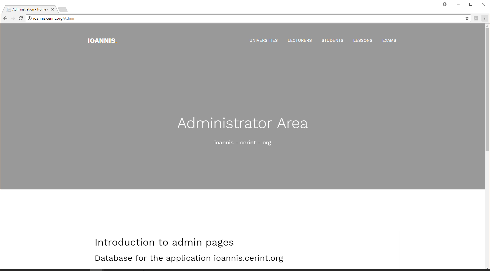
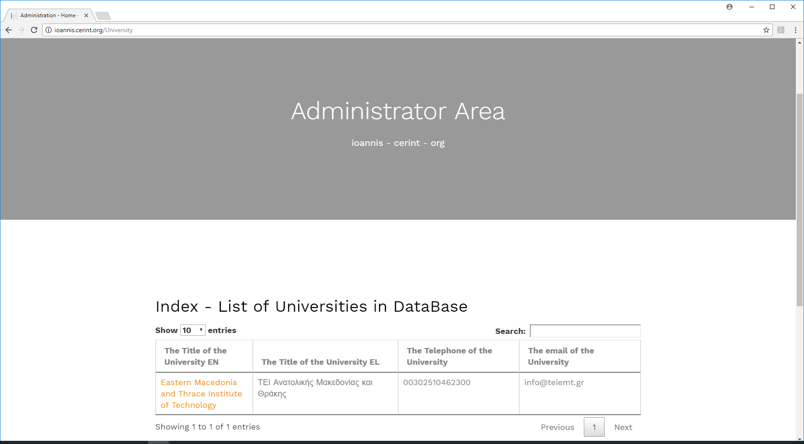
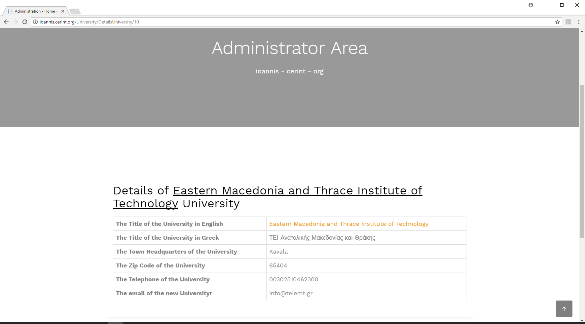

**Παραδοτέο 1 - Δήλωση θέματος και αρχικό πλάνο**

Στην παρούσα πτυχιακή θα υλοποιηθεί ένας ιστοχώρος με σκοπό την εξέταση των
φοιτητών τριτοβάθμιας εκπαιδεύσεις σε συγκεκριμένα μαθήματα. Οι ερωτήσεις, οι
οποίες θα υπάρχουν στο σύστημα, θα είναι ερωτήσεις σωστού λάθους, πολλαπλών
επιλογών, αντιστοίχισης και συμπλήρωσης κενών. Για την καλύτερη παρακολούθηση
της διενέργειας των εξετάσεων, το σύστημα θα έχει τη δυνατότητα σε πραγματικό
χρόνο να παρακολουθεί την πορεία της εξέτασης και να εμφανίζει τα αποτελέσματα
χρησιμοποιώντας τη τεχνολογία Data-Driven Documents. Επίσης, σε πραγματικό
χρόνο, θα ενημερώνεται ο υπεύθυνος καθηγητής εξέτασης για το πλήθος και το
ποσοστό των φοιτητών που έχουν ολοκληρώσει την εξέταση, για το ποσοστό των
σωστόν απαντήσεων ανά ενότητα εξέτασης, ανά φοιτητή και στο σύνολο των φοιτητών
προς εξέταση.

Παρακάτω στο "Παραδοτέο 2" παρουσιάζω με αναλυτικότερο τρόπο, τα εργαλεία που
εγκαταστάθηκαν και τις δοκιμές που έγιναν.

Αρχικά στάδια σχεδίασης:

Τρέχουσες προδιαγραφές του συστήματος:

1.  Ο ιστοχώρος θα χωρίζετε σε τέσσερα τμήματα. Τα τμήματα θα είναι:

    1.  Το γενικό -εισαγωγικό

    2.  Το τμήμα του σπουδαστή

    3.  Το τμήμα του καθηγητή

    4.  Και το τμήμα του διαχειριστή.

2.  Στο γενικό τμήμα θα υπάρχουν γενικές πληροφορίες για τα e-learning συστήματα
    και το μάθημα που θα παρουσιαστεί σαν πιλοτική εφαρμογή.

3.  Στο τμήμα του καθηγητή θα έχουμε τις εξής δυνατότητες:

    1.  Τμήμα ερωτήσεων (σωστού λάθους, πολλαπλών επιλογών):

        1.  Εισαγωγή.

        2.  Τροποποίηση.

        3.  Διαγραφή.

        4.  Έγκριση.

    2.  Τμήμα τεστ:

        1.  Δημιουργία.

        2.  Δυνατότητα Τροποποίησης πριν την τελική έγκριση δημοσίευσης.

        3.  Διαγραφή πριν την τελική έγκριση δημοσίευσης.

        4.  Τελική έγκριση δημοσίευσης test.

        5.  Δημοσίευση τεστ.

        6.  Παρακολούθηση της επίλυσης των τεστ ανά φοιτητή και ομάδα φοιτητών
            online και offline.

        7.  Παρακολούθηση των στατιστικών αποτελεσμάτων των τεστ ανά φοιτητή
            ομάδα φοιτητών σύγκριση με παλιότερα και στατιστικά ανά τμήμα
            (κεφάλαιο ύλης) των τεστ.

        8.  Επικύρωση βαθμολογίων.

4.  Στο τμήμα του φοιτητή θα έχουμε τις εξής δυνατότητες:

    1.  Τμήμα ποσοτικών στοιχείων:

        1.  Εισαγωγή.

        2.  Τροποποίηση.

        3.  Διαγραφή.

    2.  Τμήμα τεστ:

        1.  Διενέργεια τεστ.

        2.  Επιλογή σωστών απαντήσεων ανά ερώτηση.

        3.  Διόρθωση απαντήσεων ανά τμήμα πριν την οριστική υποβολή των
            απαντήσεων ανά τμήμα.

        4.  Παρακολούθηση αποτελεσμάτων μετά το πέρας τις ολοκλήρωσης του τεστ

        5.  Παρακολούθηση βαθμολογίων μετά την επικύρωση της βαθμολογίας από τον
            καθηγητή.

5.  Στο τμήμα του διαχειριστή θα έχουμε τις εξής δυνατότητες:

    1.  Εισαγωγή διαγραφή τροποποίηση πανεπιστημίων.

    2.  Εισαγωγή διαγραφή τροποποίηση σχολών.

    3.  Εισαγωγή διαγραφή τροποποίηση τμημάτων.

    4.  Εισαγωγή διαγραφή τροποποίηση μαθημάτων.

    5.  Εισαγωγή διαγραφή τροποποίηση στοιχείων καθηγητή.

    6.  Εισαγωγή διαγραφή τροποποίηση στοιχείων φοιτητή.

    7.  Στατιστικά χρήσης ιστοχώρου

Παραδοτέο 2 – Εύρεση αναγκαίων εργαλείων, εφαρμογή τους και μία αρχική χρήση
============================================================================

Εύρεση αναγκαίων εργαλείων, εφαρμογή τους και μία αρχική χρήση
--------------------------------------------------------------

Εδώ παραθέτω μια αναφορά σχετικά με όλα τα εργαλεία για την ανάπτυξη της
εφαρμογής και μια αρχική τους εφαρμογή.

Η δημιουργία ενός ιστοχωρου μπορεί να γίνει με διάφορους τρόπους. Δυο είναι η
βασική ο πρώτος είναι με την χρήση ενός συστήματος διαχείρισης περιεχομένου
(**ΣΔΠ**, **Content Management Systems**, **CMS**). Ο δεύτερος είναι με
ολοκληρωμένο περιβάλλον ανάπτυξης(*Integrated Development Environment, IDE*).

Επιλέξαμε να δημιουργήσουμε το e-learning σύστημα μας με το δωρεάν ολοκληρωμένο
σύστημα Visual Studio 2019. Η επιλογή του συγκεκριμένου IDE θεωρείτε
επιβεβλημένη διότι έχει μεγάλη ευχρηστία, πολύ καλό debugging και καθώς και
πολλά εργαλεία για τη γρήγορη συγγραφή κώδικα.

Το δεύτερο εργαλείο που χριζόμαστε είναι μια βάση δεδομένων και επιλέξαμε τον
SQL server 2016 που είναι δωρεάν, έχει ένα πολύ δυνατό και εύχρηστο σύστημα
διαχείρισης. Επίσης συνεργάζεται άψογα με το VS2019.

Για την μορφοποίηση του υπερκείμενου θα χρησιμοποιήσουμε την HTML 5.0
(**H**yper**T**ext **M**arkup **L**anguage) και την CSS 3.0 (**C**ascading
**S**tyle **S**heets) που θεωρούνται οι βασικές γλώσσες μορφοποίησης και
δημιουργίας ιστοσελίδων.

Για τον προγραμματισμό του ιστοχώρου θα χρησιμοποιηθεί η γλώσσα προγραμματισμού
C\# που είναι μια πολύ δυνατή και η βασική γλώσσα προγραμματισμού που
χρησιμοποιεί το VS2019. Επίσης θα χρησιμοποιηθεί η διερμηνευμένη γλώσσα
προγραμματισμού JavaScript (JS) και η Node.js ver12.4.

Τέλος θα χρειαστούμε ένα πακέτο εργαλείων για την οπτικοποίηση των δεδομένων και
την στατιστική τους ανάλυση, ένα τέτοιο εργαλείο είναι D3.js (**Data-Driven
Documents).** Το εργαλείο D3.js είναι μια βιβλιοθήκη JavaScript είναι μια
βιβλιοθήκη JavaScript για την παραγωγή δυναμικών, διαδραστικών οπτικοποιήσεων
δεδομένων σε προγράμματα περιήγησης ιστού.

Εικόνα 1 μια σελίδα από το γενικό τμήμα της εφαρμογής.

Εικόνα 2 μια σελίδα από την περιοχή του διαχειριστή.

Εικόνα 3 Λίστα από τα πανεπιστήμια από την περιοχή του διαχειριστή.

Εικόνα 4 Πληροφορίες για πανεπιστήμιο από την περιοχή του διαχειριστή.

Εικόνα 5 Τροποποίηση πληροφοριών πανεπιστημίου από την περιοχή του διαχειριστή.

http://ioannis.cerint.org/imagesAdmin/DataBaseOrg.png

Εικόνα 6 Μερικοί πίνακες της βάσεις δεδομένων της εφαρμογής

Η βάση δεδομένων εμφανίζεται στην εικόνα 6. Οι βασικοί πίνακες είναι τα
προσωπικά στοιχεία του σπουδαστή και ο πίνακας ακαδημαϊκά στοιχεία σπουδαστή που
συσχετίζονται με μία σχέση ένα προς πολλά. Ο πίνακας προσωπικά στοιχεία καθηγητή
και ο αντίστοιχος πίνακας ακαδημαϊκά στοιχεία καθηγητή που σχετίζονται με τον
πίνακα τμήμα και τον πίνακα μάθημα. Οι σχέσεις είναι πολλά προς πολλά
λαμβάνοντας υπόψη ότι ένας καθηγητής μπορεί να κάνει πολλά μαθήματα και ένα
μάθημα μπορεί να γίνεται από πολλούς καθηγητές. Τέλος ο βασικός πίνακας της
εφαρμογής είναι η εξέταση. Ο πίνακας σχετίζεται με το τμήμα και με τον πίνακα
καθηγητής. Η εξέταση έχει σχέση ένα προς πολλά με τον πίνακα καθηγητής (ο ένας
καθηγητής μπορεί να κάνει πολλές εξετάσεις αλλά η εξέταση γίνεται από έναν
καθηγητή). Στην εικόνα 6 εμφανίζονται όλα τα πεδία του κάθε πίνακα.

**Παραδοτέο 3 - Πρώτο Demo εφαρμογής.**

**Παραδοτέο 4 - Περαιτέρω υλοποίηση της εφαρμογής e-learning.**

**Παραδοτέο 5 - Τελικά στάδια υλοποίησης της εφαρμογής e-learning.**

**Παραδοτέο 6 - ολοκλήρωση του κώδικα και δοκιμές.**

**Παραδοτέο 7 - Δημιουργία των εγγράφων.**

**Παραδοτέο 8 - Τελικό προσχέδιο αναφοράς και παρουσίασης για σχολιασμό.**

**Τελικό παραδοτέο - Τελική αναφορά και παρουσίαση.**

### Χρονοδιάγραμμα

Δήλωση θέματος και αρχικό πλάνο.

Εύρεση αναγκαίων εργαλείων, εφαρμογή τους και μία αρχική χρήση.

Πρώτο Demo εφαρμογής (30 Απριλίου

Περαιτέρω υλοποίηση της εφαρμογής (30 Μαΐου)

Τελικά στάδια υλοποίησης εφαρμογής (30 Ιουνίου)

Ολοκλήρωση του κώδικα και δοκιμές (15 Αυγούστου)

Δημιουργία των εγγράφων (30 Αυγούστου)

Τελικό προσχέδιο αναφοράς και παρουσίασης για σχολιασμό (20%) - έως 15
Σεπτεμβρίου.

Τελική αναφορά και παρουσίαση (30%) - 30 Σεπτεμβρίου.
